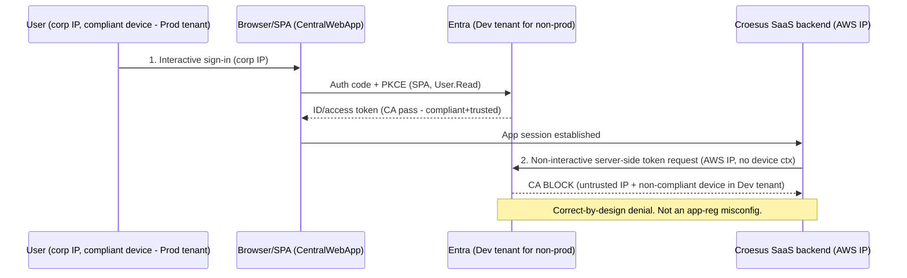

<!-- markdownlint-disable-file -->
# Task Research: App Registration Analysis (3 Customer Text Files)

Perform the analysis described in assets/app-registration-analysis.md against the three customer-provided Entra ID app-registration export files (assets/dev-dev.txt, assets/dev-prod.txt, assets/prod-prod.txt), verify their contents, and answer the customer's core question: is the observed second non-interactive sign-in from the Croesus SaaS AWS IP (blocked by Conditional Access) **expected OAuth behaviour** or a **misconfiguration** — and should the fix be **internal (Option A)** or **escalated to vendor Croesus (Option B)**.

## Task Implementation Requests

* Read and apply the analysis methodology in assets/app-registration-analysis.md.
* Verify the contents of the three app-registration .txt files (dev-dev, dev-prod, prod-prod).
* Use the other assets/ documents for context where helpful.
* Produce a determination on the second-sign-in behaviour and an Option A vs Option B recommendation.

## Scope and Success Criteria

* Scope:
  * In scope: the three JSON app-registration exports; the analysis-intent markdown; the readable Conditional Access advisory PDF; comparison across the dev-dev / dev-prod / prod-prod matrix; a determination + remediation recommendation.
  * Out of scope (blocked): two Azure RMS/IRM-encrypted binaries (croesus_entra_oauth_integration_report_*.pdf and PROD.docx) could not be decrypted in this context; raw Entra sign-in logs were not provided.
* Assumptions:
  * `e1fe6dd8-ba31-4d61-89e7-88639da4683d` is the well-known Microsoft Graph delegated `User.Read` scope (high confidence).
  * `MVTDEVDesjardins.onmicrosoft.com` = Dev Entra tenant; `mvtdesjardins.onmicrosoft.com` = Prod Entra tenant (per publisherDomain casing).
  * The three exports are Graph `application` objects (az ad app show style), not service principals.
* Success Criteria:
  * Each .txt file is verified and characterized (format, tenant, redirect URIs, credentials, permissions, audience, implicit grant).
  * The dev-dev / prod-dev(=dev-prod) / prod-prod matrix from the analysis doc is reconciled against actual file contents.
  * A defensible answer to "expected vs misconfiguration" and an Option A vs Option B recommendation, with evidence.

## Outline

1. What the analysis doc asks (intent + matrix + 6 verification dimensions + the decision).
2. Verified contents of the three app-registration exports (with a comparison table).
3. The blocked evidence (two RMS-encrypted docs) and the one readable advisory PDF.
4. The decisive technical finding: these registrations cannot perform a standards-compliant Entra OBO.
5. Determination on the second sign-in (3 separated facts).
6. Selected approach (Option B-first, then scoped Option A) + alternatives.
7. Concrete next steps and verification queries.

## Potential Next Research

* Obtain rights-removed copies (or pasted excerpts) of croesus_entra_oauth_integration_report_20260529_185237.pdf and PROD.docx.
  * Reasoning: they hold the authoritative OAuth flow definition and the prod reference behaviour; both are RMS-locked.
  * Reference: .copilot-tracking/research/subagents/2026-06-15/sso-ca-oauth-evidence.md
* Obtain raw Entra sign-in log JSON for both events (interactive + non-interactive): AADSTS code, CA policy name, Client App, Resource/audience, Source IP, Device compliance state.
  * Reasoning: the readable PDF is advisory, not logs; verbatim codes/policy names are missing.
  * UPDATE: PARTIALLY SATISFIED by assets/Screenshots of app registrations.docx (images 13-16) for the prod-prod scenario — verbatim Token Protection status, source IPs, device claims, resource, and app are now in hand. Still missing: the verbatim AADSTS failure code + CA policy name for the non-prod DEV-tenant denial.
* Get Croesus's written flow definition + AWS egress IP ranges, and confirm whether they intend a true OBO.
  * Reasoning: determines whether an exposed-API scope + confidential-client credential change is needed at all.
* Pull app owners (`az ad app owner list`) and admin-consent state (`az ad app permission list-grants`) for the three appIds.
  * Reasoning: not present in the application-object exports; needed to close governance/consent gaps.
* Confirm the dev and prod tenant IDs behind the two publisher domains.
  * Reasoning: makes the cross-tenant device-compliance argument concrete.

## Research Executed

### File Analysis

* assets/app-registration-analysis.md
  * Intent/scoping document (~199 lines, no output template, no numeric scoring). Defines a tenant x Croesus-env x auth-flow matrix and 6 verification dimensions; frames the core question (is the second AWS-IP non-interactive sign-in expected or misconfigured) and the Option A vs Option B decision (lines 1-13 intent, 17-30 matrix, 32-150 dimensions, 152-199 decision).
* assets/dev-dev.txt
  * Graph application object. objectId 0110690a-75b6-4809-9c9a-956ab805434b (line 2), appId 713d6ede-38a2-45f4-8982-89ea4fcf1a7f (line 4), displayName sp-CentralGPD-UAT-dev-fed (line 9), publisherDomain MVTDEVDesjardins.onmicrosoft.com (line 18 = DEV tenant). 2 SPA redirects incl. a SiteMinder federation URI; implicit ID-token issuance TRUE.
* assets/dev-prod.txt
  * Graph application object. objectId a2a7a9ad-8624-43d7-a921-a33d00c05c5b, appId e3e358ea-0aae-4f11-b866-00f76b1cf6c1, same displayName sp-CentralGPD-UAT-dev-fed, publisherDomain mvtdesjardins.onmicrosoft.com (PROD tenant). 1 SPA redirect (certif/pat); implicit fully off. A UAT/dev-named app living in the PROD tenant.
* assets/prod-prod.txt
  * Graph application object. objectId f75b1dc5-6d7b-4a37-a353-caf805022eaf, appId 92dd40a3-f7c2-42ff-9303-fff5928e195a, displayName sp-CentralGPD-prod-fed, publisherDomain mvtdesjardins.onmicrosoft.com (PROD tenant). 1 clean prod SPA redirect; cleanest config; the reference.
* assets/non_prod_sso_conditional_access_report_20260529_180104.pdf (13 pp, READ)
  * Advisory/options report (not raw logs). Frames the second event as a Croesus backend OBO token exchange from AWS, blocked correctly by CA due to cross-tenant device-compliance gap + untrusted IP. Proposes 3 remediation options.
* assets/croesus_entra_oauth_integration_report_20260529_185237.pdf (BLOCKED)
  * Azure RMS/MIP encrypted (label "Highly Confidential \ Internal Only", siteId 72f988bf-86f1-41af-91ab-2d7cd011db47). Likely holds the authoritative OAuth flow; unreadable.
* assets/PROD.docx (BLOCKED)
  * OLE2/CFB with DRMEncryptedTransform / EncryptedPackage streams; same MIP label. Likely prod reference behaviour; unreadable.
* assets/Screenshots of app registrations.docx (READ — 16 screenshots)
  * NOT RMS-encrypted (readable OOXML). 16 sequential PNG screenshots from a recorded Teams meeting (5/29/2026) showing live Azure Portal app-registration / enterprise-application blades AND an Excel export of the raw Entra sign-in logs for both events. Full catalogue: .copilot-tracking/research/subagents/2026-06-15/screenshot-evidence.md. Supplies the previously-missing raw sign-in logs and the prod reference behaviour.

### Code Search Results

* Graph delegated scope id e1fe6dd8-ba31-4d61-89e7-88639da4683d -> Microsoft Graph User.Read (delegated), present in all three exports.
* Graph resource appId 00000003-0000-0000-c000-000000000000 -> Microsoft Graph, in all three requiredResourceAccess.
* createdByAppId 18ed3507-a475-4ccb-b669-d66bc9f2a36e -> same provisioning/automation app created all three.

### External Research

* Microsoft Entra On-Behalf-Of flow requirements (confidential client + exposed API scope)
  * Source: [Microsoft Entra OBO flow](https://learn.microsoft.com/entra/identity-platform/v2-oauth2-on-behalf-of-flow)
* Cross-tenant access "Trust compliant devices"
  * Source: [Cross-tenant access settings](https://learn.microsoft.com/entra/external-id/cross-tenant-access-settings-b2b-collaboration)

### Project Conventions

* Standards referenced: research artifacts under .copilot-tracking/research/ per Task Researcher mode.
* Instructions followed: plain-text workspace-relative file paths in tracking docs.

## Key Discoveries

### Project Structure

The customer engagement (Desjardins / Croesus "GPD Central" SaaS integration) supplied 7 assets: 1 analysis-intent markdown, 3 app-registration JSON exports (.txt), 1 readable CA advisory PDF, and 2 RMS-encrypted binaries (1 PDF + 1 DOCX). README.md contains only `# croesus`.

### Implementation Patterns

All three registrations share an identical, tightly-scoped shape: SPA platform only (public client, auth-code + PKCE), single-tenant (AzureADMyOrg), Microsoft Graph User.Read delegated only, no exposed API, no app roles, no client secrets, no certificates, no federated identity credentials, servicePrincipalLockConfiguration enabled, acceptMappedClaims true. They differ only in tenant, redirect URIs, and implicit-grant settings.

#### Verified comparison of the three exports

| Field | dev-dev.txt | dev-prod.txt | prod-prod.txt |
| --- | --- | --- | --- |
| displayName | sp-CentralGPD-UAT-dev-fed | sp-CentralGPD-UAT-dev-fed | sp-CentralGPD-prod-fed |
| appId | 713d6ede-38a2-45f4-8982-89ea4fcf1a7f | e3e358ea-0aae-4f11-b866-00f76b1cf6c1 | 92dd40a3-f7c2-42ff-9303-fff5928e195a |
| objectId | 0110690a-75b6-4809-9c9a-956ab805434b | a2a7a9ad-8624-43d7-a921-a33d00c05c5b | f75b1dc5-6d7b-4a37-a353-caf805022eaf |
| publisherDomain (tenant) | MVTDEVDesjardins (DEV) | mvtdesjardins (PROD) | mvtdesjardins (PROD) |
| created | 2025-07-09 20:25Z | 2025-07-09 20:39Z | 2025-04-25 15:06Z |
| platform | SPA | SPA | SPA |
| SPA redirect count | 2 | 1 | 1 |
| SiteMinder federation redirect | YES | no | no |
| Redirect cleanliness | dev + certif/pat | certif/pat | clean prod |
| Implicit ID token | TRUE | false | false |
| Implicit access token | false | false | false |
| Secrets / certs / FIC | none | none | none |
| Exposed API / appRoles / scopes | none | none | none |
| Graph permissions | User.Read (delegated) | User.Read (delegated) | User.Read (delegated) |
| signInAudience | AzureADMyOrg | AzureADMyOrg | AzureADMyOrg |
| SP lock enabled | yes | yes | yes |

Redirect URIs (verbatim):

* dev-dev: `https://spsfondation.dev.desjardins.com/affwebservices/tools/oidc-tool.html` (SiteMinder federation) and `https://pat-gpd-central.certif.desjardins.com/CentralWebApp/LogonSso.aspx`
* dev-prod: `https://pat-gpd-central.certif.desjardins.com/CentralWebApp/LogonSso.aspx`
* prod-prod: `https://gpd-central.desjardins.com/CentralWebApp/LogonSso.aspx`

### Naming hypothesis (resolved)

Filenames encode `<CroesusEnv>-<EntraTenant>`: dev-dev = dev app in dev tenant; dev-prod = dev/UAT app in prod tenant; prod-prod = prod app in prod tenant. The analysis doc labels the cross-boundary row `prod-dev`; the file is named `dev-prod` — same scenario, token order reversed. There is no separate prod-dev.txt. The cross-environment mismatch is confirmed in dev-prod.txt (a dev/UAT-named registration physically in the PROD tenant).

### Decisive finding — these registrations cannot perform a standards-compliant Entra OBO

A genuine Entra On-Behalf-Of (OBO) flow requires the middle tier (Croesus backend) to be a confidential client (client secret or certificate) AND requires the app to expose an API (custom scope / Application ID URI) so the front-end can obtain a token whose audience is that backend. All three exports have `passwordCredentials: []`, `keyCredentials: []`, and `api.oauth2PermissionScopes: []`, with SPA-only platform. Therefore, as configured, they cannot legitimately support a real Entra OBO. The second non-interactive AWS-IP event is therefore either (a) a non-standard server-side token reuse/replay by Croesus that Entra logs as a non-interactive sign-in, or (b) an intended OBO that also depends on additional config not present here. The readable advisory PDF repeatedly calls it an "OBO" but hedges ("details depend on Croesus's design") — it was written generically and never reconciled against the app-registration export.

### Configuration / security observations

1. No credentials anywhere (no secrets, certs, or federated identity credentials) — consistent with pure SPA/PKCE; no long-lived/expiring-secret risk to report. Positive.
2. dev-dev has implicit ID-token issuance enabled while dev-prod/prod-prod have it off — residual/test hygiene gap; corroborates the doc's "dev has residual/test config" claim.
3. dev-dev carries an extra SiteMinder federation redirect (`spsfondation.dev.../oidc-tool.html`) absent in the prod-tenant apps — a federation/test redirect surface to scope/clean.
4. Naming/labeling drift across the tenant boundary — a UAT/dev-named registration (dev-prod.txt) physically in the prod tenant; governance/clarity concern matching the customer's "environments partly mixed" suspicion.
5. Redirects are environment-scoped (dev->pat/certif, prod->clean prod), all HTTPS, no localhost/http/wildcard — no dangling-redirect concern.
6. All single-tenant (AzureADMyOrg) — no multi-tenant/personal-account exposure. Positive.
7. servicePrincipalLockConfiguration enabled on all three — good tamper protection.
8. No owners or admin-consent state present in the application-object export — governance gap to close out-of-band.

### Cross-tenant device-compliance gap is the architectural root cause

Devices are compliant/managed in the Prod tenant (Intune / hybrid join), but non-prod Croesus authenticates in the Dev tenant. A device can be compliant in only one tenant, so a Prod-compliant device reads as non-compliant/unknown in the Dev tenant. The Croesus backend's server-side token step originates from an untrusted AWS IP with no device context. Device-based Conditional Access in the Dev tenant therefore correctly fails the second event. In prod-prod the same step succeeds because device + tenant + trusted-location conditions align.

### Screenshot Evidence (readable docx) — confirms the manifests and supplies the missing raw logs

assets/Screenshots of app registrations.docx is NOT RMS-encrypted (readable OOXML, 16 sequential PNG screenshots from a 5/29/2026 recorded Teams meeting). Full per-image catalogue: .copilot-tracking/research/subagents/2026-06-15/screenshot-evidence.md. It complements the .txt manifests in three ways:

1. Live portal confirmation that the running tenants match the manifests: dev-dev implicit ID-token ON (image2), dev-prod implicit OFF (image4), prod-prod SPA redirect + servicePrincipalLock (image12); all appIds/objectIds reconciled (images 1, 3, 4, 11). Adds the enterprise-application (service principal) object IDs absent from the application-object exports: DEV app 713d6ede -> SP 2052c434-d7fa-4022-a2f8-a1676c187456; dev-prod app e3e358ea -> SP 323e25ff-4afb-47c1-aa3e-0d1142515473 (both Assignment-required = No, Visible-to-users = No). Surfaces 54 user-created CA policies in the DEV tenant incl. a "Restriction Perimetre" perimeter block (image9) and no token encryption (image10).
2. The previously-missing raw Entra sign-in logs for the prod-prod scenario (images 13-16, an Excel "SignInLog" export) directly evidence the token-replay determination:

| Field | Sign-in #1 (interactive) | Sign-in #2 (replay) |
| --- | --- | --- |
| IsInteractive | TRUE | FALSE |
| IPAddress | 142.195.80.133 (Desjardins corp) | 3.97.32.113 (Amazon AWS) |
| Token Protection status | bound (code 0) | unbound (code 1008) |
| browser | Edge 146.0.0 | (empty) |
| deviceId | 5b4b24f4-...-4518e81f06c8 (PP5CD3358905) | 5b4b24f4-...-4518e81f06c8 (same) |
| isCompliant / trustType | true / Azure AD joined | true / Azure AD joined |
| App / Resource | sp-CentralGPD-prod-fed (92dd40a3...) / Microsoft Graph | same / Microsoft Graph |
| ResultType | 0 (success) | 0 (success) |

Both rows share SessionId 007bc799-6350-25bf-fbe9-ebbcb7093b63 and tenant 728d20a5-0b44-47dd-9470-20f37cbf2d9a. A second Amazon IP, 3.99.119.124, appears in the meeting-chat notes (image1).

3. The screenshots resolve the OBO-vs-replay ambiguity (DD-01): the second event's resource is Microsoft Graph (User.Read), not a custom backend-API audience, and Token Protection records it as "unbound" (replay), code 1008 — a server-side TOKEN REPLAY that carries the original session's deviceId and "Azure AD joined / compliant" device claims from an AWS IP with no real device context. This is NOT a standards-compliant Entra OBO (which the manifests cannot support anyway: no confidential-client credential, no exposed API scope). In PROD the replay succeeds and is only flagged by Token Protection; in non-prod (DEV tenant) Conditional Access blocks it. The meeting-chat question "Unbound is saying token REUSE — is this dangerous?" has a concrete answer: a replayed token inheriting compliant-device claims from an external IP can satisfy device-based CA grants it should not; enforcing a Token Protection / token-binding CA control would deny it.

## Technical Scenarios

### Determination: is the second non-interactive sign-in expected or a misconfiguration?

Separate three distinct facts:

1. The existence of a second, server-initiated token event from the Croesus AWS backend is a property of the vendor's SaaS architecture, not a toggle the customer set. In that sense it is "expected" of this vendor's design and is not a Desjardins app-registration mistake.
2. The Conditional Access block of that second event in non-prod is CA working correctly (Zero Trust): a token from an untrusted AWS IP with no compliant-device context in the Dev tenant is correctly denied. This is NOT a misconfiguration.
3. The flow cannot be a legitimate Entra OBO given the exports (no secret, no cert, no exposed API scope). The newly-readable screenshot sign-in logs (images 13-16) confirm this directly: the second event is a server-side TOKEN REPLAY (Token Protection "unbound", code 1008) targeting Microsoft Graph — not a custom backend-API audience — carrying the original session's deviceId and compliant-device claims from an AWS IP. So it is non-standard token replay, not OBO. The vendor's INTENDED design (whether they meant this, or meant a true OBO that was misimplemented) is the only piece still owed by the RMS-locked OAuth report.

Bottom line: the CA denial is expected and correct; the second sign-in is driven by the vendor's server-side design (now confirmed by the screenshot sign-in logs to be a Token-Protection-"unbound" replay, not a standards OBO), not a Desjardins app-reg error. The only open item is whether Croesus intended this replay or a true OBO — obtainable from the RMS-locked OAuth report or a direct vendor confirmation.

**Requirements:**

* Confirm the exact Croesus flow (true OBO vs server-side token replay), token audience, and AWS egress IP ranges.
* Decide remediation only after the flow is confirmed.

**Preferred Approach — Option B first (escalate to Croesus), then a scoped Option A accommodation:**

* Escalate to Croesus to obtain: the exact OAuth/OIDC flow, whether their backend is a confidential client and against which app/scope, the audience of the reused token, and published AWS egress IP ranges. This is required first because the authoritative evidence is RMS-locked and because the exports prove these registrations cannot do a standards OBO unaided.
* Then apply the most proportionate internal accommodation:
  * Preferred internal lever: cross-tenant device-compliance trust via Entra B2B "Trust compliant devices" (PDF Option 2) so the Dev tenant honors the Prod tenant's device-compliance claim — High security, addresses the root cause directly.
  * Alternative internal lever: a scoped CA exception adding Croesus AWS egress IPs as a trusted location for the non-prod app only, with MFA as a compensating control (PDF Option 1) — lower complexity, lower assurance.
* Do NOT frame the CA policy as "broken." Any Option A change is a deliberate, scoped accommodation, not a bug fix.

```text
Decision flow:
  1. Escalate to Croesus (Option B) -> obtain flow definition + AWS IP ranges
  2. If true OBO intended -> require exposed-API scope + confidential-client credential on the Croesus backend (config change), then
  3. Apply scoped Option A: B2B "Trust compliant devices" (preferred) OR scoped CA trusted-location exception + MFA
  4. Re-test the non-prod (dev-prod) scenario; compare to prod-prod reference
```



**Implementation Details:**

* Verification queries to close gaps (run against the relevant tenant):

```bash
# Confirm delegated scope is User.Read and capture admin-consent grants
az ad app permission list --id 713d6ede-38a2-45f4-8982-89ea4fcf1a7f
az ad app permission list-grants --id 713d6ede-38a2-45f4-8982-89ea4fcf1a7f

# Pull owners (not present in the application-object export)
az ad app owner list --id 92dd40a3-f7c2-42ff-9303-fff5928e195a -o table

# Resolve tenant IDs behind the two publisher domains
az rest --method get --url "https://login.microsoftonline.com/MVTDEVDesjardins.onmicrosoft.com/v2.0/.well-known/openid-configuration" --query issuer
az rest --method get --url "https://login.microsoftonline.com/mvtdesjardins.onmicrosoft.com/v2.0/.well-known/openid-configuration" --query issuer
```

* Sign-in log query (Entra -> Monitoring -> Sign-in logs, or Log Analytics) to capture verbatim AADSTS code, CA policy name, Client App, Resource, Source IP, and Device compliance for both events of the affected user.

#### Considered Alternatives

* Option A only (treat as internal misconfiguration and fix CA/app-reg immediately): rejected as the first move because the CA policy is behaving correctly and the authoritative flow evidence is RMS-locked; fixing blindly risks weakening security to accommodate an unconfirmed flow.
* Option B only (push everything to Croesus): insufficient on its own — even if Croesus confirms the flow, the cross-tenant device-compliance gap is a customer-side architectural condition that needs an internal accommodation (B2B trust or scoped CA exception).
* PDF Option 3 (unify/redesign to a single tenant or dedicated test-tenant-joined devices): highest assurance but a large re-architecture; reserved as a last resort, not the proportionate first remediation.
* Treating the dev-dev implicit-ID-token + SiteMinder redirect as the cause of the second sign-in: rejected — those are dev hygiene gaps worth cleaning, but they do not produce a server-side AWS-IP token event; that is a backend behaviour.
