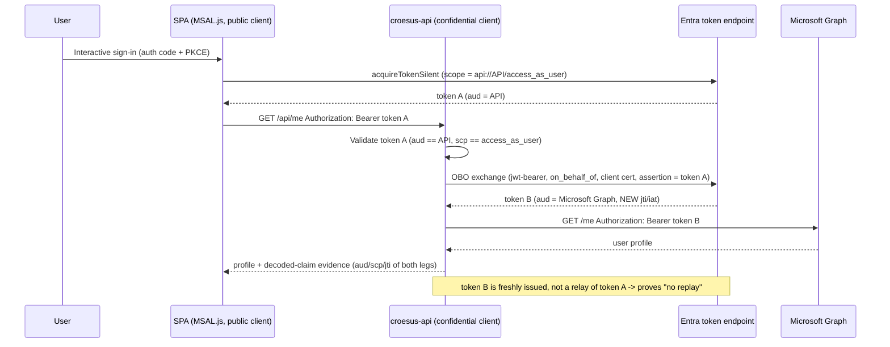

<!-- markdownlint-disable-file -->
# Task Research: Mock Croesus SaaS App with Standards-Compliant MSAL OBO Flow

Build a mock "Croesus / GPD Central" SaaS reference application that demonstrates a **standards-compliant Entra On-Behalf-Of (OBO) flow** — an MSAL.js SPA front end that signs the user in interactively, calls a confidential-client middle-tier API, and the API exchanges the user token via OBO to call Microsoft Graph. The purpose is to **prove to the customer (Desjardins) that the alleged token-replay issue is avoidable** when the vendor implements OAuth correctly, and to provide a CI/CD pipeline that deploys the app to Azure and surfaces sign-in / API logs showing **no "unbound" token replay (Token Protection code 1008)**.

This research drives an implementation that contrasts with the current production behaviour documented in `assets/app-registration-analysis-findings.md`, where the second server-side token event is a Token-Protection-"unbound" replay (code 1008) from an AWS IP to Microsoft Graph, rather than a true OBO targeting a custom backend API.

## Task Implementation Requests

* Mock SaaS app modeling Croesus/GPD Central using MSAL.js (SPA front end) doing the **proper** post-login OAuth flow.
* A confidential-client middle-tier API performing a **standards-compliant OBO** token exchange to call Microsoft Graph (so the second token leg is a bound OBO, not an unbound replay).
* Demonstrate / prove the absence of the token-replay issue (no Token Protection "unbound" / code 1008 events) via runtime evidence and logs.
* A CI/CD pipeline (assume GitHub Actions for `devopsabcs-engineering/croesus`) that deploys the app to Azure and surfaces sign-in + API logs as evidence.
* Framing: "we are the Croesus vendor"; an outsider representing Desjardins creates the correct app registrations and performs a SaaS SSO login with the proper OAuth flow without the replay issue.

## Scope and Success Criteria

* Scope: SPA + middle-tier API + Graph OBO; app registration design (SPA public client + API confidential client with exposed scope); Azure hosting choice; GitHub Actions CI/CD; logging/evidence approach that demonstrates bound tokens / no replay. Excludes: changing real Desjardins/Croesus tenants; reproducing the actual proprietary Croesus product.
* Assumptions:
  * Implementation will target a demo/sandbox Entra tenant and Azure subscription (not the real prod/dev tenants in the analysis).
  * GitHub Actions is the CI/CD system (repo is on GitHub under `devopsabcs-engineering`).
  * The demo must visibly contrast "wrong" (token replay) vs "right" (OBO) to be persuasive to the customer.
* Success Criteria:
  * Documented architecture for a correct OBO flow (SPA → API → Graph) with concrete MSAL config.
  * Concrete app-registration recipe: SPA public client + confidential-client API exposing a scope, with delegated Graph permission for OBO.
  * A selected Azure hosting + CI/CD approach with example pipeline YAML.
  * A defined evidence/logging strategy proving bound OBO tokens vs unbound replay.

## Outline

1. Reference architecture for standards-compliant OBO (SPA + middle-tier API + Graph).
2. App registration design for the demo (vendor API confidential client + SPA public client + Desjardins outsider role).
3. Technology/framework choice (MSAL.js SPA stack; backend stack for OBO).
4. Azure hosting choice and CI/CD pipeline (GitHub Actions) to deploy.
5. Evidence & logging strategy proving no token replay (Token Protection / sign-in logs / API telemetry).

## Potential Next Research

* Runtime-specific claim-logging code (App Insights / OpenTelemetry) for the chosen API stack, with a token-claim redaction helper.
  * Reasoning: the "no replay" evidence depends on logging decoded `aud`/`scp`/`jti` of both token legs safely; exact SDK code differs by runtime.
  * Reference: subagent doc `.copilot-tracking/research/subagents/2026-06-29/azure-hosting-cicd-evidence-research.md` §3a.
* Certificate / federated-identity-credential variant for the API confidential client and its `client_assertion` OBO request shape (vs client secret).
  * Reasoning: production-grade credential; affects Key Vault wiring and provisioning script.
  * Reference: `.copilot-tracking/research/subagents/2026-06-29/app-registration-design-research.md` Topic 5.
* Idempotent ("look-up-or-create") provisioning script + teardown, storing the API credential in Key Vault.
  * Reasoning: `az ad app create` is not idempotent; CI re-runs would create duplicate registrations.
* Bicep/IaC for App Service + Key Vault + Managed Identity + App Insights + diagnostic settings (sign-in logs → Log Analytics).
  * Reasoning: makes the evidence pipeline reproducible and the demo self-contained.
* Validate `AADNonInteractiveUserSignInLogs` columns (`IncomingTokenType`, `ResourceIdentity`) against a live tenant.
  * Reasoning: the corroborating KQL relies on these columns distinguishing the OBO leg.

## Research Executed

### File Analysis

* README.md
  * Project is an Entra app-registration & SSO Conditional Access analysis of Desjardins "GPD Central" / Croesus SaaS. Bottom line: CA block correct-by-design; second sign-in is a token replay (Token Protection "unbound", code 1008) to Graph, not a standards OBO; registrations have no secret/cert/exposed-API scope.
* assets/app-registration-analysis-findings.md
  * Verified that all three registrations are SPA-only public clients with Microsoft Graph `User.Read` delegated only, **no secrets/certs/FIC, no exposed API/appRoles/scopes** — therefore cannot perform a standards OBO. Raw sign-in logs (prod-prod) show sign-in #2 as IsInteractive=FALSE, IP=AWS (3.97.32.113), Token Protection status **unbound (1008)**, Resource=Microsoft Graph, same deviceId/sessionId as sign-in #1. A true OBO would require a confidential client + exposed API and would target the vendor's API, not Graph.
* assets/croesus-escalation-packet.md
  * Vendor questions Q1–Q6: exact flow (OBO vs replay), confidential client?, token audience (Graph vs custom API), AWS egress ranges, device-compliance claim reliance, Token Protection compatibility. This demo answers these by showing the *correct* design.

### External Research

Three subagents produced authoritative Microsoft Learn–cited findings (full docs linked below):

* MSAL OBO architecture — `.copilot-tracking/research/subagents/2026-06-29/msal-obo-architecture-research.md`
* App registration design — `.copilot-tracking/research/subagents/2026-06-29/app-registration-design-research.md`
* Azure hosting + CI/CD + evidence — `.copilot-tracking/research/subagents/2026-06-29/azure-hosting-cicd-evidence-research.md`

Primary authoritative sources:

* On-Behalf-Of flow: [v2-oauth2-on-behalf-of-flow](https://learn.microsoft.com/en-us/entra/identity-platform/v2-oauth2-on-behalf-of-flow) (ms.date 2025-01-04) — `grant_type=urn:ietf:params:oauth:grant-type:jwt-bearer`, `requested_token_use=on_behalf_of`, the "DO NOT relay tokens" warning, the `aud` must equal the API constraint, and the SPA-must-use-a-middle-tier-confidential-client rule.
* Web API calling APIs: [scenario-web-api-call-api-overview](https://learn.microsoft.com/en-us/entra/identity-platform/scenario-web-api-call-api-overview) (ms.date 2024-07-19) — `EnableTokenAcquisitionToCallDownstreamApi`, `AddMicrosoftGraph`, Key Vault `ClientCredentials`.
* Expose a web API: [quickstart-configure-app-expose-web-apis](https://learn.microsoft.com/en-us/entra/identity-platform/quickstart-configure-app-expose-web-apis) (ms.date 2025-05-14) — Application ID URI, `access_as_user`, pre-authorized apps.
* Token Protection: [concept-token-protection](https://learn.microsoft.com/en-us/entra/identity/conditional-access/concept-token-protection) (ms.date 2026-03-24) and [deployment-guide-token-protection-windows](https://learn.microsoft.com/en-us/entra/identity/conditional-access/deployment-guide-token-protection-windows) (ms.date 2026-03-24) — Bound/Unbound, the `signInSessionStatusCode` values (1002/1003/1005/1006/**1008**), and the **native-app-only / EXO-SPO-Teams-only** scope limitation.
* GitHub OIDC to Azure: [connect-from-azure-openid-connect](https://learn.microsoft.com/en-us/azure/developer/github/connect-from-azure-openid-connect) (ms.date 2024-07-01).
* App Service Key Vault references: [app-service-key-vault-references](https://learn.microsoft.com/en-us/azure/app-service/app-service-key-vault-references) (ms.date 2026-04-09).
* Single/multitenant apps: [single-and-multi-tenant-apps](https://learn.microsoft.com/en-us/entra/identity-platform/single-and-multi-tenant-apps) (ms.date 2025-03-13).

### Project Conventions

* Repository currently contains only analysis docs + assets; no existing application code or pipelines. The mock app, registrations, and pipeline are net-new. Suggested layout: `./spa`, `./api`, `./infra`, `./scripts`, `.github/workflows/`.

## Key Discoveries

### CRITICAL CORRECTION — re-anchor the proof on OBO audience-binding, not "Token Protection 1008"

The existing analysis (and the user request) frame the proof as "no Token Protection unbound / code 1008". Subagent research surfaced that this framing **will not hold up** for this demo and must be re-anchored:

* Entra **Token Protection** (the source of `1008`) is a **Conditional Access session control** that checks for a **device-bound PRT**. It is **native-app only** ("Browser-based applications are not supported") and protects **only Exchange Online / SharePoint Online / Teams** — not a custom Web API and not Microsoft Graph generically.
* `1008` specifically means **"the client isn't integrated with the platform broker (WAM)"** — it is *not* literally "unbound token replay". There is also **no documented `code 0 = bound`** status; "Bound" is a textual value.
* Therefore a browser **MSAL.js SPA → custom API → Graph OBO** demo **will not emit a 1008 signal at all**. Leading the customer-facing proof with `1008` would be technically incorrect and would fail scrutiny from a security-literate audience (Desjardins).

The **defensible, demonstrable** "this is not a replay" property is **OAuth audience-binding of the tokens** (the property that genuinely distinguishes OBO from replay):

1. Leg-1 token (SPA→API) has `aud = <API app/URI>` and `scp = access_as_user` — **not** `aud = graph`. The SPA never holds a Graph token.
2. Leg-2 token (API→Graph) is a **freshly issued** token with `aud = https://graph.microsoft.com`, a **different `jti`/`iat`**, obtained via `grant_type=jwt-bearer` + `requested_token_use=on_behalf_of` using the API's **confidential-client credential** — i.e., the API did not forward/replay the client's bearer token.
3. Negative controls: the API **rejects** any token whose `aud` ≠ API (401); and the SPA's API-token presented directly to Graph is **rejected** (wrong audience). This is the strongest, repeatable "you cannot just replay the token" demonstration.

The existing finding V1 (token replay → Token Protection "unbound/1008") may be retained as a **separate, clearly-labeled advanced exhibit** about device-bound session tokens, but the OBO proof must stand on audience-binding.

### The "wrong" flow being contrasted (from existing analysis)

The current Croesus design produces a second, non-interactive token event from an AWS IP that is a **token replay** targeting **Microsoft Graph**, reusing the original interactive session's token. It cannot be a real OBO because the registrations are SPA-only public clients with **no credential** and **no exposed API scope** — so there is no API audience to exchange and no credential to sign the exchange.

### What "correct" looks like (target for the mock)

A standards OBO requires four things the broken apps lack:

1. The middle-tier API is a **confidential client** (client secret or, preferably, certificate).
2. The API **exposes a scope** (`access_as_user`) with an Application ID URI, so the SPA token's `aud` is the API.
3. The SPA requests **the API scope** (`api://<api-app-id>/access_as_user`), never a Graph scope.
4. The API redeems the inbound user assertion for a **new** Graph-audience token via the OBO grant (`urn:ietf:params:oauth:grant-type:jwt-bearer`, `requested_token_use=on_behalf_of`).

### Recommended backend: ASP.NET Core + Microsoft.Identity.Web (correct-by-construction)

The single fluent chain `AddMicrosoftIdentityWebApi(...).EnableTokenAcquisitionToCallDownstreamApi().AddMicrosoftGraph(...).AddInMemoryTokenCaches()` validates the inbound token **and** performs the OBO exchange, leaving no place to accidentally "just forward" the token — so the demo cannot accidentally model the replay bug it disproves. Node.js + `@azure/msal-node` `acquireTokenOnBehalfOf` is a viable uniform-stack alternative if the team is JS-committed, but requires hand-wiring token validation and must add explicit OBO-vs-replay assertions.

### Two app registrations (single-tenant demo)

* **SPA (public client):** SPA redirect URI, auth code + PKCE, no credentials, delegated permission to the API scope.
* **API (confidential client):** exposed `access_as_user` scope + Application ID URI, **client secret or certificate**, Microsoft Graph `User.Read` delegated + admin consent, with `preAuthorizedApplications` + `knownClientApplications` set so the SPA gets the API scope without an extra consent prompt.
* Single-tenant (`AzureADMyOrg`) is the Microsoft-recommended shape for the "customer builds the registration for a third-party/vendor app" case (exactly Croesus→Desjardins). Document the real-world multi-tenant SaaS onboarding (`/v2.0/adminconsent`) as a callout, but build the demo single-tenant.

### Hosting + CI/CD + evidence

* **Hosting:** Azure **App Service — two Web Apps** (`croesus-spa`, `croesus-api`). Native Managed Identity → Key Vault reference for the API certificate; one-toggle Application Insights; documented `azure/webapps-deploy`. Simplest credible place for a confidential client. (Alternative: SWA + managed Functions, but SWA built-in `/.auth` ≠ MSAL OBO.)
* **CI/CD:** GitHub Actions with **OIDC federated identity** for deploy (no stored deploy secret). The **API confidential credential = certificate in Key Vault**, surfaced via `@Microsoft.KeyVault(SecretUri=...)` + Managed Identity. Public IDs (client/tenant/scope) as non-secret `vars.*`.
* **Evidence:** (a) App Insights structured logging of decoded `aud`/`scp`/`appid`/`jti` for both legs + negative tests (primary); (b) Entra `SigninLogs` (interactive SPA→API) + `AADNonInteractiveUserSignInLogs` (OBO legs) correlated by `CorrelationId` via KQL; (c) a post-deploy CI job that runs a smoke-test login + gated negative tests (assert 401), runs the KQL, and emits results + portal deep links to `$GITHUB_STEP_SUMMARY`.

### Complete Examples

SPA — request the API scope (never Graph):

```ts
export const apiRequest = { scopes: ["api://API_CLIENT_ID/access_as_user"] };
const res = await instance.acquireTokenSilent({ ...apiRequest, account });
// res.accessToken => token A, aud = API_CLIENT_ID
```

API (ASP.NET Core + Microsoft.Identity.Web) — OBO + Graph `/me`, no manual token handling:

```csharp
builder.Services.AddAuthentication(JwtBearerDefaults.AuthenticationScheme)
    .AddMicrosoftIdentityWebApi(Configuration.GetSection("AzureAd"))
    .EnableTokenAcquisitionToCallDownstreamApi()
    .AddMicrosoftGraph(Configuration.GetSection("Graph"))
    .AddInMemoryTokenCaches();

// Controller
[Authorize, RequiredScope("access_as_user")]
[HttpGet("api/me")]
public async Task<IActionResult> Me() => Ok(await _graph.Me.GetAsync());
```

Raw OBO exchange (what happens on the wire — the evidence of a NEW token, not a relay):

```http
POST /<tenant>/oauth2/v2.0/token
grant_type=urn:ietf:params:oauth:grant-type:jwt-bearer
&client_id=<API_CLIENT_ID>&client_secret=<secret>
&assertion=<token A (aud = API)>
&scope=https://graph.microsoft.com/user.read offline_access
&requested_token_use=on_behalf_of
```

### Configuration Examples

GitHub Actions deploy (OIDC, no deploy secret) — abbreviated:

```yaml
permissions: { id-token: write, contents: read }
steps:
  - uses: azure/login@v2
    with:
      client-id: ${{ vars.AZURE_CLIENT_ID }}      # deploy FIC, NOT the API credential
      tenant-id: ${{ vars.AZURE_TENANT_ID }}
      subscription-id: ${{ vars.AZURE_SUBSCRIPTION_ID }}
  - uses: azure/webapps-deploy@v3
    with: { app-name: croesus-api, package: api }
```

Provisioning (single-tenant, two registrations) — key steps:

```bash
API_ID=$(az ad app create --display-name "Croesus GPD Central API (mock)" --sign-in-audience AzureADMyOrg --query appId -o tsv)
az ad app update --id "$API_ID" --identifier-uris "api://$API_ID"
# PATCH api.oauth2PermissionScopes (access_as_user) + preAuthorizedApplications + knownClientApplications
az ad app credential reset --id "$API_ID" --append --years 1            # secret (cert in prod)
az ad app permission add --id "$API_ID" --api 00000003-0000-0000-c000-000000000000 \
  --api-permissions e1fe6dd8-ba31-4d61-89e7-88639da4683d=Scope          # Graph User.Read
az ad app permission admin-consent --id "$API_ID"
```

Evidence KQL (corroborating exhibit — two legs correlated):

```kusto
AADNonInteractiveUserSignInLogs
| where TimeGenerated > ago(1h)
| where AppDisplayName == "Croesus API" or ResourceDisplayName == "Microsoft Graph"
| project TimeGenerated, CorrelationId, AppDisplayName, ResourceDisplayName, UserPrincipalName, Status
| sort by TimeGenerated asc
```

## Technical Scenarios

### Scenario 1 — Reference OBO app: MSAL.js SPA + ASP.NET Core middle tier + Graph (SELECTED)

A React + `@azure/msal-browser`/`@azure/msal-react` SPA signs the user in (auth code + PKCE), acquires a token **for the API scope only**, and calls the ASP.NET Core middle-tier API. The API (Microsoft.Identity.Web) validates the inbound token, performs the OBO exchange to acquire a Graph token, and calls `GET /me`. The API logs decoded claims of both legs to App Insights to prove audience-binding.

**Requirements:**

* SPA never requests a Graph scope (forces the OBO boundary).
* API is a confidential client (cert in Key Vault) exposing `access_as_user`.
* API enforces `aud == API` and `scp == access_as_user`; rejects mismatched audiences.

**Preferred Approach:**

* ASP.NET Core + Microsoft.Identity.Web for the middle tier — correct-by-construction (no place to implement a replay), first-class certificate/Key Vault support, built-in audience/scope validation.

```text
croesus/
├─ spa/                 # React + MSAL.js (public client)
├─ api/                 # ASP.NET Core + Microsoft.Identity.Web (confidential client, OBO)
├─ infra/               # Bicep: App Service x2, Key Vault, MI, App Insights, diag settings
├─ scripts/             # provision-app-registrations.sh, smoke-test + negative-test
└─ .github/workflows/   # deploy-croesus.yml (OIDC) + post-deploy evidence job
```



**Implementation Details:**

* App Insights logs (claims only, never raw tokens): leg-1 `aud/scp/appid/oid/jti`; OBO request shape (`jwt-bearer`, `on_behalf_of`, cert thumbprint); leg-2 `aud=graph`, different `jti/iat`.
* Negative tests gated in CI: Graph-audience token → API returns 401; token A → Graph returns 401.

#### Considered Alternatives

* **Node.js + `@azure/msal-node` middle tier:** uniform JS stack and shows `acquireTokenOnBehalfOf` explicitly, but hand-wires token validation/caching → more surface area to accidentally implement a replay. Acceptable if the team mandates Node; must add explicit audience-binding assertions.

### Scenario 2 — Hosting and CI/CD: App Service two Web Apps + GitHub Actions OIDC (SELECTED)

Deploy `croesus-spa` and `croesus-api` to two App Service Web Apps. GitHub Actions deploys via OIDC federated identity (no deploy secret). The API certificate lives in Key Vault, referenced by the App Service via Managed Identity. A post-deploy evidence job runs the smoke test + gated negative tests + KQL and writes the proof to the run summary.

**Requirements:**

* No long-lived deploy secret (OIDC FIC).
* API credential never in repo/workflow — Key Vault reference only.
* Evidence is a gated, repeatable CI check, not a one-off screenshot.

**Preferred Approach:**

* App Service (credible enterprise middle tier; native MI + Key Vault references + App Insights) over SWA+Functions (simpler but built-in auth ≠ MSAL OBO) and Container Apps (most infra overhead).

#### Considered Alternatives

* **Azure Static Web Apps + managed Functions:** single resource/workflow, cheapest, but must use MSAL.js directly (ignore SWA `/.auth`) and the confidential-client/Key Vault story is weaker. Use only if "simplest possible" outranks "most credible".
* **Azure Container Apps:** maximum flexibility/portability, but Dockerfiles + ACR + image build/push is overkill for a two-tier demo.

### Scenario 3 — Evidence strategy: OBO audience-binding as the headline proof (SELECTED)

Prove "no replay" via decoded token claims (App Insights) + correlated Entra non-interactive sign-in logs (KQL), with Token Protection 1008 demoted to a clearly-labeled advanced/optional exhibit.

**Requirements:**

* Show two distinct tokens with distinct audiences and `jti`.
* Show the API rejecting mismatched-audience tokens.
* Do not present `1008` as the OBO proof (it won't fire for a browser SPA + custom API + Graph).

**Preferred Approach:**

* Lead with App Insights structured claim logging (primary) + Entra sign-in log correlation (corroborating). Optionally include a separate native-app/EXO exhibit if a real bound/unbound signal is desired — but scope that explicitly as "advanced".

#### Considered Alternatives

* **Token Protection 1008 as headline proof:** rejected — technically incorrect for this app shape; native-app/EXO-SPO-Teams only; would undermine credibility with a security-literate customer.

