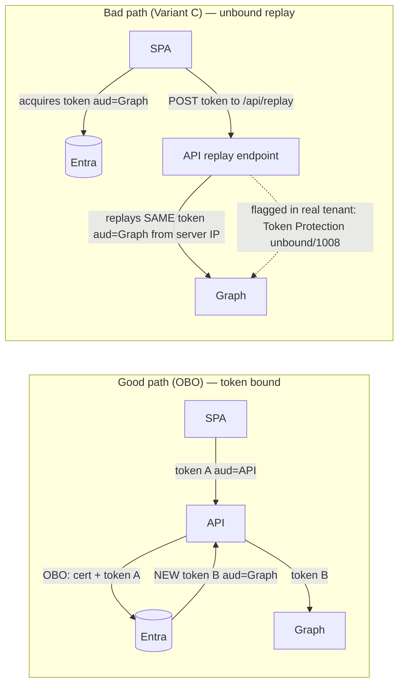

<!-- markdownlint-disable-file -->
# Task Research: Reproduce the Croesus Unbound Token-Replay Anti-Pattern Behind the 1008 Finding

Reproduce, inside the existing Croesus demo, the **wrong** way the real Croesus
("GPD Central") app is believed to behave: a user Microsoft Graph bearer token
is re-presented from a server without a standards On-Behalf-Of exchange. The
demo must reproduce the replay anti-pattern behind the customer "1008" finding,
while being explicit that the literal Token Protection 1008 platform signal is
external customer-log evidence and is not expected from this SPA/custom-API/Graph
mock.

## Task Implementation Requests

* Add a demonstrable "bad path" alongside the working "good path" (OBO) so the
  contrast is instructive.
* Make the bad path mirror what we believe the real Croesus app does to cause
  unbound token replay.
* Reproduce the observable replay anti-pattern behind the real-app "1008" finding
  without overpromising that this mock will emit a literal Token Protection 1008.

## Scope and Success Criteria

* Scope: Research only. Determine (a) what the "1008 issue" actually is, (b) how
  the real app is believed to acquire/replay an unbound token, (c) the precise,
  minimal way to reproduce that anti-pattern in this repo as a toggleable demo
  next to the existing OBO good path.
* Assumptions (to verify):
  * "1008" is a specific error code/signal tied to token audience/replay; source
    likely in `assets/` (escalation packet, app-registration analyses).
  * The good path already exists end-to-end (verified working this session).
* Success Criteria:
  * The meaning and origin of "1008" is documented with a cited source.
  * The real-app suspected behavior is described concretely (token kind, audience,
    replay target).
  * One staged implementation approach is selected, with exact files/lines to
    change and runnable examples, plus what each stage proves and does not prove.

## Outline

* Background: current good-path architecture (SPA public client → API confidential
  client → Graph via OBO).
* Evidence: what "1008" means and what the real Croesus app is believed to do.
* The anti-pattern: unbound token replay — definition and three reproducible variants.
* The honest 1008 boundary: what the mock can and cannot literally emit.
* Selected approach: staged implementation. Tier 1 safe negative controls first;
  Tier 2 gated backend replay lab only when explicitly enabled.
* Implementation details: files, code, env vars, provisioning, expected outcomes,
  logging caveats, and safety gates.

## Potential Next Research

* Confirm Microsoft's authoritative scope of the Token Protection 0/1008 signal
  (which client types + which resources, EXO/SPO/Teams vs Graph).
  * Reasoning: reconciles the real prod-prod 1008 log against the repo's own
    "1008 won't fire for SPA→API→Graph" correction; determines whether the mock
    can ever emit a literal 1008 or only narrate it.
  * Reference: assets/croesus-escalation-packet.md, docs/evidence-narrative.md
* Capture the verbatim AADSTS code + Conditional Access policy name for the
  non-prod denial.
  * Reasoning: lets the bad-path demo cite the exact control that blocks replay.
  * Reference: app-registration-verification.md §4 KQL
* Confirm whether SPA app reg 06ef7c0a-9df3-4bcd-8b6f-ee275ca0adc2 already has
  delegated Microsoft Graph User.Read with admin consent.
  * Reasoning: required for Variant B/C; if absent, a provisioning step is needed.
  * Reference: live tenant (Graph /servicePrincipals oauth2PermissionGrants)

## Research Executed

### Subagent Research Documents

* .copilot-tracking/research/subagents/2026-06-30/1008-and-real-app-replay.md
  * Defines "1008", the real-app replay behavior, audience facts, and the
    prod-vs-nonprod symptom split.
* .copilot-tracking/research/subagents/2026-06-30/good-path-code-map.md
  * Maps the SPA auth/scope code, API audience validation, bad-path insertion
    points, env vars, and MSAL Graph feasibility.

### File Analysis

* assets/croesus-escalation-packet.md:14
  * "server-side token replay (Token Protection status \"unbound\", code 1008)
    targeting Microsoft Graph."
* assets/app-registration-analysis-findings.md (sign-in table)
  * "Token Protection status | bound (code 0) | unbound (code 1008)."
* assets/dev-dev.txt / dev-prod.txt / prod-prod.txt
  * Three SPA-only registrations: oauth2PermissionScopes = [], passwordCredentials
    = [], keyCredentials = []. No API scope, no credential ⇒ OBO structurally
    impossible. Client appIds: dev-dev 713d6ede…, dev-prod e3e358ea…, prod-prod
    92dd40a3….
* spa/src/authConfig.ts:26-34
  * apiRequest and loginRequest both use the single scope [VITE_API_SCOPE]
    (api://<API_CLIENT_ID>/access_as_user). No Graph scope exists in SPA source.
* spa/src/App.tsx:10-56
  * A static ContrastPanel already describes "Broken — token replay" vs
    "Correct — On-Behalf-Of" in text, with NO live code wired to it.
* spa/src/api.ts:65-83
  * callApiMe() does GET {VITE_API_BASE_URL}/api/me with Bearer token A only.
* api/Controllers/MeController.cs:21,51-64
  * Framework AddMicrosoftIdentityWebApi rejects wrong-aud tokens with 401; an
    explicit invalid_audience check returns 401 and skips OBO. Only endpoint is
    GET api/me; no token-echo/forward endpoint exists.
* api/Program.cs:31-43
  * CORS policy "SpaCors" allows GET only.

### Project Conventions

* SPA configuration is entirely via VITE_ env vars injected at build time
  (deploy-croesus.yml); no client/tenant GUIDs are hardcoded in source.
* API configuration via AzureAd:*, Graph:*, Cors:* app settings (App Service).

## Key Discoveries

### What "1008" actually is

"1008" is the Microsoft Entra **Token Protection** token-binding status in the
raw sign-in logs: **0 = bound, 1008 = unbound**. It is a characterization Entra
applies to a sign-in/token-redemption event — not an AADSTS error, not an HTTP
status, not an MSAL exception, and not a Croesus app code. In the customer's real
PROD tenant the replayed Graph token's redemption was recorded with status
**unbound (1008)** from an Amazon AWS IP (3.97.32.113).

### What the real Croesus app is believed to do

After the user's interactive browser login, the Croesus SaaS **backend (AWS)
re-presents the user's existing Microsoft Graph access token** to Microsoft Graph
**from the server, non-interactively, with no On-Behalf-Of exchange**. The same
`aud = Microsoft Graph` (00000003-0000-0000-c000-000000000000, scope User.Read)
token is reused. Because the app registrations expose no API scope and carry no
credential, the app **cannot** do OBO even if it wanted to — so it replays the
front-channel Graph token instead. The replayed token still carries the original
session's device/compliance claims despite originating from AWS.

### Prod vs non-prod symptom

* PROD: replay **succeeds** (ResultType 0) and is merely **flagged** unbound/1008.
* DEV/non-prod: the same replay is **blocked by Conditional Access** (untrusted
  AWS IP + cross-tenant non-compliant device).

### The honest 1008 boundary (critical)

The repo's own docs/evidence-narrative.md notes that the Token Protection 1008
signal fires for **native clients calling EXO/SPO/Teams**, NOT for a browser
**SPA → custom API → Graph** shape. Therefore this mock **cannot literally emit a
1008 sign-in-log entry** without (a) a native/confidential client redeeming a
token against a Token-Protection-participating resource and (b) a Token Protection
Conditional Access policy in the tenant. The faithful, always-true reproduction is
the **unbound-bearer-token-replay shape and its consequence**; the literal 1008
code is reproduced **narratively** (and only truly in a tenant with Token
Protection CA + the right client/resource). Audience-binding (distinct `aud` +
`jti`, already proven in the good path) remains the primary, demonstrable proof.

The real prod-prod logs may still be accurately summarized as Token Protection
unbound code 1008. That is customer-environment evidence, not a success criterion
for this mock. If the App Service replay lab presents an already-issued Graph
token to Microsoft Graph, it is not requesting a new token from Entra. It may or
may not create a useful Entra log row. If a row appears, it should be treated as
opportunistic corroboration; absence of `1008` is not evidence that the token was
bound, because "not evaluated / no signal" and "bound" are different states.

### What the bad-path demo proves

* A SPA can be configured to obtain a Microsoft Graph bearer token directly,
  collapsing the API/OBO boundary.
* The same Graph bearer token can be handed to a backend and re-presented to
  Graph from a server without OBO.
* The good path and bad path differ in protocol identity: OBO receives token A
  (`aud = API`) and obtains a distinct token B (`aud = Graph`), while replay
  reuses the same Graph-audienced token.
* The replay lab can show local evidence: Graph audience, delegated scope,
  absence of a `cnf`/proof-of-possession claim when absent, same token identity,
  and the server-side Graph call result.

### What the bad-path demo does not prove

* It does not prove Entra will emit Token Protection code 1008 for this mock.
* It does not prove the exact Croesus vendor implementation or vendor intent.
* It does not prove the non-prod Conditional Access AADSTS failure code.
* It does not prove App Service replay will appear in Entra sign-in logs.
* It does not prove a token is bound when Token Protection fields are absent.

## Technical Scenarios

The three variants below all reproduce "a token used outside the context it was
bound to, with no OBO." They differ in faithfulness to the real app and in cost.

### Variant A — Replay the API token to Graph (zero new prerequisites)

The SPA takes token A (`aud = API`) and calls
`https://graph.microsoft.com/v1.0/me` directly. Graph rejects it with **401**
(wrong audience).

* Pros: no API change, no new app-registration consent, no new env var. Pure
  client-side. Demonstrates that an **audience-bound** token CANNOT be replayed
  cross-resource — the inverse lesson that motivates OBO.
* Cons: replay **fails** at Graph, whereas the real app's replay **succeeds**. So
  it shows "binding blocks replay," not "the app holds a replayable token."
* Faithfulness to real app: LOW (opposite outcome), but high instructional value
  as a counter-exhibit.

### Variant B — SPA acquires and uses a Graph token directly

The SPA requests a Graph delegated scope (User.Read), receives a
**Graph-audienced bearer token**, and calls Graph from the browser — **succeeds**.

* Pros: faithfully reproduces "the app holds a Graph token it can replay anywhere"
  (the root flaw). Decoding the token shows `aud = Graph` and **no `cnf`/PoP
  claim** ⇒ a plain replayable bearer. No API change.
* Cons: requires the SPA app registration to have delegated Graph **User.Read**
  with admin consent (a provisioning step); needs a `VITE_GRAPH_SCOPE` env var.
* Faithfulness: MEDIUM-HIGH (same token kind held client-side; the "server
  replays it" nuance is absent).

### Variant C — Frontend acquires Graph token, backend replays it (gated lab)

The SPA acquires a Graph token (as in B), then **POSTs it to our own API**, and a
**deliberately vulnerable `POST /api/replay` endpoint replays that same token to
Microsoft Graph from the App Service (a different server IP)** — mirroring the
real Croesus AWS backend re-presenting the user's Graph token.

**Requirements:**

* SPA app reg 06ef7c0a-9df3-4bcd-8b6f-ee275ca0adc2 granted delegated Graph
  User.Read + admin consent.
* New `VITE_GRAPH_SCOPE` (default `User.Read`); optional `VITE_GRAPH_BASE_URL`.
* New API endpoint `POST /api/replay` (API-authenticated, demo-only, clearly
  fenced).
* CORS widened to allow POST for the replay route.

**Rationale:** Variant C is the closest mock shape available in this repo: the
server receives a user Graph token it did not mint and re-presents that same
token to Graph with no OBO. It mirrors the suspected replay mechanics, while the
literal 1008 classification remains dependent on Entra Token Protection support
for the client/resource shape. It should be implemented only as a deliberately
vulnerable lab mode, never as the default demo path.

### Selected staged approach

Rubber-duck review changed the recommendation from "implement Variant C first"
to a **two-tier plan**:

* **Tier 1 — minimum viable bad-path contrast:** Add client-only negative-control
  UX first. Replay the existing API-audienced token directly to Graph and show
  Graph rejects it with 401. This needs no new app-registration permission, no
  API endpoint, and no dangerous token forwarding. It proves why audience binding
  matters and gives an immediate visual contrast next to the OBO success path.
* **Tier 2 — faithful server replay lab:** Add Variant C only behind explicit
  source, infrastructure, build, CI, and auth gates. This proves server-side
  bearer-token replay shape, but remains a deliberately unsafe lab path.

This staging is safer and more useful for demos: Tier 1 is always safe and
teachable; Tier 2 is available only when the operator intentionally wants to
reproduce the real Croesus server-replay shape.

```text
spa/
  src/
    authConfig.ts        (+ graphRequest, graphMeEndpoint — bad path only)
    getGraphToken.ts     (new — mirrors getApiToken.ts for the Graph scope)
    api.ts               (+ replayViaApi(): POST /api/replay with the Graph token)
    App.tsx              (+ "Replay via backend (WRONG)" button in ContrastPanel,
                          + handler + ReplayPanel render)
    components/
      ReplayPanel.tsx    (new — shows the replayed token's aud=Graph, no cnf,
                          server replay IP/result, and the 1008 narrative)
  .env.example           (+ VITE_GRAPH_SCOPE, optional VITE_GRAPH_BASE_URL)
api/
  Controllers/
    ReplayController.cs   (new — POST /api/replay; DEMO-ONLY vulnerable forwarder)
  Program.cs              (CORS: allow POST on the replay route; fence behind a
                           Demo:EnableReplay flag so it is not deployed by default)
infra/
  modules/appservice.bicep (+ SPA VITE_GRAPH_SCOPE build arg; + API Demo__EnableReplay)
.github/workflows/
  deploy-croesus.yml       (+ inject VITE_GRAPH_SCOPE at SPA build)
```



**Implementation Details:**

Authored from the good-path code map; these are illustrative, to be finalized at
implementation time.

#### Tier 1 minimum implementation

Tier 1 uses only SPA changes and no new tenant permissions:

```text
spa/
  src/
    api.ts                    (+ callGraphWithApiTokenWrongWay())
    App.tsx                   (+ bad-path result state + button near ContrastPanel)
    components/
      ReplayPanel.tsx         (new, or extend ContrastPanel)
```

```ts
// spa/src/api.ts — Tier 1: replay token A directly to Graph.
export async function callGraphWithApiTokenWrongWay(instance, account) {
  const apiToken = await getApiToken(instance, account); // aud = API, not Graph
  const res = await fetch("https://graph.microsoft.com/v1.0/me", {
    headers: { Authorization: `Bearer ${apiToken}` },
  });

  return {
    attemptedTarget: "https://graph.microsoft.com/v1.0/me",
    expectedAudience: "https://graph.microsoft.com",
    tokenAudience: decodeJwtPayload(apiToken).aud,
    status: res.status,
    ok: res.ok,
    body: await res.text().catch(() => ""),
    interpretation: "Graph rejects the API-audienced token. Audience binding blocks cross-resource replay.",
  };
}
```

Tier 1 should be the first implementation because it has the fewest moving parts
and no new security exposure. It is not a faithful reproduction of the real app's
successful replay, but it is the clean negative-control panel that explains why
the good OBO path is necessary.

#### Tier 2 replay lab implementation

Tier 2 builds on Variant C only after replay-lab gates are explicit:

```ts
// spa/src/authConfig.ts — BAD PATH ONLY
export const graphRequest = {
  scopes: [import.meta.env.VITE_GRAPH_SCOPE ?? "User.Read"],
};
export const graphMeEndpoint =
  (import.meta.env.VITE_GRAPH_BASE_URL ?? "https://graph.microsoft.com/v1.0") + "/me";
```

```ts
// spa/src/getGraphToken.ts — mirrors getApiToken.ts but for the Graph scope.
// Acquiring this in the browser IS the anti-pattern: the SPA now holds a
// Graph-audienced bearer token that can be replayed from anywhere.
import { InteractionRequiredAuthError } from "@azure/msal-browser";
import { graphRequest } from "./authConfig";

export async function getGraphToken(instance, account) {
  try {
    return (await instance.acquireTokenSilent({ ...graphRequest, account })).accessToken;
  } catch (e) {
    if (e instanceof InteractionRequiredAuthError) {
      return (await instance.acquireTokenPopup(graphRequest)).accessToken;
    }
    throw e;
  }
}
```

```ts
// spa/src/api.ts — Variant C: hand the Graph token to our backend to replay.
export async function replayViaApi(instance, account) {
  const graphToken = await getGraphToken(instance, account); // aud = Graph
  const baseUrl = import.meta.env.VITE_API_BASE_URL.replace(/\/+$/, "");
  const res = await fetch(`${baseUrl}/api/replay`, {
    method: "POST",
    headers: { "Content-Type": "application/json" },
    body: JSON.stringify({ token: graphToken }),
  });
  if (!res.ok) throw new Error(`POST /api/replay failed: ${res.status}`);
  return await res.json();
}
```

```csharp
// api/Controllers/ReplayController.cs — DEMO-ONLY, DELIBERATELY VULNERABLE LAB.
// Accepts a caller-supplied Graph token and re-presents it verbatim to Graph with
// NO OBO. This must be fenced behind Demo:EnableReplay and require a normal API
// Authorization header so it never becomes an anonymous token replay service.
[ApiController]
[Route("api/replay")]
[Authorize]
[RequiredScope("access_as_user")]
public sealed class ReplayController(IHttpClientFactory http, IConfiguration cfg) : ControllerBase
{
    public sealed record ReplayRequest(string GraphAccessToken);

    [HttpPost]
    public async Task<IActionResult> Replay([FromBody] ReplayRequest body, CancellationToken ct)
    {
        if (!cfg.GetValue<bool>("Demo:EnableReplay"))
            return NotFound();

        var client = http.CreateClient();
        client.DefaultRequestHeaders.Authorization = new("Bearer", body.GraphAccessToken);
        var resp = await client.GetAsync("https://graph.microsoft.com/v1.0/me", ct);
        var payload = await resp.Content.ReadAsStringAsync(ct);

        // The server replayed a token it did not mint, from the server's IP —
        // the same shape the real Croesus AWS backend exhibits.
        return Ok(new
        {
            replayed = true,
            graphStatus = (int)resp.StatusCode,
            graphSucceeded = resp.IsSuccessStatusCode,
            note = "Server re-presented the caller's Graph token with no OBO. "
                + "This reproduces the replay shape behind the customer 1008 finding; "
                + "the literal Token Protection 1008 signal is not expected from this mock."
        });
    }
}
```

**Expected outcomes:**

* Variant A: Graph → 401 (wrong audience) — replay rejected by binding.
* Variant B: Graph → 200 — the SPA holds and uses a replayable Graph bearer token.
* Variant C: Graph → 200 from the server — the backend replays the user's Graph
  token (most faithful to the real app). Annotate as replay-shape evidence only;
  do not require or promise Token Protection 1008 in Entra logs for this mock.

**Entra-log caveat:** `POST /api/replay` does not request a new token from Entra.
It presents an existing Graph bearer token from App Service. If Graph/Entra logs
the resource access, the row may show the App Service egress IP, but it is not an
OBO issuance event and is not expected to carry Token Protection 1008 for this
SPA/custom-API/Graph shape.

**Provisioning / security caveats (must be flagged before implementation):**

* Granting the SPA delegated Graph User.Read + admin consent is a real change to
  app registration 06ef7c0a-… in the MFA CAPS sandbox tenant.
* `POST /api/replay` is a genuine token-forwarding vulnerability by design. It
  MUST be gated behind `Demo:EnableReplay=false` in source and Bicep,
  `VITE_ENABLE_REPLAY_DEMO=false` in the SPA build, and never enabled outside a
  manually approved replay-lab environment.
* The replay endpoint must require a valid API token (`aud = API`,
  `scp = access_as_user`) on the request `Authorization` header while receiving
  the Graph token only in the JSON body. It must never be anonymous.
* The replay target must be hardcoded to `GET https://graph.microsoft.com/v1.0/me`.
  Do not accept arbitrary URLs, methods, paths, or headers.
* Raw tokens must never appear in browser console logs, API logs, App Insights,
  exception messages, or response payloads. Return only derived claims, result
  metadata, and optionally a short non-reversible hash prefix.
* CORS must be widened to permit POST on the replay route only.

#### Considered Alternatives

* Variant A (replay API token to Graph): promoted to Tier 1 because it is the
  safest minimum contrast and immediately proves audience binding rejects
  cross-resource replay. It is not the faithful real-app shape because the real
  replay appears to succeed in PROD.
* Variant B (SPA calls Graph directly): kept as the first half of Tier 2. It
  proves the SPA can be given a replayable Graph token, but the real flaw is a
  SERVER replaying that token.
* Variant C (server replays Graph token): selected as Tier 2 replay lab, not the
  default implementation. It is faithful but deliberately vulnerable.

## Rubber-Duck Enhancements Applied

Two reviewer passes strengthened the research:

* .copilot-tracking/research/subagents/2026-06-30/1008-reasoning-rubber-duck.md
  * Separated real customer 1008 log evidence from what this mock can reproduce.
  * Corrected over-strong wording that implied App Service replay would emit
    Token Protection 1008.
  * Added the explicit claim matrix: what is supported, ambiguous, or too strong.
* .copilot-tracking/research/subagents/2026-06-30/bad-path-implementation-rubber-duck.md
  * Recommended the two-tier implementation sequence.
  * Added hidden pitfalls around admin consent, CORS preflight, raw-token logging,
    Vite build-time env vars, and App Service egress vs AWS analogy.
  * Added concrete safety gates: source default false, Bicep default false, SPA
    build flag default false, API auth required, fixed Graph `/me` target, and
    no raw token logging.

## Recommended Next Implementation Plan

1. Implement Tier 1 first: client-only "Replay API token to Graph (WRONG)" button
   and panel. Expected result: Graph 401, with decoded token audience showing
   `aud = API`; no API or tenant changes required.
2. Update documentation to explain Tier 1 as a negative-control contrast, not the
   real-app faithful replay.
3. If a faithful replay lab is still required, add Tier 2 configuration docs and
   gates before adding code.
4. Add the disabled-by-default API replay endpoint with API auth, fixed Graph `/me`
   target, token redaction, and tests.
5. Add SPA Graph-token acquisition and the Tier 2 button behind
   `VITE_ENABLE_REPLAY_DEMO`.
6. Only then add provisioning support for SPA Graph `User.Read`, clearly labeled
   as unsafe replay-lab setup, and deploy it through a manually approved lab path.

