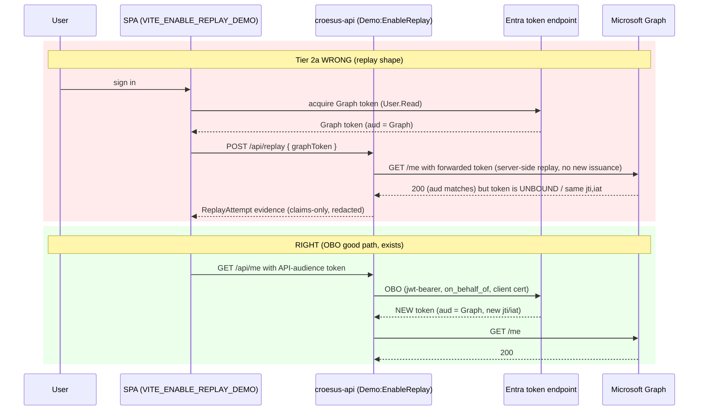

<!-- markdownlint-disable-file -->
# Task Research: Tier 2 Conditional Access 1008 Token-Replay Reproduction & Reversible Demo

Implement Tier 2 of the Croesus On-Behalf-Of (OBO) demo: faithfully reproduce the customer's server-side token-replay scenario, demonstrate the WRONG flow (currently implemented/suspected at the Croesus AWS backend) alongside the CORRECT OBO flow (the mock Croesus middle tier), make explicit what is MISSING to move from wrong to best-practice, reproduce the Conditional Access Token Protection "unbound / 1008" sign-in-log signal where the platform actually emits it, and provide a fully REVERSIBLE teardown that restores the Contoso/Entra demo tenant to its exact original state after the customer demonstration.

## Task Implementation Requests

* Implement Tier 2 tests reproducing the server-side token replay: SPA acquires a real Microsoft Graph token, forwards it to an API endpoint, and the API replays it from server-side context (the unbound-token pattern attributed to the Croesus AWS backend).
* Prove reproduction end-to-end so both the customer (Desjardins) and vendor (Croesus) can observe it.
* Show the WRONG flows (currently implemented / suspected) side-by-side with the CORRECT flows (mock Croesus OBO middle tier).
* Make explicit what is MISSING to move from the wrong approach to the recommended / best-practices approach.
* Reproduce (or observe) the Conditional Access Token Protection 1008 "unbound" signal.
* Provide a fully REVERSIBLE undo: tear down the Conditional Access policy and all other tenant / app-registration / config changes to restore the original Contoso tenant state after the demo.

## Scope and Success Criteria

* Scope (in): a gated Tier 2 server-side replay endpoint + SPA flow; a Graph-scoped SPA token path; a report-only Token Protection Conditional Access (CA) policy scoped to a single test user and a supported resource (Exchange Online / SharePoint Online / Teams); provisioning of the SPA Microsoft Graph `User.Read` delegated consent; a reversible teardown (state file + prefix sweep) that deletes the CA policy, revokes the SPA Graph consent, and resets feature gates; a `verify-clean` assertion step; wrong-vs-right side-by-side UI and evidence; KQL that surfaces the 1008 signal.
* Scope (out): making the literal 1008 signal appear for a browser-SPA → custom-API → Microsoft Graph call (the platform does not emit it for that shape — see Key Discovery 2); Tier 3 multi-tenant SaaS; production enforcement (blocking) of end users beyond an optional, scoped, reversible enforcement beat.
* Assumptions:
  * The demo tenant is `MngEnvMCAP675646.onmicrosoft.com` with Entra ID P1 and P2 both provisioned (verified 2026-06-30 via `subscribedSkus`; recorded in README.md "Entra ID licensing for the Tier 2 replay lab").
  * The operator (or deploy identity) can be granted Conditional Access Administrator (or Security Administrator) and the Graph `Policy.ReadWrite.ConditionalAccess` + `DelegatedPermissionGrant.ReadWrite.All` permissions needed to create/delete CA policies and revoke consent.
  * A dedicated test user (and a break-glass exclude account) exist for the CA policy scope.
  * The existing Tier 1 client-only negative control (spa/src/api.ts callGraphWithApiTokenWrongWay) remains and is not regressed.
* Success Criteria:
  * A gated `POST /api/replay` endpoint exists, is `[Authorize]`d + `[RequiredScope("access_as_user")]`, replays a forwarded Graph token to a FIXED target server-side, logs claims-only evidence (never raw tokens), and is ABSENT when `Demo:EnableReplay` is false.
  * The SPA, behind `VITE_ENABLE_REPLAY_DEMO`, acquires a real Graph token and drives the replay endpoint, rendering wrong-vs-right side-by-side with the existing OBO evidence.
  * A report-only Token Protection CA policy can be provisioned (beta Graph, `secureSignInSession.isEnabled=true`) scoped to the test user + a supported resource, and its Unbound/1008 sign-in-log line is surfaced by KQL.
  * A single teardown restores the tenant to its exact prior state: CA policy deleted, SPA Graph `oauth2PermissionGrant`(s) revoked, feature gates reset, app registrations + cert removed; a `verify-clean` step asserts empty results.
  * Documentation states plainly that Tier 2 reproduces the replay SHAPE and (via the scoped CA policy on a supported resource) the 1008 telemetry, without overclaiming that a SPA→Graph replay emits 1008.
  * The wrong→right gap is presented as a five-item checklist (credential, exposed scope, distinct leg-2 audience, fresh issuance, pre-authorization + reject-the-token).

## Outline

1. Two-part demo strategy: Tier 1 (deterministic audience 401, exists) + Tier 2a (server-side replay shape, new) + Tier 2b (report-only Token Protection CA policy → real 1008 telemetry, new).
2. Wrong vs right, and the five-item OBO gap.
3. API changes: `POST /api/replay`, `Demo:EnableReplay` gate, CORS POST, `ReplayAttempt` telemetry, tests.
4. SPA changes: `graphRequest`, `getGraphToken.ts`, `callApiReplay`, `VITE_ENABLE_REPLAY_DEMO` gated UI.
5. Tenant changes: SPA Graph `User.Read` consent; report-only Token Protection CA policy (beta schema).
6. Reversible teardown: state file + `croesus-demo-` prefix + guarded idempotent deletes + `verify-clean`.
7. Config-contract, infra, and CI/CD (replay-lab environment) wiring.
8. Evidence: App Insights `ReplayAttempt` claims + sign-in-log KQL (1008 + two-leg correlation).

## Potential Next Research

* WI-02 support-matrix reconfirmation at implementation time: whether Token Protection preview coverage has expanded beyond native-app → EXO/SPO/Teams.
  * Reasoning: coverage determines whether an enforced (blocking) beat can target the demo's actual resources.
  * Reference: .copilot-tracking/research/subagents/2026-07-06/token-protection-1008-mechanics.md
* Which resource the customer's REAL 1008 line targeted (EXO/SPO/Teams vs Graph).
  * Reasoning: if it was Graph, that contradicts the documented support matrix and warrants a vendor/support escalation rather than a reproduction.
  * Reference: .copilot-tracking/research/subagents/2026-07-06/token-protection-1008-mechanics.md §7
* Whether a Conditional Access policy `templateId` exists for token protection (simpler create + template-reset reversibility).
  * Reasoning: could simplify provision and strengthen the reversibility guarantee.
  * Reference: .copilot-tracking/research/subagents/2026-07-06/reversible-ca-provisioning-and-obo-gap.md §6
* Whether `az rest` against `/beta` CA policies is blocked by any tenant Graph-beta governance.
  * Reasoning: the token-protection field is beta-only; a governance block would force a Graph PowerShell fallback.
  * Reference: .copilot-tracking/research/subagents/2026-07-06/reversible-ca-provisioning-and-obo-gap.md §6

## Research Executed

### File Analysis

* api/Program.cs
  * Auth/OBO fluent chain at lines 18-24 (`AddMicrosoftIdentityWebApi("AzureAd").EnableTokenAcquisitionToCallDownstreamApi().AddMicrosoftGraph(...).AddInMemoryTokenCaches()`); CORS at 29-43 is GET-only (`.WithMethods("GET")`); middleware order UseCors→UseAuthentication→UseAuthorization→MapControllers at 52-56; `public partial class Program {}` test hook at 60. No replay/echo endpoint exists.
* api/Controllers/MeController.cs
  * `[Authorize][ApiController][Route("api/[controller]")][RequiredScope("access_as_user")]` at 22-25; defensive `AudienceMatchesThisApi` reject-the-token check at 51-64; leg-1 claims at 67-76; OBO exchange `GetAuthenticationResultForUserAsync(GraphScopes, user: User)` at 81-84; Graph `/me` at 87; claims logged via `_claimLogger.LogExchange(...)` at 110. Never logs raw tokens.
* api/Telemetry/OboClaimLogger.cs
  * `JwtShaped` redaction regex at 22-25; `LogExchange` emits `TrackEvent("OboExchange", ...)` at 63; `Redact()` at 85-93 replaces any token-shaped string with `[REDACTED:token]`. Reusable guard for the replay endpoint (with a distinct `ReplayAttempt` event name).
* api/Tests/NegativeControlTests.cs
  * xUnit + `WebApplicationFactory<Program>`; Graph-audience token → 401 at /api/me (35-45); no-token → 401 (47-55); structural `Assert.NotEqual(GraphAudience, ApiAudience)` (57-66); test host swaps JWT trust anchor to a local symmetric key with fixed `ValidAudiences=ApiAudience`, `ValidateIssuer=false` (74-121). Model for Tier 2 replay-endpoint tests (authorize + redaction).
* api/appsettings.json / api/appsettings.Development.json
  * Keys: AzureAd:{Instance,TenantId,ClientId,Audience,ClientCredentials[0]:{SourceType,Base64EncodedValue}}, Graph:{BaseUrl,Scopes}, Cors:AllowedOrigins, Logging, AllowedHosts. No `Demo:EnableReplay` (Tier 2 addition).
* spa/src/authConfig.ts
  * Reads VITE_TENANT_ID/VITE_SPA_CLIENT_ID/VITE_API_SCOPE (9-11); `apiRequest` and `loginRequest` both use ONLY the API scope (26-33); a comment explicitly forbids any Graph scope. Tier 2 adds a `graphRequest`.
* spa/src/getApiToken.ts
  * `getApiToken` silent→popup for token A (aud=API). Model for a sibling `getGraphToken.ts`.
* spa/src/api.ts
  * `callApiMe` GET /api/me (65-83); `decodeJwtClaims` returns aud/scp/jti/iat + `hasCnf` only (96-133); `callGraphWithApiTokenWrongWay` (159-215) is the Tier 1 client-only replay (API token → Graph → expects 401, explicitly NOT 1008).
* spa/src/App.tsx
  * State + handlers at 113-154; buttons rendered inside `AuthenticatedTemplate` at 183-192 (Tier 1 replay button ALWAYS rendered — no gate); `ContrastPanel` static wrong-vs-right copy at 18-62.
* spa/src/components/ReplayAttemptPanel.tsx / EvidencePanel.tsx
  * ReplayAttemptPanel frames 401 as green-check success and states it is NOT the literal 1008 signal (88-92); EvidencePanel asserts leg1AudIsApi, scp==access_as_user, distinct aud (97-99).
* infra/main.bicep + modules/{appservice,keyvault,monitoring}.bicep
  * appservice.bicep: API app settings AzureAd__* (116-131), cert via KV reference `AzureAd__ClientCredentials__0__Base64EncodedValue=@Microsoft.KeyVault(SecretUri=...)` (132-144), `Cors__AllowedOrigins__0=https://<spa host>` (149-152). monitoring.bicep: Entra sign-in diagnostic setting streams SignInLogs + NonInteractiveUserSignInLogs + AuditLogs to Log Analytics (50-70) — already captures any replay leg. keyvault.bicep: RBAC Key Vault Secrets User → API MI; cert provisioned out-of-band.
* scripts/provision-app-registrations.sh
  * Idempotent look-up-or-create for both registrations; exposes `access_as_user` + knownClientApplications + preAuthorizedApplications; imports self-signed cert to KV and attaches only the public cert to the API reg (guarded); grants Graph `User.Read` delegated + admin-consent to the API ONLY (243-249); SPA→API delegated consent (254-260). Tier 2 adds the SPA Graph `User.Read` grant here.
* scripts/teardown-app-registrations.sh
  * `get_app_id_by_name` → `delete_app` (existence-guarded, idempotent); deletes SPA then API then KV cert (+ optional purge). Does NOT revoke Graph grants or reset gates — Tier 2 must extend it.
* scripts/verify-app-registrations.sh, setup-deploy-identity.sh, smoke-test.sh, negative-test.sh, evidence-kql.kusto
  * verify: read-only OBO-capability assertions. setup-deploy-identity: OIDC FIC subjects `repo:${REPO}:environment:${ENVIRONMENT_NAME}` + branch — model for a `replay-lab` environment. negative-test: mismatched-audience → 401 both directions (DR-06: never reuses a real user token). evidence-kql: Query 3 already extracts `signInSessionStatus`/`signInSessionStatusCode` (1008) with a header warning it won't appear for SPA→API→Graph.
* .github/workflows/deploy-croesus.yml
  * OIDC login (no deploy secret); build-spa injects VITE_* at build (41-45); CODE-ONLY deploy (no Bicep step) under `environment: production` manual gate (75, 107); evidence job gated by `vars.ENABLE_ROPC_EVIDENCE` (126-148); inline KQL correlation to Log Analytics (149-176). Models for a gated replay-lab job.
* docs/configuration-contract.md, obo-demo-guide.md, evidence-narrative.md
  * configuration-contract: every new config value must be added as a row first; SPA requests only API_SCOPE (Tier 2 changes this for the gated lab). evidence-narrative: 1008 is only an optional exhibit; it applies to native-app → EXO/SPO/Teams, not browser SPA → custom API → Graph.

### Code Search Results

* `Demo:EnableReplay` / `VITE_ENABLE_REPLAY_DEMO`
  * Not present anywhere in source, config, bicep, or workflow. README lists both as Tier 2 prerequisites to ADD.
* `POST /api/replay` / replay endpoint
  * No forwarding/echo endpoint exists; only `GET /api/me`.
* Graph scope in SPA
  * None. SPA requests only `api://<API>/access_as_user`.

### External Research

* Microsoft Learn — Token Protection concept: <https://learn.microsoft.com/en-us/entra/identity/conditional-access/concept-token-protection>
  * "Token Protection currently supports native applications only. Browser-based applications are not supported." Enforced resources = Exchange Online, SharePoint Online, Microsoft Teams (+AVD/Windows 365 on Windows). Microsoft Graph is NOT a supported resource. Windows GA; iOS/iPadOS/macOS preview.
* Microsoft Learn — Token Protection Windows deployment guide: <https://learn.microsoft.com/en-us/entra/identity/conditional-access/deployment-guide-token-protection-windows>
  * Status codes: 1002/1003/1005/1006/1008. Verbatim: 1008 = "The request is unbound because the client isn't integrated with the platform broker, such as Windows Account Manager (WAM)." License requirement stated as Microsoft Entra ID P1. Recommends report-only before enforcing; capture interactive + non-interactive logs; `enforcedSessionControls` string changed `Binding`→`SignInTokenProtection` (June 2023) — match both. Includes the official KQL samples.
* Microsoft Learn — OAuth 2.0 On-Behalf-Of flow: <https://learn.microsoft.com/en-us/entra/identity-platform/v2-oauth2-on-behalf-of-flow>
  * Reject-the-token rule: "if a client sends an API a token meant for Microsoft Graph, the API can't redeem it… It should instead reject the token." SPAs must hand tokens to a middle-tier confidential client for OBO. Anti-pattern warning: "DO NOT send access tokens issued to the middle tier anywhere except the intended audience" — risks include "inability to satisfy token binding and Conditional Access scenarios." OBO request uses `grant_type=urn:ietf:params:oauth:grant-type:jwt-bearer`, `requested_token_use=on_behalf_of`, `client_assertion` (cert preferred).
* Microsoft Learn — Create/Update/Delete conditionalAccessPolicy + session controls:
  * <https://learn.microsoft.com/en-us/graph/api/conditionalaccessroot-post-policies> · <https://learn.microsoft.com/en-us/graph/api/conditionalaccesspolicy-update> · <https://learn.microsoft.com/en-us/graph/api/conditionalaccesspolicy-delete>
  * <https://learn.microsoft.com/en-us/graph/api/resources/securesigninsessioncontrol?view=graph-rest-beta>
  * Path is `POST /identity/conditionalAccess/policies`. Token protection is a SESSION control `sessionControls.secureSignInSession = { "isEnabled": true }`, documented ONLY in beta → must use `https://graph.microsoft.com/beta/...`. `state` ∈ `enabled` | `disabled` | `enabledForReportingButNotEnforced`. Delete returns 204 (idempotent). Perms: `Policy.ReadWrite.ConditionalAccess` + Conditional Access Administrator / Security Administrator.
* Microsoft Learn — Delete oAuth2PermissionGrant (revoke consent): <https://learn.microsoft.com/en-us/graph/api/oauth2permissiongrant-delete>
  * `DELETE /oauth2PermissionGrants/{id}` → 204. There can be TWO grants (`consentType: Principal` and `AllPrincipals`) — delete both. Existing tokens remain valid until expiry; only new tokens lose the scope.
* Microsoft Learn — Sign-in log activity details: <https://learn.microsoft.com/en-us/entra/identity/monitoring-health/concept-sign-in-log-activity-details>
  * Correlate legs via CorrelationId (session), Request ID (issued token), Unique token identifier. CA status `Failure` = blocked; report-only surfaces under the Report-only pane.

### Project Conventions

* Standards referenced: bash + Azure CLI (`az rest` auto-acquires Graph token for `graph.microsoft.com` host); idempotent look-up-or-skip scripts; claims-only logging with redaction; single-tenant `AzureADMyOrg`; secrets only in Key Vault or GitHub Actions secrets (never in bicepparam); config-contract-first (every new value gets a row before wiring).
* Instructions followed: docs/configuration-contract.md ("How a new value enters the contract"); README wrong-vs-right and app-registration comparison tables; evidence-narrative 1008 boundary.

## Key Discoveries

### Key Discovery 1 — Token Protection is a P1 SESSION control, not a P2 grant control (README correction)

The README states enforcement "requires Microsoft Entra ID P2." The authoritative Windows deployment guide states Token Protection "requires Microsoft Entra ID P1 licenses." Both P1 and P2 are provisioned in the demo tenant, so this does not block the demo, but the plan and docs should cite P1 for Token Protection (P2 is Identity Protection / risk-based CA — a separate control set). In Graph, token protection is `sessionControls.secureSignInSession.isEnabled=true` (a session control), documented ONLY in the beta endpoint — NOT a `grantControls.builtInControls` value.

### Key Discovery 2 — The literal 1008 signal cannot be produced by a SPA→Graph or AWS→Graph replay; it requires native-app → EXO/SPO/Teams

Token Protection supports native applications only (browsers unsupported) and enforces only on Exchange Online / SharePoint Online / Teams (+AVD/Windows 365). Microsoft Graph is not a supported resource. Therefore the Tier 2 server-side replay (SPA→API→Graph) reproduces the replay SHAPE and produces anomalous non-interactive sign-in telemetry, but will NOT emit `signInSessionStatusCode=1008` on that leg. To reproduce the customer's exact 1008 line, a separate, scoped, report-only Token Protection CA policy must target a supported resource with a non-broker (unbound) client. This splits Tier 2 into 2a (replay shape) and 2b (real 1008 telemetry).

1008 verbatim meaning: "The request is unbound because the client isn't integrated with the platform broker, such as Windows Account Manager (WAM)." A headless AWS process replaying a bearer token is by definition not WAM-integrated — matching the customer conclusion exactly.

### Key Discovery 3 — The deterministic proof is audience binding (HTTP 401), a different mechanism from the 1008 sign-in-log signal

Microsoft Graph rejects a token whose `aud` is not Graph with HTTP 401 (RFC 6750 `WWW-Authenticate: Bearer error="invalid_token"`). This is license-independent and deterministic, and is the reliable core of the wrong-vs-right story. It is NOT the CA 1008 signal (an Entra sign-in-time policy determination in the logs). The demo must keep these two mechanisms clearly labeled to avoid overclaiming.

### Key Discovery 4 — The wrong→right gap is exactly five missing pieces

To convert server-side token replay into compliant OBO the middle tier must add: (a) a confidential-client credential (certificate in Key Vault, preferred), (b) an exposed API scope `access_as_user` so leg-1's `aud` is the API, (c) a distinct leg-2 audience (Microsoft Graph), (d) fresh token issuance (new `jti`/`iat`), and (e) pre-authorization (`knownClientApplications`/`preAuthorizedApplications`) plus the reject-the-token rule. The mock API already implements all five (MeController + provision script + Key Vault cert); the three real Croesus registrations have none of the credential/scope pieces. This is the visualizable before/after checklist.

### Key Discovery 5 — Existing gates, negative control, and teardown are the templates to extend

Only two gates exist today (`vars.ENABLE_ROPC_EVIDENCE` CI gate; `environment: production` manual gate). `Demo:EnableReplay` and `VITE_ENABLE_REPLAY_DEMO` do NOT exist and must be added, defaulting OFF. The negative control is audience-binding only (client-only SPA replay + xUnit tests + negative-test.sh) — never 1008. The teardown is display-name-based, existence-guarded, and idempotent, but does NOT revoke Graph grants or reset gates — Tier 2 must extend it and add reversibility for the CA policy and SPA consent.

### Key Discovery 6 — Prior 2026-06-30 research already scoped "Variant C" and the insertion points

.copilot-tracking/research/2026-06-30/croesus-token-replay-bad-path-research.md (Variant A/B/C + two-tier plan), .copilot-tracking/research/subagents/2026-06-30/1008-and-real-app-replay.md (authoritative "what 1008 is" + real app-registration GUIDs + the AWS egress IP 3.97.32.113), and good-path-code-map.md (exact insertion points). Reuse rather than redo.

### Complete Example — token-protection CA policy (report-only, beta Graph, scoped)

```bash
# Requires Policy.ReadWrite.ConditionalAccess + Conditional Access Administrator (or Security Administrator).
POLICY_ID="$(az rest --method POST \
  --uri "https://graph.microsoft.com/beta/identity/conditionalAccess/policies" \
  --headers "Content-Type=application/json" \
  --body '{
    "displayName": "croesus-demo-token-protection",
    "state": "enabledForReportingButNotEnforced",
    "conditions": {
      "clientAppTypes": ["mobileAppsAndDesktopClients"],
      "applications": { "includeApplications": ["00000002-0000-0ff1-ce00-000000000000"] },
      "users": { "includeUsers": ["<TEST_USER_OBJECT_ID>"], "excludeUsers": ["<BREAK_GLASS_ID>"] }
    },
    "sessionControls": { "secureSignInSession": { "isEnabled": true } }
  }' \
  --query id -o tsv)"
# Persist $POLICY_ID to the demo state file (see teardown).
```

### Complete Example — KQL to surface Unbound / 1008

```kusto
AADNonInteractiveUserSignInLogs
| where TimeGenerated > ago(7d)
| where TokenProtectionStatusDetails != ""
| extend parsed = parse_json(TokenProtectionStatusDetails)
| extend bindingStatus     = tostring(parsed["signInSessionStatus"])       // "Unbound"
| extend bindingStatusCode = tostring(parsed["signInSessionStatusCode"])   // "1008"
| where bindingStatusCode == "1008"
| project TimeGenerated, UserPrincipalName, AppDisplayName, ResourceDisplayName,
          IPAddress, bindingStatus, bindingStatusCode, CorrelationId, Id
| sort by TimeGenerated desc
```

### Configuration Example — new contract rows (config-contract-first)

```text
Demo:EnableReplay        (API app setting Demo__EnableReplay)      default false   gates POST /api/replay
VITE_ENABLE_REPLAY_DEMO  (SPA build env)                           default false   gates Tier 2 UI section
VITE_GRAPH_SCOPE         (SPA build env)                           default User.Read  Graph delegated scope
VITE_GRAPH_BASE_URL      (SPA build env, optional)                 default https://graph.microsoft.com/v1.0
```

## Technical Scenarios

### Selected Approach — Two-part Tier 2: gated server-side replay (2a) + report-only Token Protection CA policy (2b), fully reversible

Deliver Tier 2 in two clearly-labeled parts behind default-off feature gates, plus a reversible teardown. Part 2a reproduces the vendor's replay MECHANICS (the missing-OBO shape); Part 2b reproduces the customer's exact 1008 TELEMETRY on a supported resource; the existing Tier 1 audience-401 remains the deterministic anchor. This directly satisfies every request: wrong-vs-right side-by-side, the five-item gap, real 1008 reproduction where the platform emits it, and a one-command undo.

**Requirements:**

* Do not regress the Tier 1 client-only control or the existing OBO good path.
* Every new tenant/config change must be reversible and gated OFF by default.
* Never log or return raw tokens (reuse the `OboClaimLogger` redaction guard).
* Document the 1008 boundary honestly (no overclaiming for the SPA→Graph shape).

**Preferred Approach:**

Anchor the demo on three labeled exhibits so the customer and vendor see the whole picture:

1. Tier 1 (exists) — deterministic audience 401: replay the API-audience token to Graph → 401. Keep as the always-on, license-independent proof.
2. Tier 2a (new) — server-side replay shape: SPA acquires a real Graph token → forwards to `POST /api/replay` → API replays it server-side to a FIXED target (`https://graph.microsoft.com/v1.0/me`) → the API emits a `ReplayAttempt` claims-only event and the non-interactive sign-in appears in logs. This is the faithful "AWS backend re-presents the user's token" reproduction, gated behind `Demo:EnableReplay` / `VITE_ENABLE_REPLAY_DEMO`.
3. Tier 2b (new) — real 1008 telemetry: a report-only Token Protection CA policy (beta `secureSignInSession`, scoped to a test user + Exchange Online, native client apps) makes an unbound (non-WAM) sign-in surface `signInSessionStatusCode=1008` in `AADNonInteractiveUserSignInLogs`. Surface it with the KQL above. Optionally flip report-only→enabled for a scoped enforcement beat, then revert.

Then present the five-item OBO gap (Key Discovery 4) as the bridge from wrong (2a) to right (the OBO good path), and run the reversible teardown to restore the tenant.

```text
api/
  Controllers/
    MeController.cs            (unchanged)
    ReplayController.cs        (NEW: POST /api/replay, [Authorize][RequiredScope], fixed-target replay, ReplayAttempt event)
  Program.cs                  (EDIT: map ReplayController only when Demo:EnableReplay; CORS .WithMethods("GET","POST"))
  appsettings.json            (EDIT: add "Demo": { "EnableReplay": false })
  Tests/
    ReplayEndpointTests.cs     (NEW: authorize + redaction + gate-off-absent assertions)
spa/src/
  authConfig.ts               (EDIT: add graphRequest)
  getGraphToken.ts            (NEW: silent->popup Graph token)
  api.ts                      (EDIT: add callApiReplay -> POST /api/replay)
  App.tsx                     (EDIT: VITE_ENABLE_REPLAY_DEMO-gated Tier 2 section)
  components/
    ReplayAttemptPanel.tsx     (EDIT/EXTEND: render server-side replay result + wrong-vs-right)
infra/modules/appservice.bicep (EDIT: Demo__EnableReplay app setting, default 'false')
scripts/
  provision-app-registrations.sh (EDIT: grant SPA Graph User.Read + admin consent)
  provision-ca-policy.sh          (NEW: create report-only token-protection CA policy; write state file)
  teardown-app-registrations.sh   (EDIT: revoke SPA Graph grant; reset gates)
  teardown-ca-policy.sh           (NEW: delete CA policy by recorded id; prefix sweep fallback)
  verify-clean.sh                 (NEW: assert no demo CA policy, no SPA Graph grant, no registrations)
  evidence-kql.kusto              (EDIT: correct display names; add 1008 + two-leg correlation queries)
docs/configuration-contract.md   (EDIT: add the four new rows)
.github/workflows/deploy-croesus.yml (EDIT: replay-lab environment + gated Tier 2 provision/evidence steps)
```



**Implementation Details:**

API `POST /api/replay` (new controller): `[Authorize][ApiController][Route("api/[controller]")][RequiredScope("access_as_user")]`; POST action accepts a body carrying the forwarded Graph token; rejects any caller-supplied target (hard-coded `https://graph.microsoft.com/v1.0/me`); server-side `HttpClient` re-presents the token; decodes only non-sensitive claims for a `ReplayAttempt` App Insights event via `OboClaimLogger` (reuse `Redact()`); returns claims-only evidence (aud, scp, jti, iat, hasCnf, Graph status, interpretation). Register the endpoint in Program.cs ONLY when `Demo:EnableReplay` is true (absent-when-off is safer than present-but-refusing). Widen CORS to `.WithMethods("GET","POST")`.

SPA: add `graphRequest = { scopes: [graphScope] }` to authConfig.ts; add `getGraphToken.ts` (silent→popup); add `callApiReplay(instance, account)` in api.ts that acquires the Graph token and POSTs it to `/api/replay`; gate a new Tier 2 section in App.tsx behind `import.meta.env.VITE_ENABLE_REPLAY_DEMO === 'true'` (the Tier 1 button stays always-on).

Tenant: extend provision-app-registrations.sh to grant the SPA (not just the API) Graph `User.Read` delegated + admin consent (`az ad app permission add --id $SPA_CLIENT_ID --api 00000003-0000-0000-c000-000000000000 --api-permissions e1fe6dd8-ba31-4d61-89e7-88639da4683d=Scope` then `az ad app permission admin-consent`); add provision-ca-policy.sh creating the beta report-only token-protection policy and recording ids to `.demo-state.json`.

Reversible teardown: state file of created ids + `croesus-demo-` displayName prefix + guarded idempotent deletes. Order: revoke SPA Graph `oauth2PermissionGrant`(s) (both `Principal` and `AllPrincipals`) → delete CA policy by recorded id (fallback: prefix sweep) → reset `Demo:EnableReplay`/`VITE_ENABLE_REPLAY_DEMO` to false → existing app-reg + cert teardown. Add verify-clean.sh asserting empty results for: demo CA policies, SPA Graph grants, app registrations.

```bash
# teardown (guarded, idempotent, restores exact prior state)
STATE_FILE="${STATE_FILE:-.demo-state.json}"
del_graph() { az rest --method DELETE --uri "https://graph.microsoft.com/beta/$1" 2>/dev/null \
  && echo ">>> deleted $1" || echo ">>> already gone: $1"; }
if [[ -f "$STATE_FILE" ]]; then
  GR="$(jq -r '.spaGraphGrant // empty' "$STATE_FILE")"
  CA="$(jq -r '.caPolicyId    // empty' "$STATE_FILE")"
  [[ -n "$GR" ]] && del_graph "oauth2PermissionGrants/$GR"                       # revoke consent first
  [[ -n "$CA" ]] && del_graph "identity/conditionalAccess/policies/$CA"          # delete CA policy
  rm -f "$STATE_FILE"
fi
```

CI/CD: add a `replay-lab` GitHub environment (manual approval) + a federated-credential subject `repo:${REPO}:environment:replay-lab` via setup-deploy-identity.sh add_fic; gate Tier 2 provisioning/evidence steps behind it, mirroring the existing `environment: production` + `if: vars.*` patterns. Deploy is code-only today, so also set `Demo__EnableReplay` live via `az webapp config appsettings set` in the gated job (a code redeploy won't apply the bicep app setting).

#### Considered Alternatives

**Alternative A — Server self-acquire replay (API mints/holds the Graph token itself) instead of SPA-forwarded token.** Rejected: it does not reproduce the customer's shape (the vendor forwards the USER's token from the SPA/front channel). The README explicitly says "the SPA acquires a real Microsoft Graph token, forwards it to an API endpoint." SPA-forwarded (Variant C) is the faithful reproduction.

**Alternative B — Present-but-refusing endpoint gate (endpoint always mapped, returns 403 when disabled) instead of absent-when-off.** Rejected: absent-when-off (do not map the route unless `Demo:EnableReplay`) minimizes attack surface for a deliberately weak endpoint and is the safer default; a disabled endpoint that still parses a forwarded token is unnecessary risk.

**Alternative C — Try to force 1008 on the SPA→API→Graph leg.** Rejected as impossible/overclaiming: Token Protection does not apply to browser clients or to Microsoft Graph as a resource, so the binding evaluation never runs for that leg. Splitting into 2a (shape) + 2b (real 1008 on EXO/SPO/Teams) is the honest, documented way to show both.

**Alternative D — Fold CA/teardown into the existing app-registration scripts (no new files).** Rejected: separate provision-ca-policy.sh / teardown-ca-policy.sh / verify-clean.sh keep the reversibility surface auditable and let the CA lifecycle be run/undone independently of the app registrations. A state file (vs display-name lookup alone) deletes the EXACT object created, avoiding collision with any pre-existing same-named policy.

**Alternative E — Use v1.0 Graph or a grant control for token protection.** Rejected: token protection is a session control `secureSignInSession` documented only in beta; v1.0 and `grantControls.builtInControls` do not carry it. The beta endpoint is required.
