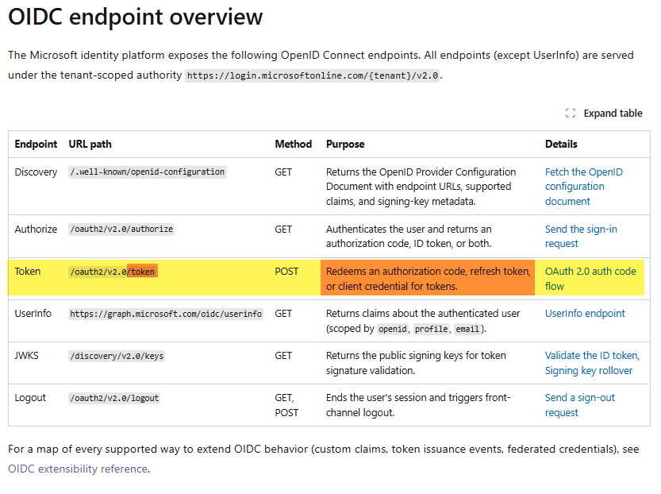

<!-- markdownlint-disable-file -->
# Task Research: Croesus Token Endpoint and Revised Identity Position

Mathieu Santerre asked why Croesus must call Microsoft Entra's `/token` endpoint when Croesus says it does not use On-Behalf-Of (OBO) and has not implemented refresh. The evidence changes our position: `/token` is also the normal endpoint for redeeming an authorization code. Olivier's authorization-code-with-PKCE explanation is protocol-plausible and fits the supplied app registrations better than the repository's OBO mock, but it remains unverified until one correlated transaction identifies the grant and the token later sent to Microsoft Graph.

A second, decisive finding tightens the analysis. The supplied registrations declare their redirect URIs under the Microsoft Entra `spa` (public-client) platform node only, with no client secret or certificate. Microsoft Entra rejects a genuine server-side (no-`Origin`) authorization-code redemption for a `spa`-platform redirect URI with `AADSTS9002327` ("Tokens issued for the 'Single-Page Application' client-type may only be redeemed via cross-origin requests"). Therefore the registrations are correct for a browser-driven redemption, but are not correct for a literal server-side `/token` redemption. This does not disprove Olivier; it means "mandatory server-side `/token` call" and a `spa`-platform registration cannot both be literally true unless the redemption actually carries a browser `Origin` header.

## Task Implementation Requests

* Reconstruct Mathieu's question and Olivier's response with source references and the related image
* Determine whether the Croesus `/token` operation is OBO, another standards-based flow, or token reuse
* Correct repository assumptions where evidence requires it
* Compare the revised Desjardins/Microsoft position with Croesus's position
* Recommend tests and confirmations that can prove or falsify the revised assumption
* Prepare response material for Mathieu and Olivier

## Scope and Success Criteria

* Scope: Customer correspondence, supplied screenshot, app-registration exports, repository implementation and tests, Microsoft identity documentation, and OAuth standards
* Assumptions: Endpoint names and sign-in-log labels do not classify an OAuth grant; raw credentials and tokens must never enter shared evidence
* Success Criteria:
  * Classify the currently supportable position and its confidence
  * Separate facts, source claims, simulations, and interpretations
  * Define one transaction that distinguishes authorization code, OBO, refresh, client credentials, token exchange, and bearer reuse
  * Provide customer-ready wording and an implementation-ready correction list

## Selected Position

Our previous assumption was too strong. The repository does not prove that Croesus replayed an access token, and the use of `/token` does not imply OBO.

1. Provisionally accept Olivier's authorization-code-plus-PKCE description as the leading explanation.
2. Do not characterize the AWS `/token` call as replay or OBO without its redacted request shape.
3. Keep Desjardins Conditional Access unchanged while one correlated successful and failing transaction is captured.
4. Do not allowlist Croesus IPs, add a Desjardins proxy, or mandate OBO before the transaction is classified.
5. Describe this repository as an OBO reference architecture and negative-control lab, not a demonstrated reconstruction of Croesus production.
6. Raise the registration-platform question directly: the exported apps are `spa`-platform public clients, so either the code is redeemed from the browser (with an `Origin` header) or, if a real backend redeems it server-side, the registration should be a `web`-platform confidential client with a certificate credential. The single `Origin`-header fact in one captured `/token` request or sign-in log resolves this.

An authorization-code redemption at `/token` can trigger or surface Conditional Access behavior similar to an OBO token request. The evaluations are not necessarily identical because grant type, client type, application, resource, network location, device and session context, and claims-challenge handling can differ.

## Customer Question and Chronology

### Mathieu's Question

In assets/latest-info/mathieu-santerre.md:1-10, Mathieu asks why `/token` is mandatory without OBO, why it is needed before refresh support exists, and whether it causes Conditional Access behavior comparable to OBO.

The first premise requires correction: `/token` is not specific to OBO or refresh. It is also where an OAuth client redeems the one-time authorization code in authorization-code flow.

### Olivier's Latest Explanation

In assets/latest-info/email-thread-with-croesus.md:1-5, Olivier says Central uses OAuth with PKCE, does not use OBO, and performs the mandatory Azure `/token` call from a Croesus server. This is coherent if the AWS request contains `grant_type=authorization_code`, a one-time `code`, and the matching `code_verifier`. A server can redeem the code without making the operation OBO.

### Earlier Competing Interpretations

* Olivier initially attributed failure to different AWS egress addresses and missing nonproduction authorization in assets/latest-info/email-thread-with-croesus.md:283-310.
* Mathieu says no Croesus IPs are defined in Desjardins Conditional Access and attributes production success to compliant-device context while describing AWS token reuse in assets/latest-info/email-thread-with-croesus.md:223-236.
* The Microsoft escalation calls the AWS event replay rather than OBO and cites `Unbound (statusCode 1008)` in assets/latest-info/email-thread-with-croesus.md:600-668.
* Olivier asks whether Central and Conseiller behave the same way in assets/latest-info/email-thread-with-croesus.md:165-187. Product equivalence is unverified.

The correspondence proves a disagreement and an observed policy result. It does not include the request body, token continuity, or raw sign-in fields required to prove either causal account.

## Related Image



The image says `/oauth2/v2.0/token` redeems an authorization code, refresh token, or client credential. It directly supports Olivier's explanation that `/token` can be mandatory without OBO and before refresh is implemented. It does not identify Croesus's grant, verifier owner, `1008` cause, or later bearer handling.

## Protocol Verification

### Authorization Code With PKCE

```http
grant_type=authorization_code
client_id=<registered-client>
code=<one-time-authorization-code>
redirect_uri=<registered-redirect>
code_verifier=<matching-verifier>
```

The input is an authorization code, not an access token. See [Microsoft authorization-code flow](https://learn.microsoft.com/entra/identity-platform/v2-oauth2-auth-code-flow) and [RFC 7636](https://www.rfc-editor.org/rfc/rfc7636.html).

### Microsoft Entra OBO

```http
grant_type=urn:ietf:params:oauth:grant-type:jwt-bearer
client_id=<middle-tier-client>
assertion=<access-token-audienced-to-middle-tier>
requested_token_use=on_behalf_of
scope=<downstream-resource-scopes>
```

The middle tier must authenticate as a confidential client. See [Microsoft OBO flow](https://learn.microsoft.com/entra/identity-platform/v2-oauth2-on-behalf-of-flow).

### Classification Matrix

| Operation | Decisive request evidence | Meaning |
|-----------|-----------------------------|---------|
| Authorization code with PKCE | `authorization_code`, `code`, `code_verifier` | Initial interactive authorization is redeemed |
| Microsoft Entra OBO | JWT bearer grant, `assertion`, `requested_token_use=on_behalf_of` | Middle tier gets a downstream token |
| Refresh | `refresh_token`, refresh credential | Existing authorization is renewed |
| Client credentials | `client_credentials`, client authentication | Application acts without delegated user context |
| RFC 8693 exchange | Token-exchange grant, `subject_token`, `subject_token_type` | Standards-based token exchange |
| Bearer relay or replay | Same access-token fingerprint is presented again without issuance | Holder reuses the bearer token |
| Proprietary brokerage | Vendor-defined input and vendor-issued session/token | Separate application trust contract |

Endpoint URL, AWS source IP, non-interactive classification, or `1008` cannot independently select a row.

## Verified Repository Findings

### Registration Evidence

assets/dev-dev.txt:18-92, assets/dev-prod.txt:18-91, and assets/prod-prod.txt:18-91 show single-tenant SPA registrations, delegated Graph `User.Read`, no exposed API scopes, no app roles, and no credentials. These objects cannot be the confidential OBO middle tier modeled by this repository. They fit direct delegated Graph acquisition better, but do not prove verifier ownership or exclude another backend registration.

The redirect URIs are the strongest single tell. Both registrations carry their redirect URIs under the `spa` platform node only (`web.redirectUris` and `publicClient.redirectUris` are empty), yet the URIs point at server-rendered surfaces: `https://gpd-central.desjardins.com/CentralWebApp/LogonSso.aspx` (ASP.NET Web Forms) and `https://spsfondation.dev.desjardins.com/affwebservices/tools/oidc-tool.html` (CA SiteMinder / Broadcom Single Sign-On). A server-rendered relying party is a confidential client by nature, but the registration declares a public SPA client.

## Registration Correctness for the Intended Flow

This is the direct answer to whether the Desjardins registrations are correct for Olivier's stated flow (authorization code with PKCE, no OBO, mandatory server-side `/token` call).

### Decisive Platform-Node Behavior

Microsoft Entra changes token-endpoint behavior based on the platform node that owns the redirect URI. For a `spa` redirect URI, redemption at `/oauth2/v2.0/token` must be a cross-origin browser request carrying an `Origin` header; a no-`Origin` server call is rejected. See [authorization-code flow](https://learn.microsoft.com/entra/identity-platform/v2-oauth2-auth-code-flow) and the error text at [AADSTS9002327](https://login.microsoftonline.com/error?code=9002327):

> Tokens issued for the 'Single-Page Application' client-type may only be redeemed via cross-origin requests.

Symmetrically, Entra blocks client credentials whenever an `Origin` header is present, and rejects a public client that presents a secret or certificate with `AADSTS700025`. A `spa`-registered app also receives a fixed, non-extendable 24-hour refresh-token lifetime (`AADSTS700084`), unlike `web`/native clients.

### Verdict

| Aspect | Exported registration | Correct for literal server-side (no-`Origin`) redemption? |
|--------|-----------------------|-----------------------------------------------------------|
| Platform node | `spa` only | No — should be `web` |
| Client type | Public (no secret/cert) | No — confidential needs a credential |
| Token-endpoint contract | Requires `Origin`/CORS; no-`Origin` server call rejected (`AADSTS9002327`) | No — a server call has no `Origin` |
| Refresh-token lifetime | Fixed 24h (SPA cap) | Atypical for a server/daemon posture |
| Exposed API / app roles | None | N/A (not a resource server) |
| Graph access | Delegated `User.Read` only | Consistent with sign-in only |
| OBO enablement | None possible | N/A (vendor says no OBO) |

The registration is a correct, coherent public single-page-application client. It is not correct for a literal server-side confidential `/token` redemption. Two internally consistent readings remain, and only a captured request separates them:

* Interpretation A (registration correct, wording imprecise): the `.aspx` / `oidc-tool.html` page runs MSAL.js in the browser, redeems the code with an `Origin` header, and "server-side" describes the hosting web app rather than the token call. The SPA platform, empty credentials, and `User.Read`-only are all consistent with this.
* Interpretation B (registration is a mismatch): a Croesus AWS backend redeems the code server-to-server with no `Origin`. Against a `spa`-only registration this fails with `AADSTS9002327` unless the backend spoofs an `Origin` header, and it cannot present a credential (public client, `AADSTS700025`). If a real backend must redeem, the correct fix is a `web`-platform registration with a certificate credential.

What is provable from the exports: the apps are `spa`-platform public clients with no credential, no exposed API, and delegated `User.Read` only, so they cannot service a genuine no-`Origin` server redemption and cannot enable OBO. What is not provable without a captured `/token` request or sign-in-log row: whether the real redemption carries an `Origin` header. That one fact is decisive.

## Explaining the 1008 Replay-Token Evidence

The Microsoft escalation cited `Unbound (statusCode 1008)` as replay evidence. This overstates the signal.

* `1008` means "the request is unbound because the client isn't integrated with the platform broker, such as Windows Account Manager (WAM)." It is a device/session-binding classification, not proof that an access token was stolen and replayed. See [Token Protection deployment guide](https://learn.microsoft.com/entra/identity/conditional-access/deployment-guide-token-protection-windows).
* Token Protection "supports native applications only. Browser-based applications are not supported," and it protects Exchange Online, SharePoint Online, and Teams (plus Azure Virtual Desktop / Windows 365 on Windows) — not Microsoft Graph. See [Token Protection concept](https://learn.microsoft.com/entra/identity/conditional-access/concept-token-protection).
* Consequences for this case: a browser/SPA sign-in that later reaches Microsoft Graph `User.Read` is out of Token Protection scope, so an `Unbound / 1008` line against it is expected and benign, not an indicator of compromise. Any headless server context (an AWS backend, or a non-broker client) is inherently "unbound" because it has no PRT and is not WAM-integrated; that unbound status is a property of the client type, not evidence of what token it presented.
* Correct framing for Mathieu and Olivier: `1008` tells us the sign-in was not device-broker bound. It does not tell us the grant type, whether a token was reused, or whether the flow was OBO. It is consistent with, but does not prove, a server-side call. To move from "unbound" to "replay" we need token-continuity evidence (the same bearer fingerprint crossing a trust boundary without a new issuance), which `1008` alone does not supply.

### Why the Mock App Cannot Currently Reproduce a Real 1008

The repository lab forwards a Graph bearer token to Graph (bearer relay). Because Token Protection does not apply to browser clients or to Graph, that motion cannot emit `1008`. A genuine `1008` line is only reproducible by pointing a non-broker client at a Token-Protection-covered resource (Exchange Online / SharePoint Online / Teams) under a report-only Token Protection Conditional Access policy. The lab reproduces the replay shape and the audience-rejection outcome, not the literal `1008` telemetry.

### Mock Architecture

* spa/src/getApiToken.ts:14-30 acquires an API token through MSAL.
* spa/src/api.ts:59-80 presents it to the mock API.
* api/Program.cs:16-29 configures Microsoft.Identity.Web and Graph.
* api/Controllers/MeController.cs:48-89 validates inbound audience, requests Graph `User.Read`, and calls Graph.
* scripts/provision-app-registrations.sh:104-296 creates separate SPA and confidential API registrations, an exposed scope, and API credential.

This is a valid reference for a true frontend-to-API-to-Graph middle tier. It is not demonstrated as Croesus's design.

### Negative Controls and Tests

Tier 1 in spa/src/api.ts:157-214 sends an API-audienced token to Graph. It tests wrong-audience rejection, not same-token replay. Tier 2 in spa/src/api.ts:265-302 and api/Controllers/ReplayController.cs:45-118 forwards a Graph bearer token through the API. It simulates bearer relay, but a Graph status alone cannot prove binding or its absence.

All seven focused .NET tests passed during delegated research. They use synthetic HS256 tokens, disable issuer validation, avoid Entra, and stub Graph. They prove local audience middleware, route gating, forwarding, and redaction. They do not prove live OBO, Croesus behavior, Graph's decision reason, Conditional Access, Token Protection, or real credentials. No successful test exercises `MeController` through mocked token acquisition and Graph together.

## Corrected Assumptions

| Previous assumption | Revised position |
|---------------------|------------------|
| `/token` is unexpected without OBO or refresh | Authorization-code redemption is a normal `/token` use |
| AWS event plus `1008` proves replay | It establishes network/session observations, not token identity or grant |
| No credential and no API scope leaves only replay | Direct delegated Graph authorization-code flow remains plausible |
| OBO is required | OBO is appropriate only for a protected middle tier calling downstream |
| OBO removes the policy block | OBO remains subject to Conditional Access and claims challenges |
| Tier 1 proves replay | Tier 1 proves only audience mismatch |
| Tier 2 status proves binding state | `200`, `401`, and `403` have several possible causes |
| Telemetry proves fresh token-B `jti`/`iat` and audience | api/Controllers/MeController.cs:99-108 does not decode token B |
| Telemetry logs a certificate thumbprint | api/Controllers/MeController.cs:90-97 logs source and optional name only |
| The registrations support a server-side `/token` call as stated | They are `spa`-platform public clients; a no-`Origin` server redemption is rejected with `AADSTS9002327` |
| A public SPA client can present a secret for server redemption | A public client presenting a credential is rejected with `AADSTS700025`; server redemption needs a `web`-platform confidential client |
| `1008` proves token replay | `1008` means the client is not WAM/broker-integrated (unbound); it does not identify the grant or prove reuse |
| The lab can reproduce the customer's `1008` line | Token Protection is native-app-only and excludes Graph; the lab reproduces the replay shape, not `1008` |

`Unbound (1008)` is sign-in-session binding status. The [status schema](https://learn.microsoft.com/graph/api/resources/tokenprotectionstatusdetails?view=graph-rest-beta) does not define it as proof of access-token replay. Token Protection also has [client and resource support limits](https://learn.microsoft.com/entra/identity/conditional-access/concept-token-protection#overview).

## Smallest Decisive Evidence Packet

Capture one successful and one failing transaction. Preserve parameter names and non-secret identifiers; replace credential values with presence indicators or stable SHA-256 fingerprints.

### Croesus Capture

1. `/authorize`: timestamp, correlation ID, `client_id`, `response_type`, redirect URI, scopes, `code_challenge_method`, and challenge fingerprint.
2. `/token`: endpoint, timestamp, source component, `client_id`, `grant_type`, redirect URI, scopes, and client-authentication method.
3. Presence and hashes only for `code`, `code_verifier`, `refresh_token`, `assertion`, `subject_token`, `client_secret`, and `client_assertion`.
4. Safe projections where available: `iss`, `aud`, `azp`/`appid`, `scp`/`roles`, `iat`, `exp`, `uti`/`jti`, and `cnf` presence.
5. Separate fingerprints for the token returned by `/token` and the bearer sent to Graph.
6. Graph URL, response, `request-id`, and `client-request-id`.
7. Library method, cache behavior, registration platform, and component holding the PKCE verifier.

Never capture raw codes, verifiers, tokens, assertions, secrets, cookies, or private keys in shared evidence.

### Desjardins Capture

Export correlated sign-in rows with `Id`, `CorrelationId`, `SessionId`, `UniqueTokenIdentifier`, timestamps, client and resource, source IP, device context, Conditional Access evaluation, failure detail, and Token Protection status.

### Decision Rules

* Authorization-code grant plus matching verifier, followed by Graph use of the newly returned token, supports Olivier.
* `assertion` plus `requested_token_use=on_behalf_of` establishes OBO.
* Refresh or RFC 8693 fields establish their respective grants.
* The same bearer fingerprint crossing the disputed boundary without issuance supports relay or replay.
* An unrecognized shape requires documentation of Croesus's proprietary contract.

## Alternatives Evaluated

### Selected: Provisional Authorization Code With Proof

This best fits the evidence and avoids premature policy or architecture changes. It is falsified by missing code/PKCE evidence, OBO fields, client or redirect mismatch, or bearer continuity from an earlier leg.

### Rejected for Now: Categorical Replay and OBO Requirement

This becomes appropriate only if bearer continuity or a true middle-tier requirement is proved. Current `1008`, AWS, and non-interactive evidence is not discriminating.

### Deferred: IP Allowlist or Desjardins Proxy

Network location can affect Conditional Access but cannot validate grant, audience, verifier ownership, or token continuity. A proxy becomes a high-value credential path. Production reportedly succeeds without Croesus IP allowlisting, weakening an IP-only cause.

### Rejected for Now: Immediate OBO Redesign

OBO provides useful audience separation for a true middle tier, but requires new scopes, confidential credentials, consent, cache and claims handling, and regression work. It is not required for ordinary code redemption.

### Rejected as Sole Framing: Conditional Access Configuration

Policy outcome and protocol validity are separate. Calling this configuration-only risks weakening a correct control around an unclassified flow.

## Proposed Answer to Mathieu

> The `/token` call is not evidence of OBO by itself. Microsoft Entra uses `/oauth2/v2.0/token` to redeem authorization codes, refresh tokens, client credentials, and OBO assertions. With authorization code plus PKCE, the mandatory request contains `grant_type=authorization_code`, the one-time `code`, and its matching `code_verifier`. OBO instead contains an access-token `assertion`, `requested_token_use=on_behalf_of`, and confidential-client authentication.
>
> The three registrations we have are SPA clients with delegated Graph `User.Read`, no exposed Croesus API scope, and no secret or certificate. That fits Olivier's stated grant family better than our OBO mock, but does not prove that the AWS component is the legitimate redeemer or that no token is relayed later.
>
> There is one important wrinkle. Those registrations declare their redirect URIs under the `spa` (public client) platform. Microsoft Entra only lets a `spa` authorization code be redeemed by a cross-origin browser request that carries an `Origin` header, and rejects a plain server-side redemption with `AADSTS9002327`. So a literal "mandatory server-side `/token` call" and a `spa` registration cannot both be exactly true. Either the redemption happens in the browser (registration is correct, "server-side" is loose wording), or a real backend redeems it and the registration should instead be a `web` confidential client with a certificate. This is not an accusation; it is the one point we should clarify with a single captured request.
>
> Yes, authorization-code redemption at `/token` can be subject to Conditional Access and can create non-interactive behavior similar to OBO. We should not say the evaluations are identical because the grant, client type, application, resource, source IP, and device/session context can differ. `Unbound (1008)` describes session binding — specifically that the client is not integrated with the platform broker (WAM). Token Protection is native-app-only and does not cover Microsoft Graph, so an unbound/`1008` line against a browser-to-Graph flow is expected and does not by itself prove access-token replay.
>
> Our revised position should be to accept authorization code plus PKCE as the leading explanation and verify it with one correlated nonproduction trace before changing policy or architecture. We should not allowlist Croesus IPs, add a proxy, or require OBO until that trace identifies the grant, registered client and redirect, and token actually sent to Graph.

## Proposed Response to Olivier

> Thank you. Authorization code plus PKCE is a valid reason for a server-side call to the Microsoft Entra `/token` endpoint and is distinct from OBO. To reconcile this with the non-interactive sign-in and Conditional Access result, we propose one successful and one failing correlated nonproduction transaction, with secrets and raw tokens removed.
>
> For `/authorize`, please retain timestamp, correlation ID, `client_id`, `response_type`, redirect URI, scopes, `code_challenge_method`, and a challenge fingerprint. For `/token`, please retain endpoint, source component, `client_id`, grant type, redirect URI, scopes, client-authentication method, and only presence plus stable hashes for `code`, `code_verifier`, `refresh_token`, `assertion`, and client credentials. Please identify the app-registration platform used by AWS and the library method constructing the request.
>
> One specific point will save a round trip. Your app registrations declare their redirect URIs under the `spa` platform. Microsoft Entra only redeems a `spa` authorization code from a cross-origin browser request with an `Origin` header, and returns `AADSTS9002327` for a plain server-side redemption. Could you confirm whether the `/token` POST is issued from the browser (with an `Origin` header) or from the AWS backend server-to-server? If it is genuinely server-side, the supported registration is a `web`-platform confidential client with a certificate credential rather than a `spa` public client. The presence or absence of the `Origin` header on one request answers this.
>
> For the token returned by `/token` and the token sent to Graph, please provide separate SHA-256 fingerprints and, where safely available, `iss`, `aud`, `azp`/`appid`, `scp`/`roles`, `iat`, `exp`, `uti`/`jti`, and `cnf` presence. Include the Graph URL, HTTP result, `request-id`, and `client-request-id`. Do not send codes, verifiers, tokens, secrets, assertions, cookies, or private keys.
>
> Desjardins will correlate the transaction with application, resource, source IP, device state, Conditional Access policy and controls, failure code, correlation ID, and token-protection status. An authorization-code grant with matching verifier and Graph use of the newly returned token supports your explanation. OBO fields establish OBO. The same bearer fingerprint from an earlier leg without issuance supports relay or replay.
>
> We are not asking Croesus to move `/token` behind a Desjardins proxy or redesign to OBO at this stage. We will evaluate the minimum change after classification. Please provide separate flows for Central and Conseiller if their client, redirect, backend, or token handling differs.

## Repository Test and Documentation Backlog

1. Revise README.md:6-15, 53-63, and 86-90 to remove categorical replay and OBO-required claims.
2. Correct docs/evidence-narrative.md:20-51 and docs/obo-demo-guide.md:137-187 so they do not claim downstream `jti`/`iat`, decoded audience, certificate thumbprint, or broad Token Protection proof.
3. Describe Tier 1 as wrong-audience rejection and Tier 2 as bearer forwarding with status-neutral interpretation.
4. Correct docs/configuration-contract.md:34 because `[RequiredScope("access_as_user")]`, not `AzureAd:Scopes`, is the active enforcement path.
5. Rename the string-comparison test at api/Tests/NegativeControlTests.cs:58-65 unless it actually calls Graph.
6. Add local acceptance and rejection tests for API-audienced and Graph-audienced synthetic tokens, clearly labeled as middleware coverage.
7. Parameterize api/Tests/ReplayEndpointTests.cs for `200`, `401`, `403`, and transport failure; verify forwarding and redaction without assigning a binding cause.
8. Add a `MeController` success-path test with mocked token acquisition and Graph, avoiding claims about unavailable token-B fields.
9. Rebuild the replay-lab SPA with `VITE_ENABLE_REPLAY_DEMO=true`; enabling only the API leaves the control absent.
10. Filter evidence by immutable app ID, persist timestamped query artifacts, and keep correlation joins labeled best-effort.

### Mock-App Tests to Support the Revised Theories

The current lab models only OBO (api/Controllers/MeController.cs) and bearer replay (api/Controllers/ReplayController.cs). Neither models the `spa`-versus-`web` redemption distinction that the Desjardins registrations actually turn on. Add:

11. Static registration-shape assertions (CI-friendly, no Entra): parse assets/dev-dev.txt, assets/dev-prod.txt, and assets/prod-prod.txt and assert `spa.redirectUris` is non-empty while `web.redirectUris`, `keyCredentials`, `passwordCredentials`, `api.oauth2PermissionScopes`, and `appRoles` are empty. This encodes "public SPA client, OBO structurally impossible" as a regression guard.
12. Registration-correctness assertion: assert that any redirect URI ending in `.aspx` or containing `affwebservices` is flagged when it appears under the `spa` node, documenting the server-rendered-page-under-SPA-platform mismatch.
13. Optional live/integration tests (gated, opt-in, real Entra apps): (a) `spa` redirect URI + no-`Origin` server POST of `code`+`code_verifier` asserts `AADSTS9002327`; (b) same app with an `Origin` header asserts `200`; (c) `web` app + certificate + no-`Origin` server POST asserts `200`; (d) public app presenting a `client_secret` asserts `AADSTS700025`. These prove SPA-vs-web redemption behavior end to end.
14. Documentation-level Token Protection assertion: record in tests/docs that a browser/SPA-to-Graph flow is out of Token Protection scope, so an observed `1008` is expected and is not replay evidence, preventing the lab from re-introducing the `1008`-proves-replay overclaim.

Researcher mode did not modify production, test, workflow, or customer-source files.

## Evidence Log

### Repository Sources

* assets/latest-info/mathieu-santerre.md:1-10
* assets/latest-info/email-thread-with-croesus.md:1-5, 165-187, 223-236, 283-310, and 600-668
* assets/latest-info/image.png
* assets/dev-dev.txt:18-92, assets/dev-prod.txt:18-91, and assets/prod-prod.txt:18-91
* api/Program.cs:16-68 and api/Controllers/MeController.cs:48-108
* api/Controllers/ReplayController.cs:45-139
* api/Tests/NegativeControlTests.cs:34-117 and api/Tests/ReplayEndpointTests.cs:21-220
* spa/src/api.ts:59-302
* scripts/provision-app-registrations.sh:104-296
* .github/workflows/deploy-croesus.yml:123-324 and scripts/evidence-kql.kusto:58-122

### External Sources

* [Authorization code flow](https://learn.microsoft.com/entra/identity-platform/v2-oauth2-auth-code-flow)
* [OBO flow](https://learn.microsoft.com/entra/identity-platform/v2-oauth2-on-behalf-of-flow)
* [OIDC endpoint overview](https://learn.microsoft.com/entra/identity-platform/v2-protocols-oidc)
* [Access tokens](https://learn.microsoft.com/entra/identity-platform/access-tokens)
* [Claims validation](https://learn.microsoft.com/entra/identity-platform/claims-validation)
* [Token Protection](https://learn.microsoft.com/entra/identity/conditional-access/concept-token-protection#overview)
* [RFC 6749](https://www.rfc-editor.org/rfc/rfc6749.html), [RFC 6750](https://www.rfc-editor.org/rfc/rfc6750.html), [RFC 7636](https://www.rfc-editor.org/rfc/rfc7636.html), and [RFC 8693](https://www.rfc-editor.org/rfc/rfc8693.html)

### Delegated Research

* .copilot-tracking/research/subagents/2026-07-28/repository-customer-evidence-research.md
* .copilot-tracking/research/subagents/2026-07-28/authoritative-token-semantics-research.md
* .copilot-tracking/research/subagents/2026-07-28/response-alternatives-analysis.md
* .copilot-tracking/research/subagents/2026-07-28/spa-platform-token-redemption-and-registration-correctness.md

## Remaining Evidence Gaps

* One captured `/token` request (or sign-in-log row) showing whether an `Origin` header is present — the single decisive fact separating browser redemption from server redemption
* Whether a separate `web`-platform confidential registration exists that the AWS backend actually uses (not present in the three exports)
* Redacted Croesus `/authorize` and `/token` requests
* The component and registration holding the verifier and redeeming the code
* Complete app and service-principal inventory
* Token fingerprints across issuance and Graph presentation
* Raw Conditional Access evaluation tied to the transaction
* Controlled explanation of production versus nonproduction
* Separate confirmation for Central and Conseiller

## Actionable Next Steps

1. Align with Mathieu on the evidence-qualified position.
2. Send Olivier the bounded evidence request before the joint meeting.
3. Capture one successful and one failing transaction with a shared marker.
4. Classify the grant and compare returned-token and Graph-bearer fingerprints.
5. Correlate Desjardins policy and sign-in evidence.
6. Select the minimum remediation only after classification.
7. Implement the repository backlog before presenting the lab as customer evidence.
