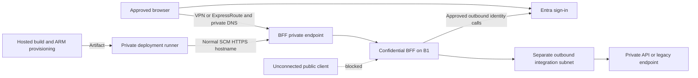

<!-- markdownlint-disable-file -->
# Task Research: Croesus BFF Private Ingress and Security Evidence

Reviewed: 2026-09-22. Status: revised implementation recommendation, not deployed or runtime-certified.

This document supersedes the previous public-access remediation and its overstatements about token custody, OBO, device claims, and Conditional Access (CA). The user's clarification that Azure Policy prohibits public access is a binding constraint. The effective assignment and current resource state still require read-only verification. No application files or Azure resources were changed during this review.

## Task Implementation Requests

1. Restore approved private access to both existing BFF comparison apps, subject to supported deployment-target validation.
2. Demonstrate a confidential-client BFF using the Microsoft OIDC reference pattern without requiring a Blazor frontend rewrite.
3. Provide an OS-compatible path from .NET Framework 4.5.2 to supported Framework and dependencies.
4. Specify app registrations, token/session custody, proxy security, and legacy authentication ownership.
5. Capture sanitized application and Entra evidence in the sample and pipeline without claiming that BFF adoption automatically resolves CA or token binding.

## Scope and Success Criteria

Work is confined to the non-production POC. Preserve the existing SPA/API evidence stack and customer CA policies. Adding the reference BFF remains additive; replacing a comparison app requires separate agreement.

Success requires all of the following:

* Public application and SCM ingress remain disabled, including during deployment and recovery.
* Each approved app is reachable through its own private endpoint using normal HTTPS hostnames, from the actual browser and deployment runner.
* The legacy comparison passes a supported-target/runtime/dependency review before renewed access. A net452 target does not by itself prove that the installed runtime is 4.5.2; prior research reports an installed 4.8 runtime. Private networking is not a runtime-support exemption.
* Auth-code plus PKCE and client authentication complete through the browser's private callback path.
* OAuth tokens remain in a server-side cache; browser cookies contain no OAuth tokens. Session tickets use a server-side store with a protected reference cookie.
* State-changing cookie-authenticated operations enforce CSRF protection; downstream requests receive only the intended credentials.
* Refresh, claims challenges, authorization, local logout, session invalidation, and failure behavior pass behavioral tests.
* Entra observations are mapped to actual operations and policy/resource IDs. Missing evidence is marked unverified, never interpreted as success.
* A controlled delegated-user run supplements deterministic CI. Workload OIDC authentication is not user authentication.

## Review Findings and Disposition

The review found high-impact design defects, not confirmed exploitable production vulnerabilities. They are corrected in this recommendation; implementation and live verification remain gates.

| ID | Severity | Previous defect | Revised requirement |
| --- | --- | --- | --- |
| H1 | High | Re-enable public ingress despite the policy constraint | Keep Disabled; add app-specific private endpoints and verify effective policy |
| H2 | High | Networking omitted browser, DNS, and SCM deployment paths | Verify all three before rollout; use a private-connected deployment runner |
| H3 | High | SaveTokens=true described as server-only storage | Use Microsoft.Identity.Web/MSAL server token caching and server-side session tickets |
| H4 | High | Forwarding sketch omitted CSRF and credential isolation | Protect mutations, constrain destinations, strip incoming credentials, test leakage |
| H5 | High | Core-owned login assumed compatible with an unchanged legacy app | Validate an explicit legacy identity bridge and prevent direct-ingress bypass |
| H6 | High | Renewal, challenges, cache concurrency, and logout underspecified | Define lifecycle and failure tests before claiming a secure reference |
| H7 | High | Two audiences, token IDs, or credential fields presented as OBO proof | Record sanitized grant-operation evidence; corroborate rather than infer the grant |
| H8 | High | Universal correlation join and Graph token inspection | Map per-operation IDs, verify tenant resource IDs, treat Graph tokens as opaque |
| H9 | High | BFF promised disappearing device claims and compliant CA outcomes | Preserve policy; measure actual resource-specific outcomes |
| H10 | High | Report-only, workload identity, and skipped tests counted as user-security proof | Separate CI from controlled user tests; required missing evidence blocks acceptance |

The earlier assertions that policy was excluded, that 4.8 is always preferable to 4.8.1, and that the legacy app need not change are withdrawn. So are the claims that two different audiences prove OBO, that Graph-bound Unbound status is automatically benign, and that BFF adoption closes the original device-context finding.

## Evidence Log

### Review Sources

The following reviews contain detailed source quotations, findings, and original-plan anchors:

* .copilot-tracking/research/subagents/2026-09-22/bff-private-ingress-review.md: private endpoint eligibility, policy distinction, DNS, browser and runner reachability, official references S1-S15.
* .copilot-tracking/research/subagents/2026-09-22/bff-auth-evidence-review.md: OAuth grants, log joins, resource claims, CA limitations, evidence gates.
* .copilot-tracking/research/subagents/2026-09-22/bff-architecture-security-review.md: token storage, CSRF, proxy controls, legacy authentication, lifecycle, pipeline gates.

No user-deleted research document was restored. Historical recommendations that conflict with this document are superseded.

### Code and Customer Anchors

* assets/session-2026-09-08.md: customer discussion and reference links; SiteMinder behavior and customer hosting OS remain questions.
* assets/latest-info/email-thread-with-croesus.md, line 625: original replay/Unbound assertion. Its grant attribution is not established by sign-in log status.
* assets/croesus-escalation-packet.md, line 60 and section 4: Unbound alone does not identify a grant; preserve customer CA/network guardrails.
* assets/app-registration-analysis-findings.md, line 141: historical paired sign-in observations show context, not continuity of token bytes or a proven grant.
* infra/poc/main.bicep, approximately lines 68-160: two Windows apps on shared B1. Networking and access clients must be added explicitly.
* poc/modern-net10/Program.cs, lines 17-57: Microsoft.Identity.Web, PKCE, SaveTokens=false, hardened cookies. Reuse these controls; false is not a defect to fix with a blind toggle.
* poc/legacy-net452/Startup.cs, lines 20-42: Katana/TLS comparison. Review target, installed runtime, packages, and cookie behavior separately.
* .github/workflows/classic-net-bff-poc.yml, line 275: windows-latest deployment runner is not automatically VNet-connected.
* api/Program.cs, lines 17-29: existing API OBO acquisition chain, useful for the optional API-to-Graph exhibit.
* api/Tests/ReplayEndpointTests.cs and api/Tests/LiveRedemptionTests.cs: non-disclosure and optional-live-test conventions. Required release evidence must not silently inherit an optional skip policy.

Locations were verified or carried forward by review agents; approximate line references are navigation aids. The previously cited .github/copilot-instructions.md was absent during review and is not represented as loaded.

### Official References

* [App Service private endpoints](https://learn.microsoft.com/en-us/azure/app-service/overview-private-endpoint): Basic Windows support, per-app endpoints, application/SCM DNS, inbound-only behavior.
* [VNet integration](https://learn.microsoft.com/en-us/azure/app-service/overview-vnet-integration): outbound connectivity and separate delegated subnet.
* [Private DNS integration](https://learn.microsoft.com/en-us/azure/private-link/private-endpoint-dns-integration): linked VNets and hybrid DNS forwarding.
* [Azure Policy deny](https://learn.microsoft.com/en-us/azure/governance/policy/concepts/effect-deny): management-request denial, distinct from application HTTP rejection.
* [GitHub Azure private networking](https://docs.github.com/en/organizations/managing-organization-settings/about-azure-private-networking-for-github-hosted-runners-in-your-organization): configured larger runners, not ordinary hosted runners.
* [OIDC BFF reference](https://learn.microsoft.com/en-us/aspnet/core/blazor/security/blazor-web-app-with-oidc?view=aspnetcore-10.0&pivots=with-yarp-and-aspire): reusable flow, not a mandate to adopt Blazor or Aspire.
* [SaveTokens](https://learn.microsoft.com/en-us/dotnet/api/microsoft.aspnetcore.authentication.remoteauthenticationoptions.savetokens?view=aspnetcore-10.0) and [SessionStore](https://learn.microsoft.com/en-us/dotnet/api/microsoft.aspnetcore.authentication.cookies.cookieauthenticationoptions.sessionstore?view=aspnetcore-10.0): default ticket persistence versus server-side sessions.
* [OBO protocol](https://learn.microsoft.com/en-us/entra/identity-platform/v2-oauth2-on-behalf-of-flow): exchange semantics and audience requirements.
* [Optional claims](https://learn.microsoft.com/en-us/entra/identity-platform/optional-claims): resource ownership of access-token claims.
* [Access tokens](https://learn.microsoft.com/en-us/entra/identity-platform/access-tokens): validation belongs to the resource; clients must not depend on Graph token format.
* [Report-only CA](https://learn.microsoft.com/en-us/entra/identity/conditional-access/concept-conditional-access-report-only): evaluation is not enforced interaction.
* [Non-interactive sign-ins](https://learn.microsoft.com/en-us/entra/identity/monitoring-health/concept-noninteractive-sign-ins): IP reporting caveat, not evidence of egress or CA remediation.
* [Framework support policy](https://dotnet.microsoft.com/en-us/platform/support/policy/dotnet-framework) and [incremental migration authentication](https://learn.microsoft.com/en-us/aspnet/core/migration/fx-to-core/areas/authentication): runtime and authentication-bridge prerequisites.

## Scenario 1: Policy-Compatible Private Ingress

### Selected Approach

Keep publicNetworkAccess Disabled. Use one approved private endpoint per App Service, private DNS, an approved browser path, and a private-connected deployment runner. Windows Basic B1 supports this; no Premium upgrade is needed solely for private endpoints.

Plan two endpoints for the existing comparison apps after readiness gates. A separately hosted third BFF adds another endpoint. Sharing a plan does not imply sharing an endpoint. Each app's application and SCM hostnames share that app's endpoint IP; SCM needs no additional endpoint.

Prior research observed disabled default ingress and no private endpoint connection. The user identifies policy as the constraint. A deny assignment blocks an ARM create/update; it does not itself serve the app's HTML 403 or establish who set Disabled. Do not call this accidental drift. Capture assignment/definition, scope, effect, parameters, exemptions and denial/remediation evidence without attempting a public-enable write.

### Network and Deployment Contract

* Reuse approved VNet, DNS, VPN/ExpressRoute and runner infrastructure. Absence from this resource group does not exclude shared infrastructure elsewhere.
* Use subresource sites, a private DNS zone group, and records for <app> and <app>.scm under privatelink.azurewebsites.net. Link or forward DNS for every actual client network.
* Use normal https://<app>.azurewebsites.net and https://<app>.scm.azurewebsites.net hostnames, not private IPs or privatelink URLs.
* The browser must reach the app before and after Entra login, and during logout. Entra does not need public inbound access to deliver a browser redirect.
* Prefer VPN-connected real workstations for device-sensitive CA tests. An approved Bastion-accessed VM can host a presenter browser, but its device context differs. Bastion is not an App Service HTTP proxy, and its networking must also comply with policy.
* Hosted runners can build and, when allowed, provision through ARM. Package upload and private probes need a connected self-hosted runner or configured GitHub larger Windows runner. OIDC login does not create that route.
* Isolate private runners from untrusted PR code. Retain protected environments and short-lived credentials; never temporarily expose SCM or enable basic publishing credentials as a connectivity workaround.
* Private endpoints are inbound only. Add BFF VNet integration in a separate delegated subnet for private APIs/cache/Key Vault or governed egress, not as a substitute for private ingress.
* Permit required outbound DNS, Entra discovery/token/keys, downstream APIs, telemetry and artifact services through approved egress.
* App Service IP restrictions do not govern private-endpoint traffic. Use applicable network controls and authorization; prevent untrusted private clients bypassing the BFF to reach legacy endpoints.



### Discriminating Checks

Run from both the private browser workstation and deployment runner, using the actual app name:

```powershell
$appName = 'croesus-bff-a3v24wppuvd34-modern'
Resolve-DnsName "$appName.azurewebsites.net"
Resolve-DnsName "$appName.scm.azurewebsites.net"
Test-NetConnection "$appName.azurewebsites.net" -Port 443
Test-NetConnection "$appName.scm.azurewebsites.net" -Port 443
curl.exe --silent --show-error --output NUL --write-out "HTTP %{http_code}\n" "https://$appName.azurewebsites.net/"
```

Modern challenge route: /. Legacy: /signin. The command above checks status only. For challenge validation, inspect headers in memory and emit only allowlisted verdicts for authority, client ID, exact HTTPS redirect URI and PKCE S256, not raw header values. Never bypass TLS validation. TCP connectivity or an unauthenticated SCM response is not successful deployment. From an unconnected client, application and SCM must remain inaccessible. Then complete sign-in/callback/logout from the private browser. Do not retain raw Set-Cookie or authorization headers in test artifacts.

Check credential-expiry metadata separately. The seven-day demo-secret limit is a reason to inspect, not proof of expiry or a particular AADSTS error. Do not recreate resources to diagnose an unverified credential failure.

### Alternatives

Public ingress, even temporary or IP-allowlisted, is rejected under the policy constraint. A public proxy with a private origin is not a compliant shortcut without policy-owner approval. VNet integration or service endpoints alone do not implement this design. A local supported-runtime demo is a fallback when private Azure access is unavailable, but cannot satisfy Azure ingress acceptance.

## Scenario 2: Secure BFF and Registration Contract

### Selected Approach

Add poc/bff-yarp-net10 using the modern app's conventions. Select Microsoft.Identity.Web/MSAL distributed token caching with SaveTokens=false, plus an explicit server-side ticket store and protected reference cookie. Reuse supported providers rather than hand-rolling redemption or refresh. Persist/protect Data Protection keys and cache data, configure access isolation and TTLs, and test restart/multi-instance behavior.

SaveTokens=true stores tokens in AuthenticationProperties. With default cookie authentication those properties are in the encrypted browser-held ticket. That prevents direct JavaScript reading but is not exclusive server-side custody. Toggling the flag or adding cookie chunking does not meet this plan.

YARP acquires resource-scoped tokens through the server token-acquisition service, not GetTokenAsync as though an MSAL cache were cookie AuthenticationProperties. No custom CookieOidcRefresher is selected alongside MSAL.

### Required Security Behavior

1. Enforce CSRF validation on every state-changing cookie-authenticated endpoint, including proxied mutations and local logout. Test missing, invalid and cross-session tokens. GET/HEAD must not mutate state. SameSite is defense in depth.
2. Allowlist routes, methods, destinations and scopes. Reject user-controlled proxy destinations. Strip browser Authorization and session Cookie headers before API forwarding; attach only the server token for that resource. Prevent unexpected downstream Set-Cookie propagation. A legacy identity bridge requires its own narrow credential contract.
3. Require route/resource authorization, deny by default, and validate issuer, audience, signature and scope at the owned API. Test wrong audience and insufficient scope.
4. Test refresh, expired/revoked sessions, concurrent acquisition, cache outages and interaction-required errors. Fail closed; never fall back to browser tokens or another user's cache entry.
5. Handle resource claims challenges using supported identity libraries. Advertise cp1 only with implemented challenge behavior. JSON APIs return a bounded interaction-required result that the frontend deliberately turns into navigation, not an invisible login-page fetch.
6. Do not automatically retry non-idempotent operations after a challenge without a replay-safety contract. Test no duplicate business operation or redirect loop.
7. Local logout invalidates the server session and relevant cache association. Define other-session behavior; test post-logout requests, idle/absolute expiry and front-channel limitations. A stolen reference cookie remains a replay risk until invalidated or expired.
8. Configure forwarded-header trust for the measured topology before authentication. Never trust arbitrary client headers or blindly increase hop limits. Validate actual generated HTTPS callbacks.
9. Separate session-cookie SameSite choices from OIDC nonce/correlation cookies and response mode. Do not impose Strict globally; test the cross-site response, including form_post where used.

### App Registration Shape

Use a dedicated single-tenant demo BFF registration: confidential web client, not SPA. A shared registration has only one front-channel logout URL, which complicates independent app origins.

This is a shape example, not an unreviewed PATCH against an existing registration:

```json
{
  "signInAudience": "AzureADMyOrg",
  "isFallbackPublicClient": false,
  "web": {
    "redirectUris": [
      "https://<bff-host>/signin-oidc",
      "https://<bff-host>/signout-callback-oidc"
    ],
    "logoutUrl": "https://<bff-host>/signout-oidc",
    "implicitGrantSettings": {
      "enableAccessTokenIssuance": false,
      "enableIdTokenIssuance": false
    }
  },
  "spa": { "redirectUris": [] },
  "publicClient": { "redirectUris": [] }
}
```

Configure least-privilege delegated resource permissions and consent separately. Prefer the repository's certificate/Key Vault convention initially. MI-backed federated client authentication is an optional later choice after library support, trust configuration and exchange are validated; assigning managed identity alone does not authenticate the delegated BFF as its registration. Neither choice removes user-session expiry.

On each owned API registration, configure its delegated scope, requestedAccessTokenVersion=2, and needed optional access-token claims. Client registration claims do not control Graph tokens. Keep group claims where authorization needs them; do not delete security-relevant groups to simplify evidence. Preserve the existing two-stage scope/preauthorization provisioning order.

### Alternatives

A frontend rewrite, Aspire adoption and new identity provider are not prerequisites. Do not introduce IdentityServer8 for token custody. A typed HttpClient/DelegatingHandler is viable for a few curated calls; YARP is selected for route proxying and incremental legacy routing. A short token transform is not the whole security architecture.

## Scenario 3: Legacy Runtime and Authentication Ownership

Choose 4.8.1 where the supported OS/host permits it; choose 4.8 where required by the supported estate. Verify OS and Framework support, installed runtime, target framework, packages, TLS/SameSite and regressions. The unconditional 4.8 recommendation is removed. Windows Server 2016/2019 cannot install 4.8.1; that does not justify rejecting it on compatible hosts.

The long-term browser OIDC/token-acquisition owner is the modern BFF. YARP can front legacy routes but cannot itself make Forms Authentication, Windows Authentication or SiteMinder trust that principal.

System.Web.Adapters remote authentication normally asks Framework to authenticate Core requests. That retains legacy auth ownership; it is not automatically Core-owned BFF login. Shared OWIN/Core cookies require compatible middleware, schemes, protection and a reviewed ticket-store design. Classic FormsAuth is not made compatible by matching machineKey. Do not assume shared-cookie examples support the selected reference-session store unchanged.

Before integration, prove one authenticated route and one forbidden route with an explicit identity bridge, anti-spoofing controls, logout semantics and blocked direct ingress. Remove any promise of no legacy changes. If bridge work is not authorized, demonstrate the standalone BFF against an owned API and mark legacy integration blocked, not complete.

Microsoft.Identity.Web.OWIN offers a Framework-compatible alternative after retargeting; verify current package/API support. Native Katana redemption is another path, not something to combine blindly with library-owned redemption. For native Katana verify ResponseType=Code, PKCE and actual redemption because defaults differ. Select one redemption owner and a supported token cache.

Legacy-owned remote auth is a viable explicit transitional alternative. An in-app Framework BFF is a fallback if a second runtime is impossible, with the same custody/CSRF/lifecycle requirements. APIM can curate APIs but is not a drop-in browser OIDC session component.

## Scenario 4: Honest Entra and Conditional Access Evidence

### Flow and Proof Boundaries

Baseline: browser -> BFF -> owned API. The BFF acquires an API token using delegated authorization. If that API then calls Graph for the user, the API -> Graph hop uses OBO. Direct BFF -> Graph does not require OBO; the mere presence of a downstream API does not require it either.

| Claim | Required evidence | Insufficient evidence |
| --- | --- | --- |
| Private ingress | DNS/TLS/deployment/browser checks plus public negative check | PE exists or ARM succeeded |
| Server token custody | Ticket/cache inspection in tests; sentinel-secret leakage checks | HttpOnly or SaveTokens=true |
| Audience validation | Owned API accepts intended audience and rejects wrong audience | Two resource names in logs |
| OBO exchange | Sanitized actual exchange instrumentation: grant type, requested_token_use=on_behalf_of, expected client/resource, outcome; Entra corroboration | Different aud/uti, expiry or ClientCredentialType alone |
| Nonce/state protection | Negative tests for mismatched state/nonce and callback replay | Claims merely present; token-endpoint ID tokens need not contain at_hash |
| CA result | Exact policy ID, resource, test user/device, result and mode | Any reportOnly result or changed displayed IP |
| Claims challenge | Controlled challenge and intended interaction without loops or mutation replay | cp1 alone |

Never log an assertion, authorization code, token, cookie, client secret or complete token-endpoint body as proof. Synthetic tests may inspect these in memory but must not serialize them into artifacts.

### Correlation and Privacy

Create an application run ID/trace. Record separate sanitized acquisition-operation IDs, tenant/client/resource identifiers, times, cache-hit status, supplied client correlation IDs and returned server IDs where available. Keep Graph request IDs separate. Verify mappings before treating any value as an Entra CorrelationId join key.

Do not expect login, redemption, refresh, API OBO and Graph calls to share one CorrelationId or produce one row per call. Caching, grouped rows and delayed ingestion are expected. Stream interactive/non-interactive user categories, plus workload/MI categories when exercised; do not require all four in every flow.

Resolve tenant service-principal IDs instead of comparing ResourceIdentity blindly to a global app ID. Verify UniqueTokenIdentifier/uti mapping and field availability. Empty ClientCredentialType is inconclusive; a populated field corroborates credential use, not the grant by itself.

Treat Graph tokens as opaque. Inspect owned-API token claims at the validating resource; configure optional claims there. Replace resource-count KQL with queries parameterized by observed operation mappings; no speculative query is a release gate.

Return only a typed evidence allowlist for the current authorized test session, with Cache-Control: no-store. The page is not a tenant-log browser. Restrict log access to an operator/collector identity and expose curated per-run summaries only. Redact/pseudonymize PII, restrict retention/readers, and disable HTTP body/cookie/token telemetry. Test opaque sentinel tokens as well as JWTs; a JWT regex is not a leakage boundary.

### CA and Unbound Corrections

Unbound (1008) is a binding diagnostic, not proof of replay or a specific grant. Device context in a log is not itself proof of improper forwarding. Preserve the unresolved customer finding until grant and policy evidence is obtained.

BFF adoption does not guarantee disappearing device claims, compliant-device success or failure, or proof-of-possession binding. Confidential-client IP reporting may show original issuance context; that is not current egress evidence or grounds to change named locations. Do not replace compliant-device requirements with location controls to make the demo pass.

CA normally targets resources; verify the target of every tested operation rather than assuming the BFF client ID covers API/Graph calls. Account for documented confidential-client ID-token behavior where relevant. The policy owner must verify scope, exclusions, license and intended outcomes.

Start with approved report-only evaluation. It cannot prove enforced MFA, blocked access or completed challenges. Those require a separately approved narrow enforced test with suitable identities/devices and recovery access. Do not automate away MFA or device requirements.

Check current Token Protection client/resource support when testing; do not promise Graph binding or a permanent unsupported state. BFF reduces token exposure, not all session theft or authenticated malicious-browser risk.

### Customer-Facing Wording

> The original Unbound status does not establish token replay or identify the grant. The proposed BFF uses confidential-client authentication and keeps OAuth tokens in server-side storage, with only a protected session reference in the browser. We will validate the actual grant, API audience enforcement, session controls and resource-specific Conditional Access results. Private endpoints satisfy the hosting network constraint; they do not change token binding or guarantee a CA outcome. The original tenant difference remains open until those observations explain it.

## Scenario 5: Execution Sequence and Required Gates

Extend the existing comparison workflow rather than duplicating deployment identity/environment controls. Keep builds/static tests hosted; move private deployment/probes to the connected runner. Preserve the SPA/API demo as a separate exhibit.

| Stage | Deliverable | Required acceptance |
| --- | --- | --- |
| 0 | Policy, runtime, identity and network inventory | Approved policy IDs, DNS/network owners, browser path, runner, credential and resource scopes |
| 1 | Private ingress for both approved comparison targets | Disabled public access; private app/SCM DNS/TLS; package upload; legacy support gate |
| 2 | Existing login restored | Correct challenge and completed login/callback/logout; actual credential failure resolved if present |
| 3 | Additive reference BFF | Server token/session stores, protected proxy, behavior tests, lifecycle and isolation |
| 4 | Registration and optional OBO exhibit | Dedicated web client, least privilege, audience checks, actual OBO evidence only if exercised |
| 5 | Controlled user evidence | Intended private browser/device, exact policy/resource result, challenge behavior, bounded log collection |
| 6 | Evidence acceptance | Sanitized versioned run artifact and explicit pass/fail/not-executed for every required criterion |

Do not silently reduce the two-app goal to modern-only. Modern may be restored first; the milestone remains incomplete until the legacy gate passes or the user approves a scope change.

Deterministic CI covers shape/configuration, builds/tests, private deployment, challenge generation, CSRF, credential stripping, audience validation, synthetic challenge handling and redaction. Behavior tests take precedence over source-flag searches. Protected live tests require an approved user/device; GitHub workload federation is not a substitute. No ROPC, CA exclusions or stored user passwords as test shortcuts.

Optional developer live tests may skip absent prerequisites. Mandatory demo/release evidence instead reports blocked/not-executed and prevents a complete-proof claim. Poll ingestion with a bounded deadline; timeout is unavailable evidence, not pass. Do not rerun mutations just to generate another row.

Rollback preserves Disabled ingress and private paths. Revert the artifact or disable the affected route; never open the network or remove CA to regain green CI. Teardown must not delete shared DNS, VNets or access infrastructure.

### Implementation Surfaces

```text
infra/poc/main.bicep
  Disabled ingress, per-app endpoints, DNS references/zone groups
  Separate outbound integration when dependency inventory requires it
scripts/provision-classic-net-bff-deployment.ps1
  Policy-compatible prerequisites and private app/SCM assertions
.github/workflows/classic-net-bff-poc.yml
  Hosted validation, private deploy/probes, protected evidence gate
poc/bff-yarp-net10/ (proposed)
  Library token acquisition, distributed token/session stores
  Constrained proxy, CSRF, sanitized evidence projection
scripts/evidence-kql.kusto
  Observed-operation queries, verified resource IDs, bounded windows
docs/classic-net-bff-poc.md and docs/evidence-narrative.md
  Later implementation updates: private prerequisites and proof limits
```

These are planned changes, not files modified by this research. Pin supported compatible package versions during implementation; wildcard versions and uncompiled short sketches are not implementation deliverables.

## Remaining Decision Gates

1. Policy owner: effective assignment/definition and approved resources/egress; no prohibited-write probes.
2. Network owner: reusable VNet/subnets/DNS and actual browser/VPN path, plus private runner.
3. Application owner: Windows/Framework/packages, SiteMinder/FormsAuth/OWIN behavior, allowed changes and identity bridge.
4. Identity owner: tenant license, app/resource registrations, consent, credential and CA test identities.
5. Evidence owner: controlled interaction, any enforced-policy test, retention/read access and verified ID mappings.

These gates are blockers to deployment claims, not hidden assumptions. The revised recommendation removes the identified high-impact design defects; only implementation and live tests establish application conformance.