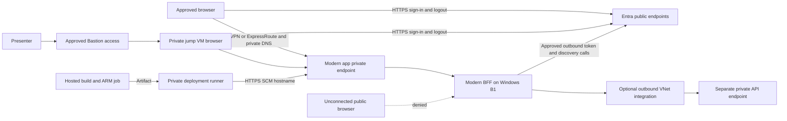

## Research Scope

Status: Complete for documentation and local-plan review. Live policy attribution and deployment validation remain unverified.

Review the primary remediation research against the user's clarification that Azure Policy disallows public access. Investigate Windows Basic B1 private endpoint support, per-app endpoints, application and SCM DNS, inbound versus outbound networking, browser and deployment access, OIDC redirects and logout, and runtime/authentication boundaries. All writes remain under .copilot-tracking/research/. No Azure mutations or application edits are authorized.

## Initial Evidence

The primary document is .copilot-tracking/research/2026-09-22/croesus-bff-oidc-remediation-research.md. The existing network report is .copilot-tracking/research/subagents/2026-09-22/croesus-codebase-and-403-research.md. Both describe prior read-only observations of disabled public ingress with no private endpoints, but incorrectly treat Azure Policy as conclusively excluded and recommend enabling public ingress.

Working hypothesis: private endpoints with correct DNS and client connectivity can restore an approved ingress path without weakening the policy constraint. The discriminating checks are official SKU/networking documentation and, in a later authorized implementation, private-path DNS/HTTPS checks alongside continued public-path rejection. This does not establish application authentication correctness.

## Applicable Instructions

* The user permits research writes only and prohibits restoring deleted research documents or spawning subagents.
* The cited .github/copilot-instructions.md is absent; it cannot be represented as loaded or followed.
* Supplied HVE Markdown instructions require YAML frontmatter, consistent heading levels, ASCII punctuation, fenced code languages, and consistent lists. A title frontmatter field means the body starts with H2.
* Supplied HVE writing instructions require precise, professional wording without em dashes, filler, or bold-prefix list items.
* Researcher mode requires progressive findings, evidence, unknowns, final review, and plain workspace-relative file references within research artifacts.
* Existing customer guardrails prohibit changing customer Conditional Access, allowlisting AWS IPs, or mandating OBO before registration and grant evidence is settled.

## Findings and Sources

### Policy constraint and the two different 403s

The user's clarification supersedes the earlier assertion that policy was excluded. Treat public access as prohibited. The prior network report supports a proximate explanation for browser failure: disabled default ingress and no configured private endpoint. It does not prove who disabled ingress or why. A resource-group-only inventory also cannot exclude shared network resources elsewhere.

Azure Policy Resource Manager-mode `deny` blocks a create/update request before it reaches the resource provider and returns a management-plane 403. It does not itself serve the web app's HTML 403 or retroactively rewrite an existing site setting. A separate `modify`/remediation action, deployment, or operator could have set that property. Obtain the actual error and effective policy evidence before attributing the actor or mechanism. [S6] [S7]

### Windows Basic B1 supports private endpoints

Microsoft's App Service private endpoint article explicitly lists Windows and Linux apps, containerized or not, on Basic plans. The retrieved article is dated 2026-09-17. B1 belongs to Basic: no Premium upgrade or App Service Environment is required solely for this feature. SKU eligibility does not establish quota, capacity, or effective-policy approval in this subscription. [S1]

A private endpoint connects to an individual app, not its shared App Service plan. Use the `sites` subresource for a production app. Two independently reachable apps require two endpoints, even on one B1 plan. Each app's application and SCM hostnames share that app's endpoint IP; SCM does not require an extra endpoint. Slots are configured separately and are not a B1 deployment strategy. [S1]

### DNS and routing

Retain the normal HTTPS hostnames and exact registered callback URLs. For each app, a private DNS zone group should manage these A records in the linked `privatelink.azurewebsites.net` zone:

| Record within the zone | Destination |
| --- | --- |
| `<app>` | That app's private endpoint IP |
| `<app>.scm` | The same private endpoint IP |

Clients use `<app>.azurewebsites.net` and `<app>.scm.azurewebsites.net`, not the private IP or `privatelink` hostname as a URL. That preserves TLS hostname validation, Host routing, and the OIDC redirect contract. A public CNAME alone does not produce private reachability: without private DNS resolution, requests can still reach the public service and return 403. [S1]

Reuse one centrally owned zone when available, with distinct record names for each app and links to client VNets. Peering alone does not propagate private DNS zone links. On-premises/VPN clients need the approved DNS forwarder or Private Resolver path; forward the recommended public service namespace (`azurewebsites.net`) toward Azure resolution rather than creating a broad private zone that shadows all public App Service names. Verify both application and SCM resolution on the actual browser and runner hosts. [S1] [S3]

Private endpoints provide inbound connectivity only. VNet integration provides application outbound connectivity only and does not fix browser ingress. It requires a separate delegated subnet from the private endpoint subnet. No integration is needed merely to receive a private request if approved default outbound access can reach Entra and public APIs. Add integration when the BFF must call a private API, private Key Vault/cache, or policy requires governed egress. The integration subnet must retain permitted DNS, identity, certificate-validation, API, and monitoring paths. [S1] [S2]

App Service IP access-restriction rules are not evaluated for private endpoint traffic. Do not present existing allow/deny rules as protection for the private path. Use approved subnet/network controls, with private-endpoint network-policy support configured where NSG enforcement is intended, plus application authorization. [S1] [S10]

### Deployment and control plane

The existing .github/workflows/classic-net-bff-poc.yml deploy job uses `runs-on: windows-latest` at line 275. Standard GitHub-hosted runners have public internet connectivity, not an automatic private route to this VNet. Successful GitHub OIDC login or Resource Manager provisioning does not demonstrate package-upload or browser-probe connectivity to SCM/application private endpoints. [S4] [S5] [S11]

Keep build/static validation on hosted runners. Execute package deployment and private-path checks on an approved self-hosted runner in a connected network, or a configured GitHub larger Windows runner with Azure private networking. The official GitHub documentation lists 2-64 vCPU Ubuntu/Windows larger runners, explicitly excludes standard runners for that feature, and lists Canada East among supported GitHub.com regions. Organization entitlement, network setup, available sizes, and capacity remain unverified. [S4] [S5]

Preserve short-lived OIDC deployment authentication and protected-environment approval. Private routing is additive to authentication, not a reason to enable basic publishing credentials or widen RBAC. Isolate any self-hosted runner from untrusted pull-request execution; give it only the required private targets and approved outbound GitHub/artifact/identity/management connectivity. [S5] [S11]

### Customer browser path

Prefer an existing approved VPN/ExpressRoute-connected client with correct DNS for direct customer testing. A new point-to-site VPN is an alternative if approved. A Bastion-accessed private Windows jump VM can host the browser for a presenter-led demonstration; Bastion provides RDP/SSH to the VM, not HTTP reverse proxying to App Service, and does not put the local desktop browser on the VNet. [S1] [S8]

Do not assume every Bastion deployment is allowed by a no-public-access policy: ordinary dedicated tiers use a public IP, while Premium supports private-only deployment and itself needs a private access path. Reuse existing approved access infrastructure before adding gateways, public IPs, or appliances. A jump-host sign-in uses the jump host's device/session/network context, not the customer's workstation context. It cannot stand in for a customer-device Conditional Access proof. [S8]

### OIDC callback and logout reachability

The browser follows Entra's authorization response to the registered HTTPS callback. Keep `/signin-oidc` on the normal app hostname. Private DNS and routing must work from that browser throughout sign-in; obtaining an Entra login page is not proof the return path works. The BFF separately needs outbound access to discovery, signing keys, and the token endpoint. Do not add a public callback route or a public-IP allowance for Entra. [S1] [S9]

Both post-logout navigation (typically `/signout-callback-oidc`) and remote front-channel logout (typically `/signout-oidc`) need browser-to-app reachability. Front-channel logout uses the user agent, commonly an iframe, rather than an Entra back-end call into the VNet. A disconnected VPN or blocked third-party cookie/iframe access can prevent local session cleanup. Test logout on the actual browser; retain local session invalidation and bounded lifetime, and never claim guaranteed global logout from a 302. [S9] [S13]

The shared registration is another limitation: Microsoft documents one front-channel logout URL per application registration. Multiple sign-in redirect URIs do not give both app origins independent remote logout callbacks. Prefer a dedicated registration for the supported reference BFF; if comparison apps retain the shared registration, document the single-sign-out limitation and test each local logout independently. [S9]

### Security boundaries that private ingress cannot repair

Private endpoints do not correct OAuth grants, client registrations, token storage, CSRF protection, session revocation, device compliance, Conditional Access, or Token Protection. They do not cryptographically bind bearer tokens. A private-path 302 proves only network reachability and challenge generation, not successful authentication, authorization, renewal, or CA satisfaction.

The primary plan's `SaveTokens = true` proposal conflicts with its strict server-side-token claim if it uses the default cookie ticket. `SaveTokens` puts tokens in AuthenticationProperties; default cookie authentication serializes the ticket into an encrypted client cookie. Encryption and HttpOnly prevent neither transmission of that ticket to the browser nor replay of a stolen session cookie. Require a server-side token cache or ticket store before asserting tokens stay server-side. `SessionStore` sends only a session identifier to the client. [S14] [S15]

Do not restore the `net452` package's reachability solely because it is private. .NET Framework 4.5.2 support ended on 2022-04-26. The earlier report says this package runs on installed Framework 4.8, which is distinct from actually running the retired 4.5.2 runtime; do not falsely label the current host runtime as 4.5.2. Nevertheless, the old-target comparison artifact is not the supported reference destination. Keep it unreachable until a supported target, dependencies, configuration, and runtime are validated. [S12]

This review does not certify the rest of the primary plan's sign-in-log joins or CA conclusions. In particular, a private path cannot substantiate its claims that device claims disappear, all four sign-in categories share one CorrelationId, two token identifiers prove OBO, or customer location/device requirements should change. Remove those guarantees pending identity-specific evidence; preserve the customer CA guardrail.

### Official references

* [S1: App Service private endpoints](https://learn.microsoft.com/en-us/azure/app-service/overview-private-endpoint), retrieved 2026-09-22: SKU support, inbound-only behavior, per-app/slot connection, app and SCM DNS, hostname/TLS requirements.
* [S2: App Service VNet integration](https://learn.microsoft.com/en-us/azure/app-service/overview-vnet-integration), retrieved 2026-09-22: outbound-only networking, Basic tier support, subnet and dependency requirements.
* [S3: Private endpoint DNS integration](https://learn.microsoft.com/en-us/azure/private-link/private-endpoint-dns-integration), retrieved 2026-09-22: linked zones, peered networks, hybrid DNS and resolver patterns.
* [S4: GitHub-hosted runner private networking](https://docs.github.com/en/actions/concepts/runners/private-networking), retrieved 2026-09-22: public default and explicit private-network alternatives.
* [S5: Azure private networking for GitHub organizations](https://docs.github.com/en/organizations/managing-organization-settings/about-azure-private-networking-for-github-hosted-runners-in-your-organization), retrieved 2026-09-22: larger-runner restriction, Windows support, Canada East, outbound and runner network controls.
* [S6: Azure Policy deny effect](https://learn.microsoft.com/en-us/azure/governance/policy/concepts/effect-deny), retrieved 2026-09-22: management-request evaluation versus existing-resource compliance.
* [S7: RequestDisallowedByPolicy](https://learn.microsoft.com/en-us/azure/azure-resource-manager/troubleshooting/error-policy-requestdisallowedbypolicy), retrieved 2026-09-22: assignment/definition evidence in deployment failures and policy-compatible remediation.
* [S8: Azure Bastion overview](https://learn.microsoft.com/en-us/azure/bastion/bastion-overview), retrieved 2026-09-22: VM access, browser RDP, tier and public-IP distinctions.
* [S9: Microsoft identity platform OIDC](https://learn.microsoft.com/en-us/entra/identity-platform/v2-protocols-oidc), retrieved 2026-09-22: redirect contract, discovery/token endpoints, logout and one front-channel logout URL per registration.
* [S10: App Service access restrictions](https://learn.microsoft.com/en-us/azure/app-service/overview-access-restrictions), retrieved 2026-09-22: default-endpoint access versus private-endpoint flow.
* [S11: Deploy App Service using GitHub Actions](https://learn.microsoft.com/en-us/azure/app-service/deploy-github-actions), retrieved 2026-09-22: OIDC deployment authentication and package deployment action.
* [S12: .NET Framework support policy](https://dotnet.microsoft.com/en-us/platform/support/policy/dotnet-framework), retrieved 2026-09-22: .NET Framework 4.5.2 support ended 2022-04-26.
* [S13: OpenID Connect Front-Channel Logout 1.0](https://openid.net/specs/openid-connect-frontchannel-1_0.html), retrieved 2026-09-22: user-agent iframe transport and third-party-content limitations.
* [S14: SaveTokens API](https://learn.microsoft.com/en-us/dotnet/api/microsoft.aspnetcore.authentication.remoteauthenticationoptions.savetokens?view=aspnetcore-10.0), retrieved 2026-09-22: token persistence in AuthenticationProperties and cookie-size consequences.
* [S15: Cookie SessionStore API](https://learn.microsoft.com/en-us/dotnet/api/microsoft.aspnetcore.authentication.cookies.cookieauthenticationoptions.sessionstore?view=aspnetcore-10.0), retrieved 2026-09-22: server-side ticket storage with only a session identifier sent to the client.

## Smallest Viable Private Deployment

Recommendation: restore the supported modern app first, retaining the Windows B1 plan and normal hostname. Keep the legacy comparison app's ingress closed pending uplift. This intentionally changes the original two-app restoration success criterion; the parent should obtain scope agreement before implementing that change.

1. Confirm the effective policy and the approved network/DNS owner. Reuse an existing connected VNet, private DNS zone, and deployment runner where available. Do not request a public-access exception or temporarily open SCM.
2. Keep public ingress explicitly disabled throughout deployment. Add one approved `sites` private endpoint for the modern app, its DNS zone group, and appropriate VNet links. The endpoint subnet need not be dedicated, but a named private-endpoint subnet helps enforce boundaries. Reserve separate subnets for runners and any later outbound integration.
3. Establish the browser path before scheduling the demonstration. Prefer an approved VPN-connected workstation for device-sensitive testing. For a presenter-only demo without that path, use an approved private jump VM through existing Bastion and label the changed client/device context.
4. Keep build/static jobs hosted. Run package upload to private SCM and private-path verification on an approved network-connected runner with protected-environment approval and short-lived OIDC credentials. Provisioning may remain on the hosted runner if its ARM access is allowed; successful provisioning is not the deployment acceptance test.
5. Verify permitted outbound Entra/API dependencies. Do not add VNet integration for ingress alone. If the downstream API is private, add its own endpoint/DNS and integrate the BFF with a different delegated subnet; sharing B1 does not create this outbound path.
6. Add a second endpoint only after the legacy app has a supported-target uplift and is approved to be reachable. A separately hosted third reference BFF needs its own endpoint too. Choosing to extend the existing modern app instead requires explicit scope agreement but avoids another app, endpoint, and registration lifecycle.

Minimal resource count with reusable access infrastructure: existing B1 and modern app, one private endpoint/NIC, a DNS zone group, zone records and necessary VNet links. If both supported comparison apps must be reachable, budget two endpoints, not one. If no reusable network/access infrastructure exists, the VNet, browser access path, DNS forwarding, runner compute, and explicit approved egress are additional requirements, not optional details.

No price estimate is asserted. Private Link, private DNS, runner compute, and any new VPN/Bastion/resolver/egress service have separate costs; compare the incremental cost against reusable infrastructure before provisioning. A B1 plan can support this POC but is not a production availability or isolation guarantee.

### Network topology

The app remains a multitenant App Service outside the customer VNet; the private endpoint NIC is inside it. All private clients use the normal app/SCM hostnames resolved through the approved private DNS path. Optional outbound integration uses a subnet different from the endpoint subnet.

### Alternatives

* Existing VPN or ExpressRoute plus self-hosted runner: smallest incremental option when already available; preserves real workstation context for browser tests.
* GitHub larger Windows runner with Azure private networking: avoids operating a persistent runner VM; requires organization setup, budget, permissions, and network governance. Canada East is documented as supported; availability is not yet measured.
* New point-to-site VPN plus approved private DNS resolution: suitable for direct individual testing when authorized, but adds gateway, DNS, routing, and client onboarding work.
* Existing Bastion plus private jump VM: suitable for presenter-led demonstration, not customer-workstation CA equivalence. Do not combine a customer browser workstation with an untrusted CI runner.
* Approved local supported-runtime demo: use when private Azure client/runner access cannot be obtained in time. It demonstrates BFF behavior but does not validate App Service private ingress or Azure policy compliance.

A public reverse proxy in front of a private origin is not selected. It changes the audience exposure boundary and needs explicit policy-owner approval; private origin connectivity alone does not make public application exposure acceptable. IP allowlisting, service endpoints alone, or outbound VNet integration alone do not replace private ingress under this constraint.

## Acceptance Gates for a Later Authorized Implementation

* Verify the effective policy permits the proposed resources and settings. Keep both existing apps' public access disabled, including during failure recovery.
* From the actual private runner and browser, resolve both normal app and SCM names to the intended private endpoint IP; validate route, HTTPS hostname, and certificate without disabling TLS checks.
* From an unconnected external client, verify the public application and SCM path remains inaccessible. DNS returning a public address is not by itself evidence of public application access.
* From the connected client, request `/signin` and assert the expected Entra authority, client ID, and exact HTTPS redirect URI in the challenge. A root-page 200 is not automatically a failure and a generic 302 is not enough.
* Deploy the package over private SCM with authorized credentials. An unauthenticated SCM 401 can prove a reachable endpoint but does not prove deployment success; a 403 requires network-versus-authorization diagnosis.
* Complete browser sign-in, callback, authorized API operation, local sign-out, post-logout callback, and front-channel logout. Test connected and disconnected-network behavior without changing CA to make the test pass.
* Validate server-side token/ticket storage, CSRF defenses, session invalidation, and bounded expiry separately. Capture only redacted evidence. Do not store authorization codes, cookies, tokens, or client credentials in research or workflow artifacts.
* Treat interactive MFA/device requirements as real prerequisites. Keep deterministic network/static checks in CI; perform the delegated interactive proof with an approved user/browser or explicitly report it unexecuted. GitHub workload OIDC login is not a substitute for user OIDC sign-in.

## Corrections to the Primary Research

The following replacements target .copilot-tracking/research/2026-09-22/croesus-bff-oidc-remediation-research.md as read in this review. Line numbers are anchors, not stable patch offsets. The primary document was not edited.

1. Critical, Scenario 1 Preferred Approach, around line 481: replace the public re-enable recommendation with: "Retain publicNetworkAccess Disabled. Restore approved ingress through an app-specific private endpoint, private DNS, and connected browser/deployment clients. Windows B1 supports this. Restore only supported deployment targets."
2. High, Scenario 1 cause and exclusions, around lines 483-493, and External Research line 164: replace "no network-related Azure Policy", "Nothing is enforcing publicNetworkAccess", and "configuration drift" with: "Prior reads observed disabled default ingress and no endpoint connection. Azure Policy is the user-confirmed constraint; its assignment/effect and the actor that wrote Disabled remain to be verified. App-path rejection and ARM policy denial are different mechanisms."
3. Critical, Scenario 1 Implementation Details, around lines 495-527: remove the two Enabled-property edits and public-enable mutation commands entirely. Replace with research-level resource requirements: Disabled ingress, endpoint per approved app, DNS zone groups/links, connected runner/browser access, and policy-compatible validation. Replace the diagram's Enabled branch with approved private endpoint routing.
4. High, Scope and Success Criteria around line 42: replace "Both POC App Services return ... 302 rather than 403" with: "Approved supported apps challenge correctly from the connected private path while public application and SCM access remains blocked. Legacy reachability requires a supported-target gate. Full user sign-in/logout is a separate acceptance test."
5. High, Potential Next Research around lines 62-64: replace the question of whether re-enabling is correct with: "Capture the effective policy assignment, definition/initiative member, scope, parameters, effect, exemptions, and relevant denied-operation evidence. Confirm approved VNet/DNS/browser/runner topology. Do not reopen public access."
6. High, Scenario 1 Considered Alternatives around line 537: promote private endpoints to the default and delete "zero demonstrative value" and the implication that B1 lacks private networking. Treat network/access cost as required compliance cost. Do not equate no VNet in this resource group with no reusable network elsewhere.
7. High, Scenario 1 Expected next failure: replace predicted secret-expiry error and the proposed full redeployment rationale with: "Verify credential expiry metadata and capture the actual redacted authentication error. Private connectivity can reveal an independent authentication failure; do not predict its code or recreate the stack without evidence."
8. High, Scenario 2 and implementation-pattern summary around lines 186, 555, and 630: replace the assertion that SaveTokens alone provides server-side retention with: "Use a server-side token cache or ticket store. Default cookie-persisted AuthenticationProperties are not server-only storage. Make this a security requirement rather than a response to large-cookie size."
9. High, registration section around line 295 and Scenario 2 diagram: add the actual browser private route for `/signin-oidc`, post-logout, and front-channel logout. Preserve normal HTTPS hostnames. Record that one shared registration has only one front-channel logout URL, and do not assume independent remote logout for both origins.
10. High, Scenario 5 around line 738: replace the universal no-human-browser requirement with separate deterministic CI network checks and approved interactive delegated-auth evidence. Add a private SCM/application runner preflight before package deploy; standard windows-latest is not VNet-connected. Keep OIDC authorization and private routing as distinct gates.
11. High, Scenario 4 around lines 709-728: do not use private networking to justify claims of device-claim disappearance, CA success, token binding, universal log joins, or replacing compliant-device requirements with location conditions. Replace with: "Networking, token custody, OAuth grant evidence, and tenant CA outcomes are separate checks. Maintain existing customer CA; reproduce and inspect actual results before claiming resolution."

The earlier network subagent report's headline remediation and H5 conclusion are superseded by this review. Do not restore or edit deleted reports; the parent can reference this correction from the primary document.

## Evidence Confidence and Limits

* High confidence: Windows Basic eligibility, inbound versus outbound split, app/SCM DNS requirements, hosted-runner private-network prerequisites, OIDC browser transport, and runtime retirement. Supported by current official documentation retrieved in this session.
* High confidence: the primary plan contains the contradictory recommendations quoted above, and its current deploy job uses standard windows-latest. Verified by local reads.
* Attributed prior evidence only: both sites' Disabled setting, empty endpoint connections, and prior HTTP 403. These were read from the earlier network report, not freshly queried.
* User-supplied constraint: Azure Policy disallows public access. Accepted as binding for the recommendation; the exact effective assignment/effect has not been independently verified.
* Unverified: current app state, policy scope, reusable network access, DNS ownership, regional capacity/quota, credentials, runner entitlements, package upload, complete login/logout, and CA outcomes. No deployment success or elimination of all application risks is claimed.

No live Azure calls or Azure CLI commands were made. This session exposes no callable `tool_search`, while the Azure best-practice, resource-query, and CLI-extension tools require that loader before use. Those prerequisites could not be loaded, so this review used local evidence and official web documentation without attempting Azure operations. The parent can use the required Azure tools in a session where they are available.

Editor diagnostics passed after the substantive findings update. The repository package script has no configured Markdown test; it only reports that no test is specified. No application tests are needed for this research-only artifact.

## Open Questions

The enforcing policy assignment, definition or initiative member, effective parameters, scope, effect, exemptions, and original denied operation have not been independently verified in this review.

### Recommended next research

* [ ] Obtain the existing redacted RequestDisallowedByPolicy/deployment-operation payload or Activity Log event, including assignment and definition IDs; do not induce a denied public-enable write.
* [ ] Inspect effective resource, resource-group, subscription, and management-group assignments, initiative members, parameterized effects, exclusions/exemptions, and assignment enforcement mode. Record authorization or pagination gaps rather than interpreting empty results as absence.
* [ ] Identify any modify/remediation record or deployment history that actually wrote Disabled; a deny assignment alone does not establish that actor.
* [ ] Check whether the policy also constrains private endpoint approval, DNS zone locations, VNet subnets, public IPs for access appliances, runner resources, or egress.
* [ ] Confirm the approved VNet, subnet capacity, DNS zone ownership/links, hybrid resolver path, and browser connection from the real intended test workstation.
* [ ] Confirm a private deployment-runner option and outbound dependencies without public SCM or publishing-authentication exceptions.
* [ ] Obtain identity-focused review of the primary plan's sign-in-log/CA assertions and validate the supported-runtime boundary before implementation.

### Clarifying questions for the parent

* Is modern-only private restoration acceptable until the legacy comparison has a supported-target uplift, or must both supported comparison apps be available in the same milestone?
* Which existing approved network path can the presenter, customer browser, and deployment runner use? Is the first demo presenter-led or direct customer-device testing?
* Can the policy owner supply the redacted denial event/assignment ID and confirm whether the prohibition concerns App Service public ingress only or all public infrastructure endpoints?
