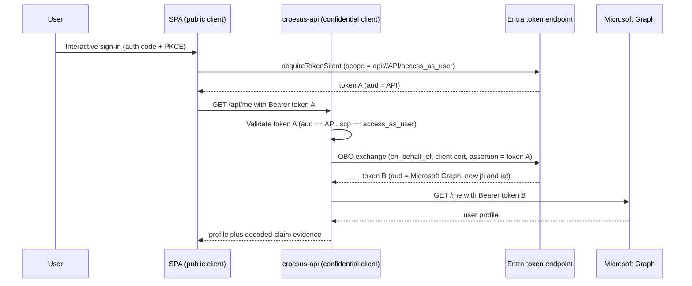

# Croesus / GPD Central — Entra App Registration & SSO Conditional Access Analysis

Analysis of the **Desjardins** "GPD Central" (Central GPD) integration with the **Croesus** SaaS platform. The work answers one customer question: the second, non-interactive sign-in arriving from the Croesus AWS backend — blocked by Conditional Access (CA) in non-prod — is this **expected OAuth behaviour** or a **misconfiguration**, and should the fix be **internal (Option A)** or **escalated to the vendor (Option B)**?

## Bottom line

- The **Conditional Access block is correct-by-design** (Zero Trust) — *not* a Desjardins misconfiguration.
- The second sign-in is driven by the **vendor's server-side SaaS design**, confirmed by raw sign-in logs to be a **token replay** (Token Protection "unbound", code 1008) to Microsoft Graph — **not** a standards-compliant Entra On-Behalf-Of (OBO) flow (the registrations have no secret, certificate, or exposed API scope).
- **Recommended path: Option B first** (escalate to Croesus for the authoritative flow definition + AWS egress IP ranges), then a **scoped Option A** internal accommodation — preferring Entra B2B "Trust compliant devices" to fix the cross-tenant root cause.

## Security findings

| ID | Severity | Finding |
| --- | --- | --- |
| V1 | High (design) | Token replay ("unbound" / Token Protection 1008) from an AWS IP carries compliant-device claims; in prod it is only flagged, not blocked. Remediation: enforce a token-binding CA control. |
| V2 | Medium | Tenant-boundary drift — a UAT/dev-named registration lives in the PROD tenant. |
| V3 | Low | dev-dev hygiene — implicit ID-token issuance enabled + an extra SiteMinder test redirect. |

Positive posture confirmed: no credentials on any registration, scoped HTTPS redirects, single-tenant, service-principal lock enabled.

## Deliverables

| Document | Purpose |
| --- | --- |
| [Analysis & findings report](assets/app-registration-analysis-findings.md) | Full analysis: verified registration matrix, naming reconciliation, security findings, determination, and Option A vs Option B recommendation. |
| [Croesus escalation packet](assets/croesus-escalation-packet.md) | Vendor questions and evidence requests to confirm the intended flow and AWS egress ranges. |
| [Verification guide](assets/app-registration-verification.md) | Operator-run commands to close evidence gaps (owners, admin-consent, tenant IDs, sign-in logs). |
| [Intent / scope notes](assets/app-registration-analysis.md) | Original analysis intent and the six comparison dimensions. |

## Source evidence

| Asset | Description |
| --- | --- |
| [dev-dev.txt](assets/dev-dev.txt) · [dev-prod.txt](assets/dev-prod.txt) · [prod-prod.txt](assets/prod-prod.txt) | Entra app-registration manifest exports for the three environments. |
| [Screenshots of app registrations.docx](assets/Screenshots%20of%20app%20registrations.docx) | 16 Azure Portal / sign-in-log screenshots from the 2026-05-29 session (readable). |
| [croesus_entra_oauth_integration_report_20260529_185237.pdf](assets/croesus_entra_oauth_integration_report_20260529_185237.pdf) | Vendor OAuth integration advisory (RMS-protected). |
| [non_prod_sso_conditional_access_report_20260529_180104.pdf](assets/non_prod_sso_conditional_access_report_20260529_180104.pdf) | Non-prod SSO Conditional Access report. |
| [PROD.docx](assets/PROD.docx) | Production reference document (RMS-protected). |

## Mock Croesus SaaS OBO demo

The analysis above concluded that the three production registrations cannot perform a standards-compliant On-Behalf-Of (OBO) exchange: they hold no credential and expose no API scope, so the second sign-in is a server-side token replay to Microsoft Graph. This demo builds the corrected shape end-to-end so we can show Desjardins exactly what a real OBO looks like and how to prove it.

We frame the demo as the vendor would: we are the Croesus vendor providing a setup guide, and Desjardins stands up the two app registrations in their own tenant.

### Architecture

A React single-page application (SPA) signs the user in and requests a token for the API scope only. The ASP.NET Core middle-tier API validates that token, performs the OBO exchange to acquire a separate Microsoft Graph token, and calls `GET /me`. The SPA never asks for a Graph scope, which forces the OBO boundary to exist.



### Wrong versus right

The broken baseline in [assets/app-registration-analysis-findings.md](assets/app-registration-analysis-findings.md) reuses the user's token directly against Graph: one token, one audience, no credential, no API scope. The live demo now shows both sides of that boundary. The good path proves OBO succeeds with distinct audiences, distinct `jti` values, and a confidential middle tier. The safe bad path replays the API token to Graph and shows Graph returning `401`. That UI rejection demonstrates audience enforcement; it does not claim the mock emits the customer's Token Protection 1008 signal.

| Property | Broken baseline (replay) | Corrected demo (OBO) |
| --- | --- | --- |
| Tokens involved | One user token reused | Two tokens, leg 1 and leg 2 |
| Second-leg audience (`aud`) | Microsoft Graph (same token) | Microsoft Graph (freshly issued) |
| Middle-tier credential | None | Certificate in Key Vault |
| Exposed API scope | None | `access_as_user` |
| `jti` across legs | Identical (replay) | Distinct (new issuance) |

### Prerequisites

- An Azure subscription and a single Microsoft Entra tenant where you can create app registrations and grant admin consent.
- The Azure CLI signed in to that tenant.
- A GitHub repository with the deploy federated-identity and configuration variables described in [docs/configuration-contract.md](docs/configuration-contract.md).

### Provision

Create the two single-tenant app registrations and capture their identifiers with the provisioning script:

```bash
./scripts/provision-app-registrations.sh
```

Store the script's outputs as the GitHub Actions repository variables listed in [docs/configuration-contract.md](docs/configuration-contract.md). The API certificate lives only in Key Vault and never enters the repository or the workflow.

### Deploy

The [.github/workflows/deploy-croesus.yml](.github/workflows/deploy-croesus.yml) workflow authenticates to Azure with an OpenID Connect federated credential (no deploy secret), provisions the infrastructure from [infra/main.bicep](infra/main.bicep), and deploys the [spa/](spa/) and [api/](api/) projects to two App Service Web Apps. A post-deploy evidence job runs the smoke test and the gated negative tests and writes the proof to the run summary.

### Read the evidence

The API logs decoded claims (never raw tokens) to Application Insights for both legs: leg 1 shows `aud == API`, leg 2 shows `aud == Microsoft Graph` with a new `jti` and `iat`. The Entra non-interactive sign-in logs in [scripts/evidence-kql.kusto](scripts/evidence-kql.kusto) corroborate the two correlated legs. Together they prove the second token is freshly issued, not a relay of the first.

For the full walk-through and the question-by-question proof, see the demo guide and the evidence narrative.

| Document | Purpose |
| --- | --- |
| [docs/obo-demo-guide.md](docs/obo-demo-guide.md) | Provision, deploy, exercise the flow, and interpret the evidence. |
| [docs/evidence-narrative.md](docs/evidence-narrative.md) | Maps the escalation-packet questions to the demo's concrete evidence. |
| [docs/configuration-contract.md](docs/configuration-contract.md) | Authoritative catalog of every configuration value the demo consumes. |
