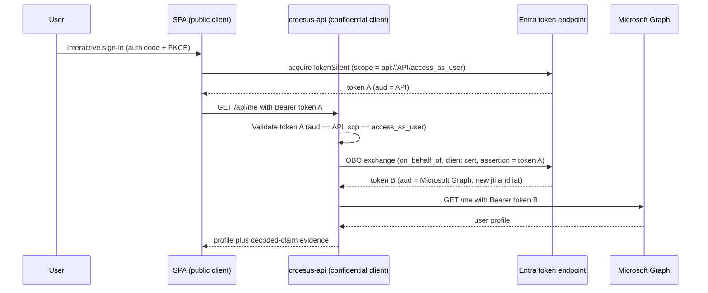

# Croesus / GPD Central — Entra App Registration & SSO Conditional Access Analysis

Analysis of the **Desjardins** "GPD Central" (Central GPD) integration with the **Croesus** SaaS platform. The work answers one customer question: the second, non-interactive sign-in arriving from the Croesus AWS backend — blocked by Conditional Access (CA) in non-prod — is this **expected OAuth behaviour** or a **misconfiguration**, and should the fix be **internal (Option A)** or **escalated to the vendor (Option B)**?

## Bottom line

- The **Conditional Access block is correct-by-design** (Zero Trust) — *not* a Desjardins misconfiguration.
- The second sign-in is driven by the **vendor's server-side SaaS design**, confirmed by raw sign-in logs to be a **token replay** (Token Protection "unbound", code 1008) to Microsoft Graph — **not** a standards-compliant Entra On-Behalf-Of (OBO) flow (the registrations have no secret, certificate, or exposed API scope).
- **Recommended path: Option B first** (escalate to Croesus for the authoritative flow definition + AWS egress IP ranges), then a **scoped Option A** internal accommodation — preferring Entra B2B "Trust compliant devices" to fix the cross-tenant root cause.

## Security findings

| ID | Severity | Finding |
| --- | --- | --- |
| V1 | High (design) | Token replay ("unbound" / Token Protection 1008) from an AWS IP carries compliant-device claims; in prod it is only flagged, not blocked. Remediation: enforce a token-binding CA control. |
| V2 | Medium | Tenant-boundary drift — a UAT/dev-named registration lives in the PROD tenant. |
| V3 | Low | dev-dev hygiene — implicit ID-token issuance enabled + an extra SiteMinder test redirect. |

Positive posture confirmed: no credentials on any registration, scoped HTTPS redirects, single-tenant, service-principal lock enabled.

## Deliverables

| Document | Purpose |
| --- | --- |
| [Analysis & findings report](assets/app-registration-analysis-findings.md) | Full analysis: verified registration matrix, naming reconciliation, security findings, determination, and Option A vs Option B recommendation. |
| [Croesus escalation packet](assets/croesus-escalation-packet.md) | Vendor questions and evidence requests to confirm the intended flow and AWS egress ranges. |
| [Verification guide](assets/app-registration-verification.md) | Operator-run commands to close evidence gaps (owners, admin-consent, tenant IDs, sign-in logs). |
| [Intent / scope notes](assets/app-registration-analysis.md) | Original analysis intent and the six comparison dimensions. |

## Source evidence

| Asset | Description |
| --- | --- |
| [dev-dev.txt](assets/dev-dev.txt) · [dev-prod.txt](assets/dev-prod.txt) · [prod-prod.txt](assets/prod-prod.txt) | Entra app-registration manifest exports for the three environments. |
| [Screenshots of app registrations.docx](assets/Screenshots%20of%20app%20registrations.docx) | 16 Azure Portal / sign-in-log screenshots from the 2026-05-29 session (readable). |
| [croesus_entra_oauth_integration_report_20260529_185237.pdf](assets/croesus_entra_oauth_integration_report_20260529_185237.pdf) | Vendor OAuth integration advisory (RMS-protected). |
| [non_prod_sso_conditional_access_report_20260529_180104.pdf](assets/non_prod_sso_conditional_access_report_20260529_180104.pdf) | Non-prod SSO Conditional Access report. |
| [PROD.docx](assets/PROD.docx) | Production reference document (RMS-protected). |

## Mock Croesus SaaS OBO demo

The analysis above concluded that the three production registrations cannot perform a standards-compliant On-Behalf-Of (OBO) exchange: they hold no credential and expose no API scope, so the second sign-in is a server-side token replay to Microsoft Graph. This demo builds the corrected shape end-to-end so we can show Desjardins exactly what a real OBO looks like and how to prove it.

We frame the demo as the vendor would: we are the Croesus vendor providing a setup guide, and Desjardins stands up the two app registrations in their own tenant.

### Architecture

A React single-page application (SPA) signs the user in and requests a token for the API scope only. The ASP.NET Core middle-tier API validates that token, performs the OBO exchange to acquire a separate Microsoft Graph token, and calls `GET /me`. The SPA never asks for a Graph scope, which forces the OBO boundary to exist.



### Wrong versus right

The broken baseline in [assets/app-registration-analysis-findings.md](assets/app-registration-analysis-findings.md) reuses the user's token directly against Graph: one token, one audience, no credential, no API scope. The live demo now shows both sides of that boundary. The good path proves OBO succeeds with distinct audiences, distinct `jti` values, and a confidential middle tier. The safe bad path replays the API token to Graph and shows Graph returning `401`. That UI rejection demonstrates audience enforcement; it does not claim the mock emits the customer's Token Protection 1008 signal.

| Property | Broken baseline (replay) | Corrected demo (OBO) |
| --- | --- | --- |
| Tokens involved | One user token reused | Two tokens, leg 1 and leg 2 |
| Second-leg audience (`aud`) | Microsoft Graph (same token) | Microsoft Graph (freshly issued) |
| Middle-tier credential | None | Certificate in Key Vault |
| Exposed API scope | None | `access_as_user` |
| `jti` across legs | Identical (replay) | Distinct (new issuance) |

### App registration comparison: mock versus real

The demo runs two registrations precisely because the three real Croesus registrations lack the pieces a standards OBO needs. The real environments (`dev-dev`, `dev-prod`, `prod-prod`) share one minimal SPA-only shape; the mock splits the work into a public SPA and a credentialed API.

| Field | Mock SPA | Mock API | Real SPA (all three environments) |
| --- | --- | --- | --- |
| Role in flow | Public client (front end) | Confidential middle tier | Single SPA, no middle tier |
| signInAudience | AzureADMyOrg | AzureADMyOrg | AzureADMyOrg |
| Platform | SPA (auth code + PKCE) | API / daemon | SPA |
| Client secret | None | None | None |
| Certificate | None | Self-signed cert in Key Vault | None |
| Exposed API scope | None | `access_as_user` | None |
| Application ID URI | None | `api://<api-client-id>` | None |
| Pre-authorized client | n/a | Mock SPA | None |
| Graph permissions | None (requests the API scope) | `User.Read` (delegated) | `User.Read` (delegated) |
| Performs standards OBO | No (by design) | Yes (the middle tier) | No (cannot) |

The decisive row is the credentialed API that exposes a scope: the mock has it, none of the three real registrations do. That single difference is why the real second hop can only be a replayed user token, while the mock mints a fresh, audience-bound token B. See [assets/app-registration-analysis-findings.md](assets/app-registration-analysis-findings.md#verified-comparison) for the full real-registration matrix.

### Prerequisites

- An Azure subscription and a single Microsoft Entra tenant where you can create app registrations and grant admin consent.
- The Azure CLI signed in to that tenant.
- A GitHub repository with the deploy federated-identity and configuration variables described in [docs/configuration-contract.md](docs/configuration-contract.md).

### Provision

Create the two single-tenant app registrations and capture their identifiers with the provisioning script:

```bash
./scripts/provision-app-registrations.sh
```

Store the script's outputs as the GitHub Actions repository variables listed in [docs/configuration-contract.md](docs/configuration-contract.md). The API certificate lives only in Key Vault and never enters the repository or the workflow.

### Deploy

The [.github/workflows/deploy-croesus.yml](.github/workflows/deploy-croesus.yml) workflow authenticates to Azure with an OpenID Connect federated credential (no deploy secret), provisions the infrastructure from [infra/main.bicep](infra/main.bicep), and deploys the [spa/](spa/) and [api/](api/) projects to two App Service Web Apps. A post-deploy evidence job runs the smoke test and the gated negative tests and writes the proof to the run summary.

### Read the evidence

The API logs decoded claims (never raw tokens) to Application Insights for both legs: leg 1 shows `aud == API`, leg 2 shows `aud == Microsoft Graph` with a new `jti` and `iat`. The Entra non-interactive sign-in logs in [scripts/evidence-kql.kusto](scripts/evidence-kql.kusto) corroborate the two correlated legs. Together they prove the second token is freshly issued, not a relay of the first.

For the full walk-through and the question-by-question proof, see the demo guide and the evidence narrative.

| Document | Purpose |
| --- | --- |
| [docs/obo-demo-guide.md](docs/obo-demo-guide.md) | Provision, deploy, exercise the flow, and interpret the evidence. |
| [docs/evidence-narrative.md](docs/evidence-narrative.md) | Maps the escalation-packet questions to the demo's concrete evidence. |
| [docs/configuration-contract.md](docs/configuration-contract.md) | Authoritative catalog of every configuration value the demo consumes. |

## Tier 2 replay lab

The live demo ships in three clearly-labeled tiers so the wrong and right flows sit side by side. All Tier 2 behaviour is gated off by default and fully reversible.

- Tier 1 (always on, no tenant changes): a client-only negative control replays the API-audienced token to Microsoft Graph and shows the expected `401` audience rejection. It proves audience binding without introducing any vulnerability.
- Tier 2a (gated): the SPA acquires a real Microsoft Graph token and forwards it to `POST /api/replay`; the API replays that same token to Graph from server-side context and emits a distinct `ReplayAttempt` Application Insights event. This reproduces the server-side replay shape the sign-in logs attribute to the Croesus AWS backend, with no fresh token issuance.
- Tier 2b (gated): a report-only Conditional Access Token Protection policy scoped to a native client and a supported resource (Exchange Online) surfaces the real Token Protection `1008` "unbound" status in the non-interactive sign-in logs.

Tier 2b produces the literal `1008` value that Tier 2a cannot. That value is a Conditional Access sign-in-log signal, not an HTTP response, and it evaluates only for native-app clients reaching Exchange Online, SharePoint Online, or Teams (see the licensing section). Tier 2a reproduces the replay mechanics; Tier 2b reproduces the telemetry.

### What a real OBO needs that the replay lacks

The corrected demo closes five gaps the broken baseline leaves open. A standards OBO requires all five; the replay has none of them.

- A confidential-client credential on the middle tier (a certificate in Key Vault), so the backend can authenticate its own token request.
- An exposed API scope (`access_as_user`) on the middle-tier registration, so the SPA can request a token whose audience is the API rather than Graph.
- A distinct leg-2 audience, minted by the OBO exchange as a new token with `aud = Microsoft Graph` rather than the API-audienced leg-1 token.
- A fresh `jti` and `iat` on the leg-2 token, proving new issuance rather than a relay of the same token.
- Pre-authorization of the SPA on the API plus resource-side reject-the-token behaviour, so a token minted for one audience cannot be redeemed against another.

### Gates and reversible teardown

Two feature gates keep Tier 2 off unless a lab explicitly enables it: `Demo:EnableReplay` on the API (the replay endpoint is only mapped when true) and `VITE_ENABLE_REPLAY_DEMO` on the SPA (the replay control only renders when true). Both default to false. The deploy workflow's manually approved `replay-lab` job provisions the policy, sets the live gate, and runs the Tier 2 evidence in one gated pass; it never runs on the default path.

Every Tier 2 change reverses cleanly:

- [scripts/provision-ca-policy.sh](scripts/provision-ca-policy.sh) creates the report-only policy; [scripts/teardown-ca-policy.sh](scripts/teardown-ca-policy.sh) deletes it by recorded id, with a `croesus-demo-` prefix sweep as a fallback.
- The extended [scripts/teardown-app-registrations.sh](scripts/teardown-app-registrations.sh) also revokes the SPA-to-Graph delegated grant, resets the live `Demo__EnableReplay` setting to false, and removes the `replay-lab` federated credential from the deploy identity.
- [scripts/verify-clean.sh](scripts/verify-clean.sh) is read-only and exits non-zero if any residue remains, so it can gate a "the tenant is clean" claim.

The `replay-lab` GitHub environment is a repository-side object with no secrets and no tenant effect, so the teardown scripts intentionally retain it as durable lab infrastructure. Remove it manually under Settings, then Environments if you want the repository returned to its exact prior state. The full end-to-end walk-through lives in [docs/obo-demo-guide.md](docs/obo-demo-guide.md).

## Entra ID licensing for the Tier 2 replay lab

Two distinct capabilities carry different licensing requirements, and the earlier working assumption that Token Protection needs P2 was wrong.

- Reading the `1008` "unbound" status from sign-in logs is telemetry available with Entra ID P1 (or P2) sign-in logs.
- Configuring token protection, the Conditional Access session control **Require token protection for sign-in sessions** (preview), requires **Microsoft Entra ID P1**, not P2. The [Token Protection deployment guide](https://learn.microsoft.com/en-us/entra/identity/conditional-access/deployment-guide-token-protection-windows) states the feature requires P1 licenses. P2 (Identity Protection and risk-based Conditional Access) is a separate set of controls and is not required for this exhibit.

Tenant findings (`MngEnvMCAP675646.onmicrosoft.com`, queried 2026-06-30 via Microsoft Graph `subscribedSkus`):

| Service plan | Capability | Provisioning status |
| --- | --- | --- |
| `AAD_PREMIUM_P2` | Microsoft Entra ID P2 (Identity Protection, risk-based Conditional Access) | Success |
| `AAD_PREMIUM` | Microsoft Entra ID P1 (Conditional Access, Token Protection, sign-in logs) | Success |
| `MFA_PREMIUM` | Multifactor authentication | Success |

These plans are delivered by the `Microsoft_365_E5_(no_Teams)` SKU (5 seats, 2 consumed), so additional seats are available for lab service accounts.

Conclusion and caveat:

- Licensing is present. Entra ID P1 is provisioned, so the report-only Token Protection policy and sign-in-log inspection are both available to the lab.
- Feature coverage is scoped by design. "Require token protection for sign-in sessions" enforces only for native applications reaching Exchange Online, SharePoint Online, or Teams, not for browser or SPA calls to Microsoft Graph. Tier 2b therefore points its exhibit at a supported resource to surface the `1008` signal; the SPA-to-API-to-Graph OBO path never emits it, and that boundary is a documented platform limit rather than a demo gap.
