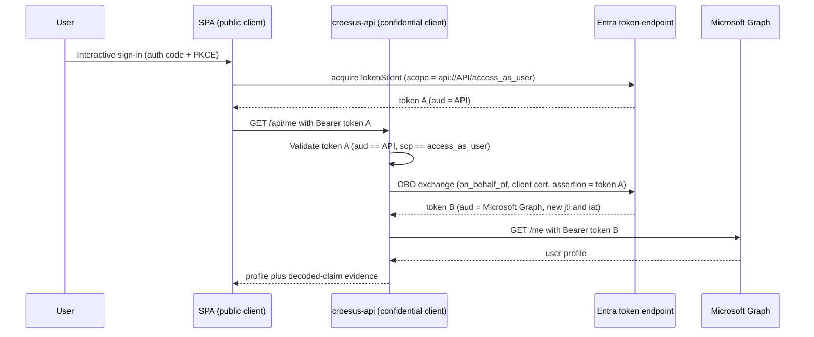

# Croesus / GPD Central — Entra App Registration & SSO Conditional Access Analysis

There are two entry points. For the running proof of the Backend-for-Frontend shape, follow the walkthrough immediately below. For the findings, the open questions, and the nine remediation routes, jump to [Three-way session findings and available routes](assets/croesus-3way-session-findings.md).

## Live BFF demonstration: every step and what it proves

Q8 and Q15 both turn on a single question: does the browser ever hold an OAuth token, or does a backend redeem the code, retain the tokens, and mediate every downstream call? Croesus asserts the second shape. Rather than argue the shape in the abstract, this repository deploys a working instance of it and produces evidence from two independent vantage points.

> [!TIP]
> **Screenshot walkthrough:** the [BFF demo walkthrough on the wiki](https://github.com/devopsabcs-engineering/croesus/wiki/BFF-Demo-Walkthrough) shows every step below with screenshots of the Azure resources, both Entra app registrations, the App Service settings, the sign-in, and the Azure Monitor telemetry. Background reading: [Backends for Frontends pattern - Azure Architecture Center](https://learn.microsoft.com/en-us/azure/architecture/patterns/backends-for-frontends) and [Secure an ASP.NET Core Blazor Web App with OpenID Connect (OIDC)](https://learn.microsoft.com/en-us/aspnet/core/blazor/security/blazor-web-app-with-oidc?view=aspnetcore-10.0&pivots=with-yarp-and-aspire).

Every step below has been executed against live Microsoft Entra in the PoC tenant `MngEnvMCAP675646`. The negative controls are part of the demonstration, not an afterthought: an assertion that survives only because nothing was ever tested is not evidence.

### What is deployed

Four Windows App Service sites sit in the resource group `croesus-bff-poc-rg` (Canada East), behind one B1 plan.

| Site | Target framework | Role in the demonstration |
|------|------------------|---------------------------|
| `croesus-bff-a3v24wppuvd34-bff` | .NET 10 | The Backend-for-Frontend. Holds the session, redeems the code, acquires and forwards downstream tokens through YARP. |
| `croesus-bff-a3v24wppuvd34-api` | .NET 10 | The owned downstream API. Validates audience and delegated scope independently of the proxy. |
| `croesus-bff-a3v24wppuvd34-modern` | .NET 10 | The supported destination half of the R8/R9 comparison. |
| `croesus-bff-a3v24wppuvd34-legacy` | .NET Framework 4.8 | The classic half of the comparison, standing in for GPD Central's reported 4.5.2 stack. |

Two app registrations carry the flow. The web client `3ee7b866-1d40-4746-a880-f7fda6d2d53e` is a confidential `web` registration holding a client secret that never leaves the server. The resource registration `7c2e2d88-88c1-4c3a-a317-5eac41200a80` publishes `api://7c2e2d88-88c1-4c3a-a317-5eac41200a80/access_as_user`, issues v2 access tokens, and pre-authorizes only the web client.

### Step 1. Load the BFF root anonymously

Browse to `https://croesus-bff-a3v24wppuvd34-bff.azurewebsites.net/`.

The page returns HTTP 200 without a sign-in redirect. A BFF that redirects every anonymous byte to the identity provider cannot serve a landing page, and cannot be told apart from a broken one. This establishes the baseline that the site is healthy before any authentication assertion is made.

### Step 2. Call the protected API path without a session

```powershell
Invoke-WebRequest -Uri 'https://croesus-bff-a3v24wppuvd34-bff.azurewebsites.net/api/profile' -SkipHttpErrorCheck
```

The response is HTTP 401 carrying a bounded JSON body that names `interaction_required`. It is not a 302 to `login.microsoftonline.com`.

This is a deliberate design decision with a visible cost. The application sets the cookie scheme as its default challenge, so an unauthenticated `fetch` receives a machine-readable refusal instead of an HTML sign-in page rendered into a JSON parser. That same decision caused a production defect later in this walkthrough, which is recorded rather than hidden.

### Step 3. Call the owned API directly, with no token at all

```powershell
Invoke-WebRequest -Uri 'https://croesus-bff-a3v24wppuvd34-api.azurewebsites.net/api/profile' -SkipHttpErrorCheck
```

The response is HTTP 401 from the API itself.

This is the first negative control. The API is independently protected, not merely hidden behind the proxy. Without this step, a successful proxied call would prove only that the proxy forwards traffic, and nothing about whether the downstream resource enforces anything.

### Step 4. Sign in

Browse to `https://croesus-bff-a3v24wppuvd34-bff.azurewebsites.net/bff/login`.

The redirect to Entra carries `response_type=code`, `response_mode=form_post`, PKCE, and a single-tenant authority. The authorization code and its downstream scopes return in the request body rather than the URL.

That response mode is not cosmetic. IIS rejects any query string longer than 2048 bytes with HTTP 404.15 and a 103-byte stock body, before .NET sees the request at all. An authorization code carrying custom API scopes crosses that limit, so query-mode callbacks failed at interactive sign-in while every synthetic test stayed green. A regression test now pins the mode so a revert fails in the suite instead of in the browser.

The request also asks for the `amr` and `auth_time` optional claims, which is what lets the evidence surface later report how the user authenticated rather than merely that they did. Asking is necessary and not sufficient. The ASP.NET Core inbound claim type map renames `amr` to a SOAP-era URI before anything reads it, and `OpenIdConnectOptions.MapInboundClaims` never reaches the token handler Microsoft.Identity.Web installs. The application clears both static maps at startup so every claim arrives under the name the issuer wrote.

### Step 5. Inspect what the browser received

After the callback completes, the browser holds one cookie: `__Host-Croesus.BffYarp.Session`. It is `HttpOnly`, `Secure`, `SameSite=Lax`, host-prefixed, and its value is an opaque key into a server-side ticket store. No access token, refresh token, or ID token is present in the cookie, in `localStorage`, or anywhere reachable by JavaScript.

This is the claim Q15 asks Croesus to substantiate, made observable.

### Step 6. Call the API path again, now with a session

Reload `https://croesus-bff-a3v24wppuvd34-bff.azurewebsites.net/api/profile`.

The request crosses `ProxyBoundaryMiddleware`, which runs five checks in order before anything is forwarded: the path must be a guarded route, the method must be on the allowlist or the response is 405, the caller must be authenticated or the response is a bounded interaction-required result, a state-changing method must carry a valid antiforgery token or the response is 400, and a delegated access token must be acquired successfully or the response is 502 with nothing forwarded. Only then does YARP forward the request, and only to an origin on the destination allowlist.

The token acquisition names the OpenID Connect scheme explicitly. Leaving it unnamed makes Microsoft.Identity.Web resolve the application's default scheme, which here is `Cookies`, find no Entra options registered under it, and throw `IDW10503` at request time. That defect reached production because the token acquisition test double accepted any scheme, including none. The double now refuses an unnamed scheme, so the same mistake fails in the suite.

### Step 7. Read what the API says about the call

```json
{
  "audience": "7c2e2d88-88c1-4c3a-a317-5eac41200a80",
  "issuer": "https://login.microsoftonline.com/aa93b9d9-037d-4f08-a26d-783cff0e2369/v2.0",
  "tenantId": "aa93b9d9-037d-4f08-a26d-783cff0e2369",
  "subjectObjectId": "b785230a-4af4-418a-acd9-aea99894d37a",
  "callingApplicationId": "3ee7b866-1d40-4746-a880-f7fda6d2d53e",
  "scopes": [
    "access_as_user"
  ],
  "receivedCookie": false
}
```

This payload is the centre of the demonstration. Each field answers a different question.

| Field | What it establishes |
|-------|---------------------|
| `audience` | The token was minted for the owned API, not for Microsoft Graph and not for the web application. The audience boundary is real, not asserted. It is the bare client ID because the resource requests v2 access tokens; a v1 token would carry the `api://` URI instead. |
| `issuer` | The v2.0 endpoint of the expected tenant, so the authority is the intended one. |
| `callingApplicationId` | The `azp` claim, showing the API exactly which application called it. A second client could not impersonate the first. |
| `scopes` | A delegated custom scope, not `.default` and not an application permission. The call carries user context. |
| `receivedCookie` | The headline. The browser's session cookie did not reach the API. The BFF terminated it and minted a fresh bearer token for the hop. |

The last row is what separates a genuine Backend-for-Frontend from a reverse proxy that merely relays browser credentials downstream.

### Step 8. Read what the BFF says about the same call

Load `https://croesus-bff-a3v24wppuvd34-bff.azurewebsites.net/bff/evidence`.

The BFF reports its own account: token custody and the detail behind it, the session cookie's hardening flags as actually configured rather than as intended, the authentication method and time drawn from `amr` and `auth_time`, the granted delegated scopes, and one sanitized record per token acquisition carrying resource, granted scopes, token source, expiry, and outcome.

Order matters here. Acquisition records are held per session inside the running process, so `Granted delegated scopes` reads `none recorded` and `Acquisition operations` reads `0` until a proxied call has actually acquired a token. Run step 6 first, then load this page. A deployment restarts the process, which issues a new `Application run` value and empties the records, so a fresh run identifier next to a zero count means the counters were reset rather than that the acquisition failed.

The surface is an allowlist, not a claims dump. It deliberately omits access tokens, refresh tokens, authorization codes, client secrets, ID token fragments, and cookie values. It also declines to claim an On-Behalf-Of exchange, because this application performs none.

Steps 7 and 8 matter jointly. The API's account and the BFF's account are produced by separate processes with separate code paths, and they agree.

### Step 9. Sign out

Post to `/bff/logout` with a valid antiforgery token, obtainable from `/bff/antiforgery`.

The server-side ticket is destroyed, so the previously captured cookie stops working even though the browser still holds the same bytes. Session lifetime is a server decision, not a client one.

### Step 10. Observe the run in telemetry

All four sites report to the workspace-based Application Insights component `croesus-bff-poc-ai`.

```powershell
$wsid = az monitor log-analytics workspace show -g croesus-bff-poc-rg -n croesus-bff-poc-law --query customerId -o tsv
az monitor log-analytics query -w $wsid --analytics-query "union AppRequests,AppTraces,AppDependencies,AppExceptions | where TimeGenerated > ago(30m) | summarize n=count(), lastSeen=max(TimeGenerated) by Type, AppRoleName" -o table
```

Query the Log Analytics workspace directly. A workspace-based component returns no rows from `az monitor app-insights query`, which reads as an absence of telemetry when the real cause is the wrong query target. Two metric alert rules now fire on failed requests and server-side exceptions, because every ingress check in this repository once passed against a site that was returning HTTP 500.

### What this demonstrates for GPD Central

The deployment establishes that a confidential `web` registration, a server-held token cache, an opaque session cookie, and a proxied delegated call to a custom API compose into a working system on supported .NET, and that the resulting shape is externally observable. If GPD Central's AWS backend redeems the code and retains tokens as Croesus reports, this is the registration shape that matches it, and these are the artifacts that would settle Q8 and Q15 without access to Croesus source code.

The comparison pair matters separately. The .NET Framework 4.8 site and the .NET 10 site exist so the R8/R9 discussion has a running reference on both sides rather than a projection.

### What it does not demonstrate

Setting limits is part of the evidence discipline used throughout this repository.

* No On-Behalf-Of exchange occurs anywhere in this system, and none is claimed. The BFF acquires a delegated token for the owned API directly.
* The PoC tenant is not the customer tenant. Nothing here changes Desjardins Conditional Access, and the guardrail below still stands.
* The distributed cache is in-process. Sessions and the token cache do not currently span instances, which is why the configuration validator refuses to start outside Development or PoC without Redis. The Data Protection key ring is persisted to App Service storage, so it is no longer the weaker half of that pair.
* The synthetic protocol tests replace Microsoft.Identity.Web's own code redemption, so they exercise state, correlation, nonce, and callback replay, and they are not evidence about Entra's single-use enforcement of an authorization code.
* Three production defects in a row, the IIS query-string rejection, `IDW10503`, and a DPAPI key ring encryption failure, were invisible to a suite built entirely on test doubles. Each now has regression coverage or a deployment-time check, and the pattern is the reason live execution is treated as mandatory rather than confirmatory.
* A fourth defect was worse than invisible. The suite asserted that inbound claim mapping was disabled and passed, while the rename that setting was meant to prevent ran anyway and left the evidence surface reporting the authentication method as absent. The assertion now targets the static claim type maps, which is what governs the behaviour.

### Reproduce it

```powershell
pwsh scripts/provision-classic-net-bff-poc.ps1
dotnet test poc/bff-yarp-net10/Tests/Croesus.BffYarp.Tests.csproj
dotnet test poc/owned-api-net10/Tests/Croesus.OwnedApi.Tests.csproj
```

The publish runtime identifier is pinned in the project files, so a Windows ARM64 developer machine cannot produce a package the x64 App Service worker refuses to load.

```powershell
dotnet publish poc/bff-yarp-net10/Croesus.BffYarp.csproj -c Release -o publish
```

Verify the deployment afterwards. The BFF challenges at `/bff/login` rather than at its root, so the challenge path is explicit.

```powershell
pwsh scripts/verify-ingress.ps1 `
  -ResourceGroupName croesus-bff-poc-rg `
  -AppName croesus-bff-a3v24wppuvd34-bff `
  -ExpectedClientId 3ee7b866-1d40-4746-a880-f7fda6d2d53e `
  -ChallengePath /bff/login
```

The verifier separates DNS, routing, authorization, challenge shape, ingress posture, and application liveness, because those six failures otherwise present identically to an operator. The liveness assertion exists because a deployment can report success while every request faults, and that exact condition occurred during this work: enabling the persisted key ring against a stale build turned on DPAPI encryption, which fails on an App Service worker with no loaded user profile, and the site returned HTTP 500 on `/bff/login` while every ingress check still passed.

The [classic .NET BFF PoC guide](docs/classic-net-bff-poc.md) carries the full provisioning, teardown, and configuration contract, and [the configuration contract](docs/configuration-contract.md) enumerates every app setting the BFF and the owned API read.

## ➤ Start here: [Three-way session findings and available routes](assets/croesus-3way-session-findings.md)

> [!IMPORTANT]
> **That document is the core artifact and it is self-contained.** It carries every finding established with Croesus and Desjardins, what each one changed, what remains open and who owns it, and all nine remediation routes with their size, owner, and durability. Read it alone and you are current.
>
> **Scope: GPD Central only. Conseiller is a separate product and a separate assessment.**
>
> **Headline:** Croesus reports .NET Framework 4.5.2, roughly 130 `.aspx` pages, a Backend-for-Frontend (BFF), and one URL for the application's functionality, but has alternated between SPA and multi-page descriptions. The UI topology is unresolved and may be SPA, multi-page Web Forms, or hybrid. If the same backend redeems the authorization code and retains tokens for the browser session, it is a confidential `web` client regardless of the UI topology. A separate browser public client may legitimately use a `spa` registration.

Run the R8/R9 comparison through the [classic .NET BFF PoC guide](docs/classic-net-bff-poc.md), which pairs a .NET Framework 4.5.2 Dev proof with the supported .NET 10 destination.

The sections below record how that conclusion was reached, and predate the core document in places.

> [!NOTE]
> **The sampled browser transaction contains no redemption.** A HAR captured by Desjardins (Mathieu Santerre) during one Central sign-in contains **only `/oauth2/v2.0/authorize` and no `/oauth2/v2.0/token`**. This proves `/token` did not occur in that browser transaction. It does not classify the UI as SPA or multi-page, and it does not independently prove which component redeemed the code. Croesus reports that redemption runs on its AWS backend; Q7, Q8, and Q15 request the evidence needed to confirm that architecture.
>
> **Guardrail:** until the registration shape and the grant are settled, do not change Conditional Access, allowlist AWS IPs, or mandate OBO.

Analysis of the **Desjardins** "GPD Central" (Central GPD) integration with the **Croesus** SaaS platform. The work answers one customer question: the second, non-interactive sign-in arriving from the Croesus AWS backend, blocked by Conditional Access (CA) in non-prod, is this **expected OAuth behaviour** or a **misconfiguration**, and should the fix be **internal** or **escalated to the vendor**?

## Bottom line

- The **Conditional Access block is correct-by-design** (Zero Trust), not a Desjardins misconfiguration.
- Croesus reports .NET Framework 4.5.2, roughly 130 `.aspx` pages, a BFF, and one visible URL, but has described Central as both SPA and multi-page. The UI may be SPA, multi-page Web Forms, or hybrid.
- The sampled HAR proves only that `/token` did not occur in that browser transaction. It does not classify the frontend. PKCE also does not classify it; PKCE is recommended for public and confidential authorization-code clients.
- SPA and BFF are compatible. A JavaScript SPA can be served by .NET Framework 4.5.2 while the backend retains OAuth tokens and the browser holds only a session cookie.
- If the same backend redeems the code and retains tokens, use a confidential `web` registration regardless of UI topology. If a separate browser public client exists, its `spa` registration may be legitimate. Q8 remains decisive.
- Treat "BFF" as vendor-reported and provisional until Q15 confirms that browser JavaScript receives no OAuth tokens and downstream API calls are mediated by the backend.
- Entra rejects a plain server-side redemption of a `spa` code with `AADSTS9002327`. **Central works in Prod**, so that redemption is **succeeding**. Either the backend **synthesises an `Origin` header**, or an **undisclosed `web` registration** exists. Resolving that is **Q8**, now the primary ask.
- **The prod/non-prod split is not yet explained.** The blocked leg carries no device context in *either* tenant, so device posture alone cannot account for Prod passing and Dev failing. Either the blocked leg is not the one we believe, or the two tenants scope Conditional Access differently for Central. **Desjardins can settle this alone**, and it is the highest-value next action.
- The `1008` "unbound" line means the client is **not integrated with the platform broker** (Windows Account Manager), a device- and session-binding status. It does not identify the grant or prove that an access token was replayed.
- **Separate finding:** .NET Framework 4.5.2 has been **out of support since April 2022**. That belongs in vendor risk review on its own track, not as leverage in this escalation.

## Security findings

| ID | Severity | Finding |
| --- | --- | --- |
| V1 | Medium (unclassified) | A non-interactive sign-in from an AWS IP records Token Protection "unbound" (code `1008`) and carries compliant-device claims; in prod it is only flagged, not blocked. `1008` is a broker-binding status, not proof of token replay, and the grant is not yet classified. Remediation: capture one correlated `/token` request to classify the grant, then enforce the minimum control that fits it. |
| V2 | Medium | Tenant-boundary drift — a UAT/dev-named registration lives in the PROD tenant. |
| V3 | Low | dev-dev hygiene — implicit ID-token issuance enabled + an extra SiteMinder test redirect. |

Positive posture confirmed: no credentials on any registration, scoped HTTPS redirects, single-tenant, service-principal lock enabled.

## Reproduction confirmed (live evidence)

We reproduced the customer's signal end to end in the demo tenant (`MngEnvMCAP675646.onmicrosoft.com`) and captured it directly from the Microsoft Entra sign-in logs.

What we confirmed:

- A browser sign-in by a guest user to the mock Croesus SPA, calling the mock Croesus API, was recorded with a Token Protection sign-in-session status of `Unbound (statusCode: 1008)`.
- The same user and source IP also produced a `bound` sign-in (statusCode `0`), giving a clean bound-versus-unbound contrast that matches the customer's reported pattern.
- A report-only Conditional Access Token Protection policy surfaced the evaluation without blocking anyone.

The captured interactive sign-in (filtered on Token Protection StatusCode equals 1008):

| Field | Value |
| --- | --- |
| User | Emmanuel Knafo (`emknafo@microsoft.com`, guest, B2B collaboration) |
| Application | Croesus GPD Central SPA (mock) (`06ef7c0a-9df3-4bcd-8b6f-ee275ca0adc2`) |
| Resource | Croesus GPD Central API (mock) (`bc6338a5-a02a-4ddf-b1f4-9a9234bed8a8`) |
| Client app | Browser |
| Token Protection - Sign In Session | `Unbound (statusCode: 1008)` |

Full proof, including portal screenshots and the reproducing KQL, is published on the project wiki: [Token Protection 1008 evidence](https://github.com/devopsabcs-engineering/croesus/wiki/Token-Protection-1008-Evidence).

Reproduce it with this query against the `croesus-law` Log Analytics workspace:

```kusto
SigninLogs
| where TimeGenerated > ago(7d)
| extend tp = parse_json(TokenProtectionStatusDetails)
| where tostring(tp.signInSessionStatusCode) == "1008"
| project TimeGenerated, UserPrincipalName, AppDisplayName, ResourceDisplayName, IPAddress
```

> [!NOTE]
> This browser-context `1008` row is retained as a captured exhibit pending verification (tracked as DR-01). Token Protection supports native applications only and does not cover Microsoft Graph, so whether a browser sign-in to a custom API legitimately carries an `Unbound (1008)` binding status is a factual question under review. Read the row as a binding-status observation, not as proof of token replay.

## Who can capture the `/token` `Origin` header

Desjardins created and owns the three app registrations and the Entra tenant; Croesus runs the backend that calls Entra's `/token` endpoint. That split determines who can observe what, because the `Origin` header exists only on the HTTP request itself.

The `/token` endpoint is **Microsoft Entra's** (`login.microsoftonline.com/{tenant}/oauth2/v2.0/token`). The `Origin` header is an HTTP header on the request **sent to** that endpoint, so it physically exists only at the two ends of that one hop: the **caller** (Croesus's server code, or the browser Croesus serves) and **Microsoft Entra**, which receives it. Entra does **not** surface the raw `Origin` header as a field in the tenant sign-in logs. Owning the app registration lets Desjardins read the sign-in log entry and change the registration — it does not let them read the raw header off Croesus's request.

The practical catch is that the sampled HAR settles only what happened in that transaction. It does not settle the application's UI topology or exclude a separate browser public client.

- If redemption runs in the **user's browser** for a separate public client, the request passes through the Desjardins user's machine and can be captured with browser DevTools. The sampled HAR did not contain such a request.
- Croesus reports that the relevant redemption runs **server-side**. If so, only Croesus can capture that outbound request. Q7 and Q15 ask for the request shape and component boundaries that confirm it.

### Self-verify sequence (cheapest first)

1. **Browser DevTools (Desjardins, no vendor). ✅ One transaction sampled.** Have a Desjardins user sign in to Central with DevTools open (Network tab, preserve log) and filter for a POST to `oauth2/v2.0/token`. **Result:** the captured HAR contains **only `/oauth2/v2.0/authorize`** and **no `/oauth2/v2.0/token`**. This proves no browser `/token` call occurred in that transaction; it does not classify the UI or independently locate redemption. A browser HAR contains real codes and tokens, so treat it as sensitive: record only "`Origin` present: yes/no", never share the raw trace.
2. **Entra sign-in logs (Desjardins, no vendor). ⏳ Next.** Entra's behaviour is deterministic: a `spa`-platform client can only redeem an authorization code from a request carrying `Origin`, and rejects a plain server-side redemption with `AADSTS9002327`. So the outcome in the tenant logs is strong indirect proof. Query the non-interactive second leg (filter on the AWS IPs `3.97.32.113` / `3.99.119.124`, or by app/resource) and read the result: a failure with `AADSTS9002327` proves a server-side, no-`Origin` redemption against a `spa` client; a success implies either a synthesised `Origin` or a confidential registration we have not been shown (**Q8**). While you are in the logs, **also compare how Prod and non-prod scope Conditional Access for Central** — that comparison may explain the whole split on its own. Caveat: if Conditional Access blocks the leg first, the logs show a CA failure code instead, which is expected-by-design and does not settle the `spa`/`Origin` question.
3. **Escalate to Croesus. ⏳ Now justified.** Request **Q8** (complete registration and service-principal inventory), **Q7** (redacted `/token`: `Origin` presence, `grant_type`, client-auth method, audience), **Q15** (concrete UI and BFF evidence), **Q12** (can Central route its Entra calls over the existing site-to-site VPN), and **Q13** (which auth library) from the [escalation packet](assets/croesus-escalation-packet.md). Use presence indicators or SHA-256 hashes only.

### What this leaves open

A server-side redemption and a `spa`-only registration cannot both hold, and yet Prod works. That narrows the possibilities to two, and both are Croesus's to resolve.

| Possibility | What it means | Minimum fix |
| --- | --- | --- |
| The backend sends a **synthesised `Origin` header** | Entra is tolerating a request its `spa` rules are written to reject, and Central depends on that continuing | Croesus moves to a **`web` confidential client** (R4) |
| An **undisclosed `web` registration** exists | The backend authenticates as something outside the three `spa` exports we hold | Croesus discloses the full inventory (**Q8**); scope any accommodation to it |

**Q8 is therefore the primary ask.** The full route list, with owners and sizing, is in the [core findings document](assets/croesus-3way-session-findings.md#4-routes-and-workarounds).

| Question | Who can answer |
| --- | --- |
| Raw `Origin` header on a **server-side** `/token` call | Croesus only (their outbound request; never reaches Desjardins users) |
| `Origin` header on a **browser-side** `/token` call | Desjardins directly, via browser DevTools for a sampled transaction |
| Did the second-leg redemption succeed or fail with `AADSTS9002327`? | Desjardins, from its own Entra sign-in logs |
| Whether Prod and non-prod scope Conditional Access differently for Central | Desjardins, from its own policy inventory |
| Intended flow definition, registration inventory, AWS egress ranges, auth library | Croesus |

## How to fix it properly

Two things must be settled before choosing a remedy: the **registration shape** (is Central declared as what it actually is?) and the **grant** (what is the blocked call?). The full route list with owners, sizing, and durability lives in the [core findings document](assets/croesus-3way-session-findings.md#4-routes-and-workarounds). In summary:

1. **Check tenant parity first (Desjardins alone).** Compare the Conditional Access policies applied to Central in Prod and in non-prod. The blocked leg carries no device context in either tenant, so device posture cannot by itself explain Prod passing and Dev failing. If the two tenants scope CA differently, the fix is internal, immediate, and needs nothing from Croesus.
2. **Route Entra calls over the existing site-to-site VPN (Q12).** If the Central backend reaches `login.microsoftonline.com` through the tunnel or a Desjardins-side forward proxy, the `/token` request egresses from a **Desjardins-owned address**. That turns "allowlist a vendor's cloud IPs" into "recognise our own network", and needs **no change to Croesus application code**. It is the strongest short-term lever.
3. **Correct the registration shape if backend redemption is confirmed (Q7, Q8, Q15).** If the same backend redeems the code and retains tokens for the browser session, the `web` platform describes that confidential client regardless of whether the UI is SPA, multi-page, or hybrid. Stage it: a **client secret** proves the shape with no library and no framework uplift, and a certificate hardens it later. If Q8 instead reveals a separate browser public client, its `spa` registration may be legitimate.
4. **Do not count on cross-tenant device trust.** The cross-tenant access **inbound trust settings** only take effect on a **B2B guest** sign-in, where they instruct the resource tenant to honour a device-compliance claim carried in the guest's token from their home tenant. They cannot make a Prod-compliant device count as compliant when the user signs in with a **non-prod tenant account**, because that sign-in is native to the non-prod tenant and is evaluated against its own device registry. Desjardins workstations can join only one tenant, and that tenant is Prod, so in non-prod they are unknown devices and "require compliant device" is an **unsatisfiable** grant for this population. The blocked server-side leg carries no device context at all. (Correction supplied by Desjardins, 2026-08-05.)
5. **Remember what a named location can and cannot do.** Grant controls combine with **AND**, so a trusted named location does not satisfy a "require compliant device" grant. Location helps only when used as a **condition** that excludes the traffic from the policy's scope.
6. **On-Behalf-Of is an option, not a requirement.** It applies only if a genuine confidential middle tier is proven, which requires an exposed API scope and a credential. It is not required for ordinary authorization-code redemption. The mock API in this repository demonstrates the shape for the case where OBO is the confirmed fix.
7. **Keep Token Protection in report-only.** It is native-app-only and does not cover Microsoft Graph, so it does not bind a browser-to-Graph hop.

The five pieces a standards OBO requires, for the case where OBO is the confirmed fix, are listed under [What a real OBO needs that the replay lacks](#what-a-real-obo-needs-that-the-replay-lacks).

## Deliverables

| Document | Purpose |
| --- | --- |
| **[Three-way session findings and routes](assets/croesus-3way-session-findings.md)** | **Start here.** All findings from the Desjardins / Croesus / Microsoft session, what they changed, what is open and who owns it, and all nine remediation routes. |
| [Analysis & findings report](assets/app-registration-analysis-findings.md) | Full analysis: verified registration matrix, naming reconciliation, security findings, determination, and Option A vs Option B recommendation. |
| [Croesus escalation packet](assets/croesus-escalation-packet.md) | Vendor questions and evidence requests to confirm the intended flow and AWS egress ranges. |
| [Verification guide](assets/app-registration-verification.md) | Operator-run commands to close evidence gaps (owners, admin-consent, tenant IDs, sign-in logs). |
| [Intent / scope notes](assets/app-registration-analysis.md) | Original analysis intent and the six comparison dimensions. |

## Source evidence

| Asset | Description |
| --- | --- |
| [dev-dev.txt](assets/dev-dev.txt) · [dev-prod.txt](assets/dev-prod.txt) · [prod-prod.txt](assets/prod-prod.txt) | Entra app-registration manifest exports for the three environments. |
| [Screenshots of app registrations.docx](assets/Screenshots%20of%20app%20registrations.docx) | 16 Azure Portal / sign-in-log screenshots from the 2026-05-29 session (readable). |
| [croesus_entra_oauth_integration_report_20260529_185237.pdf](assets/croesus_entra_oauth_integration_report_20260529_185237.pdf) | Vendor OAuth integration advisory (RMS-protected). |
| [non_prod_sso_conditional_access_report_20260529_180104.pdf](assets/non_prod_sso_conditional_access_report_20260529_180104.pdf) | Non-prod SSO Conditional Access report. |
| [PROD.docx](assets/PROD.docx) | Production reference document (RMS-protected). |

## Mock Croesus SaaS OBO demo

The analysis above concluded that the three production registrations cannot perform a standards-compliant On-Behalf-Of (OBO) exchange: they hold no credential and expose no API scope. They are declared as `spa`-platform public clients. Whether that is correct depends on who redeems the code, not on `.aspx` paths, a single URL, PKCE, or the unresolved SPA/MPA/hybrid UI topology. The grant behind the second sign-in is not yet classified from a captured request, so it is not asserted here as a replay. This demo builds the OBO shape end-to-end as a reference without claiming it reconstructs Croesus production.

We frame the demo as the vendor would: we are the Croesus vendor providing a setup guide, and Desjardins stands up the two app registrations in their own tenant.

### Architecture

A React single-page application (SPA) signs the user in and requests a token for the API scope only. The ASP.NET Core middle-tier API validates that token, performs the OBO exchange to acquire a separate Microsoft Graph token, and calls `GET /me`. The SPA never asks for a Graph scope, which forces the OBO boundary to exist.



### Wrong versus right

The broken baseline in [assets/app-registration-analysis-findings.md](assets/app-registration-analysis-findings.md) reuses the user's token directly against Graph: one token, one audience, no credential, no API scope. The live demo now shows both sides of that boundary. The good path proves OBO succeeds with distinct audiences, distinct `jti` values, and a confidential middle tier. The safe bad path replays the API token to Graph and shows Graph returning `401`. That UI rejection demonstrates audience enforcement; it does not claim the mock emits the customer's Token Protection 1008 signal.

| Property | Broken baseline (replay) | Corrected demo (OBO) |
| --- | --- | --- |
| Tokens involved | One user token reused | Two tokens, leg 1 and leg 2 |
| Second-leg audience (`aud`) | Microsoft Graph (same token) | Microsoft Graph (freshly issued) |
| Middle-tier credential | None | Certificate in Key Vault |
| Exposed API scope | None | `access_as_user` |
| `jti` across legs | Identical (replay) | Distinct (new issuance) |

### App registration comparison: mock versus real

The demo runs two registrations precisely because the three real Croesus registrations lack the pieces a standards OBO needs. The three real environments (`dev-dev`, `dev-prod`, `prod-prod`) share one minimal `spa`-declared shape; the mock splits the work into a public SPA and a credentialed API.

| Field | Mock SPA | Mock API | Real registrations (all three environments) |
| --- | --- | --- | --- |
| Role in flow | Public client (front end) | Confidential middle tier | Declared as a single public client |
| Reported application | React SPA | ASP.NET Core API | .NET Framework 4.5.2, ~130 `.aspx` pages, BFF; UI topology unresolved |
| signInAudience | AzureADMyOrg | AzureADMyOrg | AzureADMyOrg |
| Platform | SPA (auth code + PKCE) | API / daemon | SPA |
| Client secret | None | None | None |
| Certificate | None | Self-signed cert in Key Vault | None |
| Exposed API scope | None | `access_as_user` | None |
| Application ID URI | None | `api://<api-client-id>` | None |
| Pre-authorized client | n/a | Mock SPA | None |
| Graph permissions | None (requests the API scope) | `User.Read` (delegated) | `User.Read` (delegated) |
| Performs standards OBO | No (by design) | Yes (the middle tier) | No (cannot) |

The decisive row is the credentialed API that exposes a scope: the mock has it, none of the three real registrations do. That single difference is why the real registrations cannot mint a fresh, audience-bound token B through a confidential OBO exchange, while the mock can. What grant the real second hop actually uses is a separate question that only a captured `/token` request classifies. See [assets/app-registration-analysis-findings.md](assets/app-registration-analysis-findings.md#verified-comparison) for the full real-registration matrix.

### Prerequisites

- An Azure subscription and a single Microsoft Entra tenant where you can create app registrations and grant admin consent.
- The Azure CLI signed in to that tenant.
- A GitHub repository with the deploy federated-identity and configuration variables described in [docs/configuration-contract.md](docs/configuration-contract.md).

### Provision

Create the two single-tenant app registrations and capture their identifiers with the provisioning script:

```bash
./scripts/provision-app-registrations.sh
```

Store the script's outputs as the GitHub Actions repository variables listed in [docs/configuration-contract.md](docs/configuration-contract.md). The API certificate lives only in Key Vault and never enters the repository or the workflow.

### Deploy

The [.github/workflows/deploy-croesus.yml](.github/workflows/deploy-croesus.yml) workflow authenticates to Azure with an OpenID Connect federated credential (no deploy secret), provisions the infrastructure from [infra/main.bicep](infra/main.bicep), and deploys the [spa/](spa/) and [api/](api/) projects to two App Service Web Apps. A post-deploy evidence job runs the smoke test and the gated negative tests and writes the proof to the run summary.

### Read the evidence

The API logs decoded claims (never raw tokens) to Application Insights for both legs: leg 1 shows `aud == API`, leg 2 shows `aud == Microsoft Graph` with a new `jti` and `iat`. The Entra non-interactive sign-in logs in [scripts/evidence-kql.kusto](scripts/evidence-kql.kusto) corroborate the two correlated legs. Together they prove the second token is freshly issued, not a relay of the first.

For the full walk-through and the question-by-question proof, see the demo guide and the evidence narrative.

| Document | Purpose |
| --- | --- |
| [docs/obo-demo-guide.md](docs/obo-demo-guide.md) | Provision, deploy, exercise the flow, and interpret the evidence. |
| [docs/evidence-narrative.md](docs/evidence-narrative.md) | Maps the escalation-packet questions to the demo's concrete evidence. |
| [docs/configuration-contract.md](docs/configuration-contract.md) | Authoritative catalog of every configuration value the demo consumes. |

## Tier 2 replay lab

The live demo ships in three clearly-labeled tiers so the wrong and right flows sit side by side. All Tier 2 behaviour is gated off by default and fully reversible.

- Tier 1 (always on, no tenant changes): a client-only negative control replays the API-audienced token to Microsoft Graph and shows the expected `401` audience rejection. It proves audience binding without introducing any vulnerability.
- Tier 2a (gated): the SPA acquires a real Microsoft Graph token and forwards it to `POST /api/replay`; the API replays that same token to Graph from server-side context and emits a distinct `ReplayAttempt` Application Insights event. This reproduces the server-side replay shape the sign-in logs attribute to the Croesus AWS backend, with no fresh token issuance.
- Tier 2b (gated): a report-only Conditional Access Token Protection policy scoped to a native client and a supported resource (Exchange Online) surfaces the real Token Protection `1008` "unbound" status in the non-interactive sign-in logs.

Tier 2b produces the literal `1008` value that Tier 2a cannot. That value is a Conditional Access sign-in-log signal, not an HTTP response. Enforcement (blocking) evaluates only for native-app clients reaching Exchange Online, SharePoint Online, or Teams (see the licensing section), but the sign-in-session status detail is recorded more broadly. In this tenant we captured `Unbound (statusCode: 1008)` on the browser sign-in to the mock Croesus API itself (see [Reproduction confirmed](#reproduction-confirmed-live-evidence)). Tier 2a reproduces the replay mechanics; Tier 2b reproduces the telemetry.

### What a real OBO needs that the replay lacks

The corrected demo closes five gaps the broken baseline leaves open. A standards OBO requires all five; the replay has none of them.

- A confidential-client credential on the middle tier (a certificate in Key Vault), so the backend can authenticate its own token request.
- An exposed API scope (`access_as_user`) on the middle-tier registration, so the SPA can request a token whose audience is the API rather than Graph.
- A distinct leg-2 audience, minted by the OBO exchange as a new token with `aud = Microsoft Graph` rather than the API-audienced leg-1 token.
- A fresh `jti` and `iat` on the leg-2 token, proving new issuance rather than a relay of the same token.
- Pre-authorization of the SPA on the API plus resource-side reject-the-token behaviour, so a token minted for one audience cannot be redeemed against another.

### Gates and reversible teardown

Two feature gates keep Tier 2 off unless a lab explicitly enables it: `Demo:EnableReplay` on the API (the replay endpoint is only mapped when true) and `VITE_ENABLE_REPLAY_DEMO` on the SPA (the replay control only renders when true). Both default to false. The deploy workflow's manually approved `replay-lab` job provisions the policy, sets the live gate, and runs the Tier 2 evidence in one gated pass; it never runs on the default path.

Every Tier 2 change reverses cleanly:

- [scripts/provision-ca-policy.sh](scripts/provision-ca-policy.sh) creates the report-only policy; [scripts/teardown-ca-policy.sh](scripts/teardown-ca-policy.sh) deletes it by recorded id, with a `croesus-demo-` prefix sweep as a fallback.
- The extended [scripts/teardown-app-registrations.sh](scripts/teardown-app-registrations.sh) also revokes the SPA-to-Graph delegated grant, resets the live `Demo__EnableReplay` setting to false, and removes the `replay-lab` federated credential from the deploy identity.
- [scripts/verify-clean.sh](scripts/verify-clean.sh) is read-only and exits non-zero if any residue remains, so it can gate a "the tenant is clean" claim.

The `replay-lab` GitHub environment is a repository-side object with no secrets and no tenant effect, so the teardown scripts intentionally retain it as durable lab infrastructure. Remove it manually under Settings, then Environments if you want the repository returned to its exact prior state. The full end-to-end walk-through lives in [docs/obo-demo-guide.md](docs/obo-demo-guide.md).

The current live demo objects (the replay gate, the Conditional Access policy id, and the SPA-to-Graph grant id) are captured with identifiers and portal screenshots on the wiki: [Live demo state](https://github.com/devopsabcs-engineering/croesus/wiki/Live-Demo-State). Capture or refresh that record before running any teardown.

## Entra ID licensing for the Tier 2 replay lab

Two distinct capabilities carry different licensing requirements, and the earlier working assumption that Token Protection needs P2 was wrong.

- Reading the `1008` "unbound" status from sign-in logs is telemetry available with Entra ID P1 (or P2) sign-in logs.
- Configuring token protection, the Conditional Access session control **Require token protection for sign-in sessions** (preview), requires **Microsoft Entra ID P1**, not P2. The [Token Protection deployment guide](https://learn.microsoft.com/en-us/entra/identity/conditional-access/deployment-guide-token-protection-windows) states the feature requires P1 licenses. P2 (Identity Protection and risk-based Conditional Access) is a separate set of controls and is not required for this exhibit.

Tenant findings (`MngEnvMCAP675646.onmicrosoft.com`, queried 2026-06-30 via Microsoft Graph `subscribedSkus`):

| Service plan | Capability | Provisioning status |
| --- | --- | --- |
| `AAD_PREMIUM_P2` | Microsoft Entra ID P2 (Identity Protection, risk-based Conditional Access) | Success |
| `AAD_PREMIUM` | Microsoft Entra ID P1 (Conditional Access, Token Protection, sign-in logs) | Success |
| `MFA_PREMIUM` | Multifactor authentication | Success |

These plans are delivered by the `Microsoft_365_E5_(no_Teams)` SKU (5 seats, 2 consumed), so additional seats are available for lab service accounts.

Conclusion and caveat:

- Licensing is present. Entra ID P1 is provisioned, so the report-only Token Protection policy and sign-in-log inspection are both available to the lab.
- Enforcement is scoped by design, but the diagnostic status is broader. The session control "Require token protection for sign-in sessions" blocks only native applications reaching Exchange Online, SharePoint Online, or Teams. The sign-in-session status detail (`bound` or `unbound`, with code `0` or `1008`) is nonetheless recorded on other sign-ins: in this tenant the browser sign-in to the mock Croesus API was recorded as `Unbound (statusCode: 1008)`, the exact signal the customer reported. Enforcement remains scoped to the documented resources, but the diagnostic 1008 status was reproduced on the browser-to-API flow and is captured in [Reproduction confirmed](#reproduction-confirmed-live-evidence).
