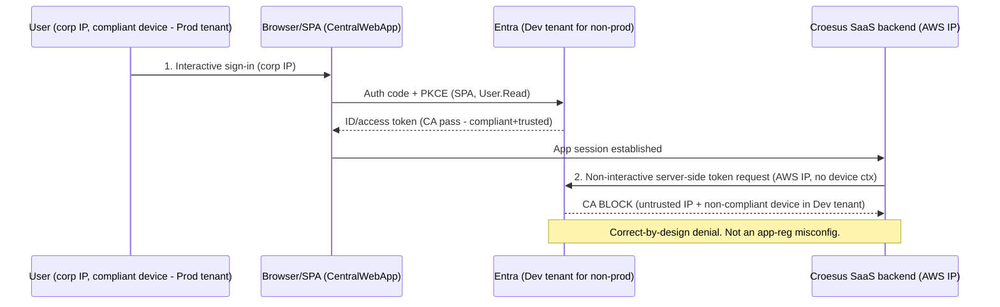

# Croesus / GPD Central — App Registration Analysis and SSO Conditional Access Findings

**Customer:** Desjardins (Croesus "GPD Central" / Central GPD SaaS integration)
**Prepared:** 2026-06-15
**Scope:** Verification of three Entra ID app-registration exports (dev-dev, dev-prod, prod-prod), determination on the blocked second non-interactive sign-in, and a remediation recommendation.

---

## 0. Executive Summary

**Core question:** the second, non-interactive sign-in seen coming from the Croesus SaaS AWS IP — blocked by Conditional Access (CA) in non-prod — is this **expected OAuth behaviour** or a **misconfiguration**, and should the fix be **internal (Option A)** or **escalated to the vendor (Option B)**?

**Answer (three separated facts):**

1. The existence of a second, server-initiated token event from the Croesus AWS backend is a property of the **vendor's SaaS architecture**, not a setting Desjardins toggled. It is "expected" of this vendor's design.
2. The **Conditional Access block of that event in non-prod is correct-by-design** (Zero Trust). It is **not** a Desjardins misconfiguration.
3. The flow **cannot be a standards-compliant Entra On-Behalf-Of (OBO)** given the registrations (no client secret, no certificate, no exposed API scope). The raw sign-in logs confirm the second event is a **server-side token replay** (Token Protection status "unbound", code 1008) targeting Microsoft Graph — not a custom backend-API audience.

**Bottom line:** the CA denial is expected and correct. The second sign-in is driven by the vendor's server-side design — confirmed by the raw sign-in logs to be a Token-Protection-"unbound" replay, **not** a standards OBO. The only open item is whether Croesus *intended* this token replay or a true OBO that was mis-implemented; that single fact is owed by the vendor (and is held in the RMS-locked OAuth integration report we could not open).

**Recommended path:** **Option B first** (escalate to Croesus for the authoritative flow definition + AWS egress IP ranges), then a **scoped Option A** internal accommodation — preferring Entra B2B "Trust compliant devices" to fix the cross-tenant root cause, with a scoped CA trusted-location exception + MFA as the lower-assurance alternative. Do **not** frame the CA policy as broken.

---

## 1. App Registration Verification

All three files are Microsoft Graph **application objects** (az ad app show style), not service principals. They share an identical, tightly-scoped shape and differ only in tenant, redirect URIs, and implicit-grant settings.

Common shape across all three: SPA platform only (public client, auth-code + PKCE), single-tenant (`AzureADMyOrg`), Microsoft Graph `User.Read` delegated only, no exposed API, no app roles, **no client secrets, no certificates, no federated identity credentials**, `servicePrincipalLockConfiguration` enabled, `acceptMappedClaims` true.

### Verified comparison

| Field | dev-dev.txt | dev-prod.txt | prod-prod.txt |
| --- | --- | --- | --- |
| displayName | sp-CentralGPD-UAT-dev-fed | sp-CentralGPD-UAT-dev-fed | sp-CentralGPD-prod-fed |
| appId | 713d6ede-38a2-45f4-8982-89ea4fcf1a7f | e3e358ea-0aae-4f11-b866-00f76b1cf6c1 | 92dd40a3-f7c2-42ff-9303-fff5928e195a |
| objectId | 0110690a-75b6-4809-9c9a-956ab805434b | a2a7a9ad-8624-43d7-a921-a33d00c05c5b | f75b1dc5-6d7b-4a37-a353-caf805022eaf |
| publisherDomain (tenant) | MVTDEVDesjardins (DEV) | mvtdesjardins (PROD) | mvtdesjardins (PROD) |
| created | 2025-07-09 20:25Z | 2025-07-09 20:39Z | 2025-04-25 15:06Z |
| platform | SPA | SPA | SPA |
| SPA redirect count | 2 | 1 | 1 |
| SiteMinder federation redirect | YES | no | no |
| Redirect cleanliness | dev + certif/pat | certif/pat | clean prod |
| Implicit ID token | TRUE | false | false |
| Implicit access token | false | false | false |
| Secrets / certs / FIC | none | none | none |
| Exposed API / appRoles / scopes | none | none | none |
| Graph permissions | User.Read (delegated) | User.Read (delegated) | User.Read (delegated) |
| signInAudience | AzureADMyOrg | AzureADMyOrg | AzureADMyOrg |
| SP lock enabled | yes | yes | yes |

### Redirect URIs (verbatim)

* **dev-dev:** `https://spsfondation.dev.desjardins.com/affwebservices/tools/oidc-tool.html` (SiteMinder federation) and `https://pat-gpd-central.certif.desjardins.com/CentralWebApp/LogonSso.aspx`
* **dev-prod:** `https://pat-gpd-central.certif.desjardins.com/CentralWebApp/LogonSso.aspx`
* **prod-prod:** `https://gpd-central.desjardins.com/CentralWebApp/LogonSso.aspx`

### Live-portal corroboration (screenshots)

A readable (non-RMS) Word document of 16 Azure Portal / sign-in-log screenshots from the 2026-05-29 working session confirms the running tenants match these manifests, and adds the enterprise-application (service principal) object IDs that the application-object exports do not contain:

* DEV app `713d6ede…` → enterprise app (SP) objectId `2052c434-d7fa-4022-a2f8-a1676c187456` (Assignment required = No, Visible to users = No)
* dev-prod app `e3e358ea…` → enterprise app (SP) objectId `323e25ff-4afb-47c1-aa3e-0d1142515473` (Assignment required = No, Visible to users = No)

---

## 2. Matrix and Naming Reconciliation

The intent document defines a `tenant × Croesus-env × auth-flow` matrix with six verification dimensions. Reconciliation:

| Dimension | Finding |
| --- | --- |
| 1. Tenant placement | dev-dev → DEV tenant; dev-prod and prod-prod → PROD tenant. Confirmed via publisherDomain casing. |
| 2. Redirect URIs | Environment-scoped, all HTTPS, no localhost/http/wildcard. dev-dev carries an extra SiteMinder federation redirect. |
| 3. Credentials | None on any of the three (no secrets, certs, or federated identity credentials). |
| 4. Permissions / exposed API | Microsoft Graph `User.Read` delegated only; no exposed API, no app roles, no custom scopes. |
| 5. Audience | All single-tenant (`AzureADMyOrg`). |
| 6. Implicit grant | dev-dev has implicit ID-token issuance ON; dev-prod and prod-prod OFF. |

**Naming reconciliation:** filenames encode `<CroesusEnv>-<EntraTenant>`. The intent doc labels the cross-boundary row `prod-dev`; the supplied file is named `dev-prod` — the **same scenario, token order reversed**. There is no separate `prod-dev.txt`.

**Confirmed cross-environment mismatch:** `dev-prod.txt` is a **UAT/dev-named registration physically living in the PROD tenant** (`sp-CentralGPD-UAT-dev-fed` with publisherDomain `mvtdesjardins`). This matches the customer's "environments partly mixed" suspicion and is a governance/clarity concern (see Section 3).

---

## 3. Configuration Hygiene and Security Observations

Ordered by severity. Items 1–3 are the actionable security/vulnerability findings; items 4–8 are posture confirmations.

### 3.1 Security findings (act on these)

| # | Severity | Finding | Why it matters | Recommended action |
| --- | --- | --- | --- | --- |
| V1 | **High (design-level)** | The second event is a **server-side token replay** ("unbound" / Token Protection code 1008), not a bound or OBO token. The replayed token inherits the original session's `deviceId` and "Azure AD joined / compliant" device claims, but is presented from an **AWS IP with no real device context**. | A replayed token carrying compliant-device claims from an external IP can satisfy **device-based CA grants it should not**. In PROD it currently succeeds and is only *flagged* (not blocked) by Token Protection. | Confirm intent with Croesus (Option B). Enforce a **Token Protection / token-binding CA control** so unbound (replayed) tokens are denied. |
| V2 | **Medium** | **Environment/tenant boundary drift:** a UAT/dev-named registration (`dev-prod.txt`) lives in the PROD tenant. | Erodes blast-radius separation and operational clarity; makes CA scoping and incident triage harder. | Rename/relocate or clearly document the dev-prod registration; confirm it is the intended non-prod app object in PROD. |
| V3 | **Low (hygiene)** | **dev-dev** has implicit ID-token issuance **enabled** and an extra **SiteMinder federation redirect** (`spsfondation.dev…/oidc-tool.html`) that the prod-tenant apps do not. | Residual/test surface; implicit grant is legacy and best disabled when auth-code + PKCE is used. | Disable implicit ID-token issuance on dev-dev; review/remove the SiteMinder test redirect if not required. Non-causal to the blocked event. |

### 3.2 Posture confirmations (positive / no action)

1. **No credentials anywhere** — consistent with pure SPA/PKCE; no long-lived or expiring-secret risk to report. *Positive.*
2. **Redirects are environment-scoped**, all HTTPS, no localhost/http/wildcard — no dangling-redirect concern. *Positive.*
3. **All single-tenant** (`AzureADMyOrg`) — no multi-tenant or personal-account exposure. *Positive.*
4. **`servicePrincipalLockConfiguration` enabled** on all three — good tamper protection. *Positive.*
5. **No owners or admin-consent state** present in the application-object export — a governance gap to close out-of-band (see verification guide). *Track.*

---

## 4. Determination

> **Is the second non-interactive sign-in expected or a misconfiguration?**

Separate three distinct facts:

1. **Vendor-driven event.** The second, server-initiated token event from the Croesus AWS backend is a property of the vendor's SaaS architecture. It is "expected" of this vendor's design and is **not** a Desjardins app-registration mistake.
2. **CA block is correct-by-design.** Denying a token from an untrusted AWS IP with no compliant-device context in the Dev tenant is Conditional Access working correctly (Zero Trust). It is **not** a misconfiguration.
3. **Cannot be a standards OBO.** A genuine Entra OBO requires the middle tier to be a **confidential client** (secret or certificate) **and** the app to **expose an API** (custom scope / Application ID URI). All three exports have empty `passwordCredentials`, `keyCredentials`, and `api.oauth2PermissionScopes`, with SPA-only platform. The raw sign-in logs confirm the second event is a **token replay** (Token Protection "unbound", code 1008) targeting **Microsoft Graph**, not a custom backend audience.

### Root cause — cross-tenant device-compliance gap

Devices are compliant/managed in the **Prod** tenant (Intune / hybrid join), but non-prod Croesus authenticates in the **Dev** tenant. A device can be compliant in only one tenant, so a Prod-compliant device reads as non-compliant/unknown in the Dev tenant. The Croesus backend's server-side token step originates from an untrusted AWS IP with no device context, so device-based CA in the Dev tenant correctly fails the second event. In `prod-prod`, the same step succeeds because device + tenant + trusted-location conditions align.

### Raw sign-in log evidence (prod-prod scenario)

| Field | Sign-in #1 (interactive) | Sign-in #2 (replay) |
| --- | --- | --- |
| IsInteractive | TRUE | FALSE |
| IP Address | 142.195.80.133 (Desjardins corp) | 3.97.32.113 (Amazon AWS) |
| Token Protection status | **bound (code 0)** | **unbound (code 1008)** |
| Browser | Edge 146.0.0 | (empty) |
| deviceId | 5b4b24f4-…-4518e81f06c8 | 5b4b24f4-…-4518e81f06c8 (same) |
| isCompliant / trustType | true / Azure AD joined | true / Azure AD joined |
| App / Resource | sp-CentralGPD-prod-fed (92dd40a3…) / Microsoft Graph | same / Microsoft Graph |
| ResultType | 0 (success) | 0 (success) |

Both rows share SessionId `007bc799-6350-25bf-fbe9-ebbcb7093b63` and tenant `728d20a5-0b44-47dd-9470-20f37cbf2d9a`. A second Amazon egress IP, `3.99.119.124`, appears in the meeting notes.

---

## 5. Recommendation — Option A vs Option B

**Preferred: Option B first (escalate to Croesus), then a scoped Option A accommodation.**

### Step 1 — Option B: escalate to Croesus (required first)

Obtain the authoritative flow definition because the definitive evidence is RMS-locked and the exports prove these registrations cannot perform a standards OBO unaided. Ask Croesus for:

* the exact OAuth/OIDC flow (true OBO vs server-side token replay);
* whether their backend is a confidential client, and against which app/scope;
* the audience of the reused token;
* their published AWS egress IP ranges.

(See the standalone escalation packet: `assets/croesus-escalation-packet.md`.)

### Step 2 — Option A: the most proportionate internal accommodation

* **Preferred lever — Entra B2B "Trust compliant devices"** (advisory PDF Option 2): have the Dev tenant honour the Prod tenant's device-compliance claim. **High security; addresses the root cause directly.**
* **Alternative lever — scoped CA trusted-location exception** (advisory PDF Option 1): add Croesus AWS egress IPs as a trusted location **for the non-prod app only**, with MFA as a compensating control. Lower complexity, lower assurance.
* If Croesus confirms they intend a **true OBO**, that additionally requires an **exposed-API scope + confidential-client credential** on the Croesus backend before the flow is standards-compliant.

> **Do not frame the CA policy as broken.** Any Option A change is a deliberate, scoped accommodation — not a bug fix.

### Decision flow

```text
1. Escalate to Croesus (Option B) -> obtain flow definition + AWS IP ranges
2. If true OBO intended -> require exposed-API scope + confidential-client credential on the Croesus backend, then
3. Apply scoped Option A: B2B "Trust compliant devices" (preferred) OR scoped CA trusted-location exception + MFA
4. Re-test the non-prod (dev-prod) scenario; compare to the prod-prod reference
```

### Sequence (current, blocked, behaviour)



---

## 6. Evidence Gaps, Further Analysis, and Considered Alternatives

### 6.1 Remaining evidence gaps (further analysis needed)

| Gap | Status | How to close |
| --- | --- | --- |
| Croesus's **intended** flow (true OBO vs deliberate replay) | **Open** — held in RMS-locked OAuth integration report | Option B escalation, or an RMS-unlocked copy of the report |
| Verbatim **AADSTS failure code + CA policy name** for the non-prod DEV-tenant denial | **Open** | Entra sign-in log query (see verification guide) |
| App **owners** and **admin-consent grants** | **Open** — not in application-object exports | `az ad app owner list` / `az ad app permission list-grants` |
| Dev/Prod **tenant IDs** behind the two publisher domains | **Open** | OIDC discovery query (see verification guide) |
| Croesus **AWS egress IP ranges** (full set) | **Partial** — `3.97.32.113`, `3.99.119.124` observed | Vendor-published ranges via Option B |

> Two authoritative customer documents (`croesus_entra_oauth_integration_report_*.pdf` and `PROD.docx`) are **Azure RMS / MIP encrypted** ("Highly Confidential \ Internal Only") and could not be opened. They likely hold the authoritative flow and prod reference behaviour. The readable screenshots doc supplied the missing raw sign-in logs, which is why the determination above is now evidence-backed rather than inferred.

### 6.2 Considered alternatives (and why not)

* **Option A only** (treat as internal misconfiguration, fix CA/app-reg immediately): rejected as the first move — CA is behaving correctly and the authoritative flow is RMS-locked; fixing blindly risks weakening security for an unconfirmed flow.
* **Option B only** (push everything to Croesus): insufficient alone — even with vendor confirmation, the cross-tenant device-compliance gap is a customer-side condition needing an internal accommodation.
* **Advisory PDF Option 3** (unify to a single tenant or dedicated test-tenant-joined devices): highest assurance but a large re-architecture; reserve as a last resort.
* **Blaming the dev-dev implicit-ID-token + SiteMinder redirect:** rejected — those are dev hygiene gaps worth cleaning, but they do not produce a server-side AWS-IP token event; that is backend behaviour.

---

## 7. Customer-Ready Next Steps

1. **Send the escalation packet** (`assets/croesus-escalation-packet.md`) to Croesus and obtain the flow definition + full AWS egress IP ranges.
2. **Run the verification commands** (`assets/app-registration-verification.md`) to capture the verbatim AADSTS/CA-policy evidence, owners, admin-consent, and tenant IDs.
3. **Apply the cross-tenant accommodation** — prefer B2B "Trust compliant devices"; otherwise a scoped CA trusted-location exception + MFA for the non-prod app only.
4. **Enforce a Token Protection / token-binding CA control** so "unbound" (replayed) tokens are denied even in PROD (addresses finding V1).
5. **Clean up hygiene** — disable implicit ID-token issuance on dev-dev, review the SiteMinder test redirect, and resolve the dev-prod naming/tenant drift (findings V2, V3).
6. **Re-test the non-prod (dev-prod) scenario** and compare against the prod-prod reference.
