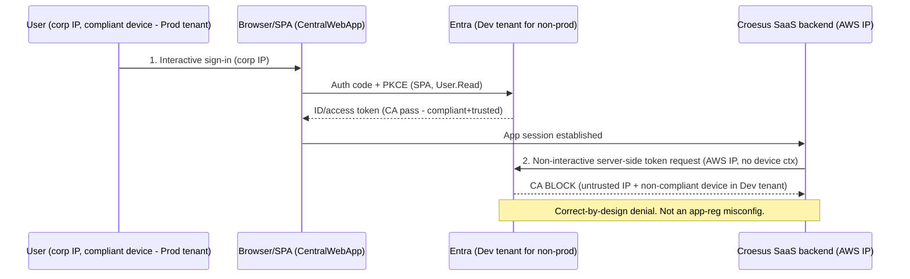

# Croesus / GPD Central — App Registration Analysis and SSO Conditional Access Findings

**Customer:** Desjardins (Croesus "GPD Central" / Central GPD SaaS integration)
**Prepared:** 2026-06-15
**Scope:** Verification of three Entra ID app-registration exports (dev-dev, dev-prod, prod-prod), determination on the blocked second non-interactive sign-in, and a remediation recommendation.

---

> [!IMPORTANT]
> **Superseding revision (2026-08-06).** Croesus reports .NET Framework 4.5.2, roughly 130 `.aspx` pages, a BFF, one URL for functionality, and server-side `/token` redemption, but has alternated between SPA and multi-page descriptions. The UI topology remains unresolved: SPA, multi-page Web Forms, and hybrid are all possible. The sampled HAR proves only that `/token` did not occur in that browser transaction. One URL, redirect paths, and PKCE do not classify the frontend; PKCE is recommended for public and confidential authorization-code clients. SPA and BFF are compatible. The registration verdict follows from the redeemer: if the same backend redeems and retains tokens, it needs a confidential `web` registration regardless of UI topology; if a separate browser public client exists, its `spa` registration may be legitimate. Treat "BFF" as provisional until Q15 confirms token custody and backend mediation. What still holds: OBO is structurally impossible with these three registrations, and the Conditional Access denial is correct-by-design. **Scope: Central only; Conseiller is a separate assessment.** The current analysis, open questions, and all nine remediation routes live in [croesus-3way-session-findings.md](croesus-3way-session-findings.md). Everything below is retained for historical record.

---

> [!NOTE]
> Revised position (2026-07-28), itself superseded in part by the note above. A later review corrected two claims in this 2026-06-15 report. First, `/oauth2/v2.0/token` and Token Protection status `1008` do not by themselves prove access-token replay: `1008` means the client is not integrated with the platform broker (Windows Account Manager), a device- and session-binding status, and Token Protection is native-app-only and does not cover Microsoft Graph. Second, the SPA-platform registrations are consistent with an ordinary authorization-code-with-PKCE redemption, which is redeemed from the browser; a literal server-side redemption of a `spa` authorization code is rejected by Microsoft Entra with `AADSTS9002327`. *(The browser-redemption half of this second point is withdrawn by the 2026-08-05 note above; the `AADSTS9002327` behaviour still holds and is now central to the analysis.)* The grant remains unclassified pending one captured `/token` request showing whether an `Origin` header is present. What still holds: On-Behalf-Of is structurally impossible with these registrations (no secret, certificate, or exposed API scope), and the Conditional Access denial is correct-by-design. See docs/evidence-narrative.md for the corrected analysis. The categorical "token replay" wording below is retained for historical record but is superseded by this note.

---

## 0. Executive Summary

**Core question:** the second, non-interactive sign-in seen coming from the Croesus SaaS AWS IP — blocked by Conditional Access (CA) in non-prod — is this **expected OAuth behaviour** or a **misconfiguration**, and should the fix be **internal (Option A)** or **escalated to the vendor (Option B)**?

**Answer (three separated facts):**

1. The existence of a second, server-initiated token event from the Croesus AWS backend is a property of the **vendor's SaaS architecture**, not a setting Desjardins toggled. It is "expected" of this vendor's design.
2. The **Conditional Access block of that event in non-prod is correct-by-design** (Zero Trust). It is **not** a Desjardins misconfiguration.
3. The flow **cannot be a standards-compliant Entra On-Behalf-Of (OBO)** given the registrations (no client secret, no certificate, no exposed API scope). The sign-in logs record the second event as Token Protection status "unbound" (code 1008) targeting Microsoft Graph. Per the revised position above, `1008` is a device/broker-binding status, not proof of token replay, and the grant is unclassified pending a captured request; the SPA registrations are equally consistent with an authorization-code-with-PKCE redemption.

**Bottom line:** the CA denial is expected and correct. The second sign-in is driven by the vendor's server-side design. Per the revised position above, the `1008` "unbound" status is a device/broker-binding signal (client not integrated with WAM), not proof of token replay, and does not identify the grant; the SPA registrations are consistent with an authorization-code-with-PKCE redemption. What is certain is that the registrations **cannot** perform a standards OBO. The open item is the authoritative flow definition, owed by the vendor (and held in the RMS-locked OAuth integration report we could not open).

**Recommended path:** **Option B first** (escalate to Croesus for the authoritative flow definition + AWS egress IP ranges), then a **scoped Option A** internal accommodation — a CA exception scoped to the non-prod application, with compensating controls, alongside a corrected registration shape on the vendor side. Entra B2B "Trust compliant devices" is **not** available for this scenario (see the correction in section 5). Do **not** frame the CA policy as broken.

---

## 1. App Registration Verification

All three files are Microsoft Graph **application objects** (az ad app show style), not service principals. They share an identical, tightly-scoped shape and differ only in tenant, redirect URIs, and implicit-grant settings.

Common shape across all three: SPA platform only (public client, auth-code + PKCE), single-tenant (`AzureADMyOrg`), Microsoft Graph `User.Read` delegated only, no exposed API, no app roles, **no client secrets, no certificates, no federated identity credentials**, `servicePrincipalLockConfiguration` enabled, `acceptMappedClaims` true.

### Verified comparison

| Field | dev-dev.txt | dev-prod.txt | prod-prod.txt |
| --- | --- | --- | --- |
| displayName | sp-CentralGPD-UAT-dev-fed | sp-CentralGPD-UAT-dev-fed | sp-CentralGPD-prod-fed |
| appId | 713d6ede-38a2-45f4-8982-89ea4fcf1a7f | e3e358ea-0aae-4f11-b866-00f76b1cf6c1 | 92dd40a3-f7c2-42ff-9303-fff5928e195a |
| objectId | 0110690a-75b6-4809-9c9a-956ab805434b | a2a7a9ad-8624-43d7-a921-a33d00c05c5b | f75b1dc5-6d7b-4a37-a353-caf805022eaf |
| publisherDomain (tenant) | MVTDEVDesjardins (DEV) | mvtdesjardins (PROD) | mvtdesjardins (PROD) |
| created | 2025-07-09 20:25Z | 2025-07-09 20:39Z | 2025-04-25 15:06Z |
| platform | SPA | SPA | SPA |
| SPA redirect count | 2 | 1 | 1 |
| SiteMinder federation redirect | YES | no | no |
| Redirect cleanliness | dev + certif/pat | certif/pat | clean prod |
| Implicit ID token | TRUE | false | false |
| Implicit access token | false | false | false |
| Secrets / certs / FIC | none | none | none |
| Exposed API / appRoles / scopes | none | none | none |
| Graph permissions | User.Read (delegated) | User.Read (delegated) | User.Read (delegated) |
| signInAudience | AzureADMyOrg | AzureADMyOrg | AzureADMyOrg |
| SP lock enabled | yes | yes | yes |

### Redirect URIs (verbatim)

* **dev-dev:** `https://spsfondation.dev.desjardins.com/affwebservices/tools/oidc-tool.html` (SiteMinder federation) and `https://pat-gpd-central.certif.desjardins.com/CentralWebApp/LogonSso.aspx`
* **dev-prod:** `https://pat-gpd-central.certif.desjardins.com/CentralWebApp/LogonSso.aspx`
* **prod-prod:** `https://gpd-central.desjardins.com/CentralWebApp/LogonSso.aspx`

### Live-portal corroboration (screenshots)

A readable (non-RMS) Word document of 16 Azure Portal / sign-in-log screenshots from the 2026-05-29 working session confirms the running tenants match these manifests, and adds the enterprise-application (service principal) object IDs that the application-object exports do not contain:

* DEV app `713d6ede…` → enterprise app (SP) objectId `2052c434-d7fa-4022-a2f8-a1676c187456` (Assignment required = No, Visible to users = No)
* dev-prod app `e3e358ea…` → enterprise app (SP) objectId `323e25ff-4afb-47c1-aa3e-0d1142515473` (Assignment required = No, Visible to users = No)

---

## 2. Matrix and Naming Reconciliation

The intent document defines a `tenant × Croesus-env × auth-flow` matrix with six verification dimensions. Reconciliation:

| Dimension | Finding |
| --- | --- |
| 1. Tenant placement | dev-dev → DEV tenant; dev-prod and prod-prod → PROD tenant. Confirmed via publisherDomain casing. |
| 2. Redirect URIs | Environment-scoped, all HTTPS, no localhost/http/wildcard. dev-dev carries an extra SiteMinder federation redirect. |
| 3. Credentials | None on any of the three (no secrets, certs, or federated identity credentials). |
| 4. Permissions / exposed API | Microsoft Graph `User.Read` delegated only; no exposed API, no app roles, no custom scopes. |
| 5. Audience | All single-tenant (`AzureADMyOrg`). |
| 6. Implicit grant | dev-dev has implicit ID-token issuance ON; dev-prod and prod-prod OFF. |

**Naming reconciliation:** filenames encode `<CroesusEnv>-<EntraTenant>`. The intent doc labels the cross-boundary row `prod-dev`; the supplied file is named `dev-prod` — the **same scenario, token order reversed**. There is no separate `prod-dev.txt`.

**Confirmed cross-environment mismatch:** `dev-prod.txt` is a **UAT/dev-named registration physically living in the PROD tenant** (`sp-CentralGPD-UAT-dev-fed` with publisherDomain `mvtdesjardins`). This matches the customer's "environments partly mixed" suspicion and is a governance/clarity concern (see Section 3).

---

## 3. Configuration Hygiene and Security Observations

Ordered by severity. Items 1–3 are the actionable security/vulnerability findings; items 4–8 are posture confirmations.

### 3.1 Security findings (act on these)

| # | Severity | Finding | Why it matters | Recommended action |
| --- | --- | --- | --- | --- |
| V1 | **High (design-level)** | The second event presents from an **AWS IP with no real device context** and records Token Protection status "unbound" (code 1008). Per the revised position above, `1008` indicates the client is not broker (WAM) integrated — a device/session-binding status — not proof of token replay; the grant is unclassified pending a captured request. The event carries the original session's `deviceId` and "compliant" device claims but originates from an external IP. | A non-broker-bound token carrying compliant-device claims from an external IP can satisfy **device-based CA grants it should not**. In PROD it currently succeeds and is only *flagged* (not blocked) by Token Protection. | Confirm the flow with Croesus (Option B). Enforce a **Token Protection / token-binding CA control** so device-unbound tokens are denied. |
| V2 | **Medium** | **Environment/tenant boundary drift:** a UAT/dev-named registration (`dev-prod.txt`) lives in the PROD tenant. | Erodes blast-radius separation and operational clarity; makes CA scoping and incident triage harder. | Rename/relocate or clearly document the dev-prod registration; confirm it is the intended non-prod app object in PROD. |
| V3 | **Low (hygiene)** | **dev-dev** has implicit ID-token issuance **enabled** and an extra **SiteMinder federation redirect** (`spsfondation.dev…/oidc-tool.html`) that the prod-tenant apps do not. | Residual/test surface; implicit grant is legacy and best disabled when auth-code + PKCE is used. | Disable implicit ID-token issuance on dev-dev; review/remove the SiteMinder test redirect if not required. Non-causal to the blocked event. |

### 3.2 Posture confirmations (positive / no action)

1. **No credentials anywhere** — consistent with pure SPA/PKCE; no long-lived or expiring-secret risk to report. *Positive.*
2. **Redirects are environment-scoped**, all HTTPS, no localhost/http/wildcard — no dangling-redirect concern. *Positive.*
3. **All single-tenant** (`AzureADMyOrg`) — no multi-tenant or personal-account exposure. *Positive.*
4. **`servicePrincipalLockConfiguration` enabled** on all three — good tamper protection. *Positive.*
5. **No owners or admin-consent state** present in the application-object export — a governance gap to close out-of-band (see verification guide). *Track.*

---

## 4. Determination

> **Is the second non-interactive sign-in expected or a misconfiguration?**

Separate three distinct facts:

1. **Vendor-driven event.** The second, server-initiated token event from the Croesus AWS backend is a property of the vendor's SaaS architecture. It is "expected" of this vendor's design and is **not** a Desjardins app-registration mistake.
2. **CA block is correct-by-design.** Denying a token from an untrusted AWS IP with no compliant-device context in the Dev tenant is Conditional Access working correctly (Zero Trust). It is **not** a misconfiguration.
3. **Cannot be a standards OBO.** A genuine Entra OBO requires the middle tier to be a **confidential client** (secret or certificate) **and** the app to **expose an API** (custom scope / Application ID URI). All three exports have empty `passwordCredentials`, `keyCredentials`, and `api.oauth2PermissionScopes`, with SPA-only platform, so OBO is structurally impossible. The second event records Token Protection status "unbound" (code 1008) targeting Microsoft Graph; per the revised position above, that status is a device/broker-binding signal, not proof of token replay, and the SPA registrations are equally consistent with an authorization-code-with-PKCE redemption.

### Root cause — cross-tenant device-compliance gap

Devices are compliant/managed in the **Prod** tenant (Intune / hybrid join), but non-prod Croesus authenticates in the **Dev** tenant. A device can be compliant in only one tenant, so a Prod-compliant device reads as non-compliant/unknown in the Dev tenant. The Croesus backend's server-side token step originates from an untrusted AWS IP with no device context, so device-based CA in the Dev tenant correctly fails the second event. In `prod-prod`, the same step succeeds because device + tenant + trusted-location conditions align.

> [!NOTE]
> **This gap is real but not closable by a tenant setting** (Desjardins correction, 2026-08-05). Cross-tenant "Trust compliant devices" only honours a device claim presented by a **B2B guest** from their home tenant; it does not bridge device state into a native Dev-tenant sign-in. And because the blocked event is a **server-side call with no device context whatsoever**, device trust could not have unblocked it under any configuration. Treat the registration shape and a scoped, app-specific CA exception as the actionable levers instead.

### Raw sign-in log evidence (prod-prod scenario)

| Field | Sign-in #1 (interactive) | Sign-in #2 (second, server-side event) |
| --- | --- | --- |
| IsInteractive | TRUE | FALSE |
| IP Address | (Desjardins corp) | 3.97.32.113 (Amazon AWS) |
| Token Protection status | **bound (code 0)** | **unbound (code 1008)** |
| Browser | Edge 146.0.0 | (empty) |
| deviceId | 5b4b24f4-…-4518e81f06c8 | 5b4b24f4-…-4518e81f06c8 (same) |
| isCompliant / trustType | true / Azure AD joined | true / Azure AD joined |
| App / Resource | sp-CentralGPD-prod-fed (92dd40a3…) / Microsoft Graph | same / Microsoft Graph |
| ResultType | 0 (success) | 0 (success) |

Both rows share SessionId `007bc799-6350-25bf-fbe9-ebbcb7093b63` and tenant `728d20a5-0b44-47dd-9470-20f37cbf2d9a`. A second Amazon egress IP, `3.99.119.124`, appears in the meeting notes.

---

## 5. Recommendation — Option A vs Option B

**Preferred: Option B first (escalate to Croesus), then a scoped Option A accommodation.**

### Step 1 — Option B: escalate to Croesus (required first)

Obtain the authoritative flow definition because the definitive evidence is RMS-locked and the exports prove these registrations cannot perform a standards OBO unaided. Ask Croesus for:

* the exact OAuth/OIDC flow (true OBO vs server-side token replay);
* whether their backend is a confidential client, and against which app/scope;
* the audience of the reused token;
* their published AWS egress IP ranges.

(See the standalone escalation packet: `assets/croesus-escalation-packet.md`.)

### Step 2 — Option A: the most proportionate internal accommodation

> [!IMPORTANT]
> **Correction (Desjardins, 2026-08-05).** An earlier revision named Entra B2B "Trust compliant devices" the preferred lever. That was wrong for this scenario. The cross-tenant access **inbound trust settings** only take effect when the user authenticates as a **cross-tenant B2B guest**, because they tell the resource tenant to honour a device-compliance claim carried **in the guest's token from their home tenant**. They cannot be switched on to make a **Prod**-compliant device count as compliant when the user signs in with a **Dev**-tenant account from that device — that sign-in is native to the Dev tenant and is evaluated against the Dev tenant's own device registry. Separately, the blocked event is a **non-interactive server-side call from AWS with no device context at all**, which no device-trust setting can remedy.

* **Scoped CA exception** (advisory PDF Option 1): admit the Croesus AWS egress ranges **for the non-prod application only**, with compensating controls. Lower assurance, but it is the lever that actually addresses a device-less backend call.
* **Fix the registration shape** so the backend authenticates as a workload with its own confidential credential rather than depending on a user's device-bound context. This is the durable answer if the redemption is genuinely server-side.
* **Re-shape non-prod to B2B guest access** (advisory PDF Option 2, corrected): only if users authenticate into the non-prod tenant as **guests from the Prod tenant** does "Trust compliant devices" become available. That is an identity-model change, not a tenant toggle, and it still does nothing for the server-side leg.
* If Croesus confirms they intend a **true OBO**, that additionally requires an **exposed-API scope + confidential-client credential** on the Croesus backend before the flow is standards-compliant.

> **Do not frame the CA policy as broken.** Any Option A change is a deliberate, scoped accommodation — not a bug fix.

### Decision flow

```text
1. Escalate to Croesus (Option B) -> obtain flow definition + AWS IP ranges
2. If true OBO intended -> require exposed-API scope + confidential-client credential on the Croesus backend, then
3. Apply scoped Option A: scoped CA exception for the non-prod app + compensating controls
   (B2B "Trust compliant devices" applies ONLY if non-prod is re-shaped to guest sign-in)
4. Re-test the non-prod (dev-prod) scenario; compare to the prod-prod reference
```

### Sequence (current, blocked, behaviour)



---

## 6. Evidence Gaps, Further Analysis, and Considered Alternatives

### 6.1 Remaining evidence gaps (further analysis needed)

| Gap | Status | How to close |
| --- | --- | --- |
| Croesus's **intended** flow (true OBO vs another server-side flow such as authorization-code redemption) | **Open** — held in RMS-locked OAuth integration report | Option B escalation, or an RMS-unlocked copy of the report |
| Verbatim **AADSTS failure code + CA policy name** for the non-prod DEV-tenant denial | **Open** | Entra sign-in log query (see verification guide) |
| App **owners** and **admin-consent grants** | **Open** — not in application-object exports | `az ad app owner list` / `az ad app permission list-grants` |
| Dev/Prod **tenant IDs** behind the two publisher domains | **Open** | OIDC discovery query (see verification guide) |
| Croesus **AWS egress IP ranges** (full set) | **Partial** — `3.97.32.113`, `3.99.119.124` observed | Vendor-published ranges via Option B |

> Two authoritative customer documents (`croesus_entra_oauth_integration_report_*.pdf` and `PROD.docx`) are **Azure RMS / MIP encrypted** ("Highly Confidential \ Internal Only") and could not be opened. They likely hold the authoritative flow and prod reference behaviour. The readable screenshots doc supplied the raw sign-in logs used here; note (per the revised-position banner) that those logs establish network, device-binding, and session observations but do not by themselves classify the OAuth grant.

### 6.2 Considered alternatives (and why not)

* **Option A only** (treat as internal misconfiguration, fix CA/app-reg immediately): rejected as the first move — CA is behaving correctly and the authoritative flow is RMS-locked; fixing blindly risks weakening security for an unconfirmed flow.
* **Option B only** (push everything to Croesus): insufficient alone — even with vendor confirmation, the cross-tenant device-compliance gap is a customer-side condition needing an internal accommodation. Note that the accommodation must be a scoped CA decision, not a device-trust setting (see the correction in section 5).
* **Advisory PDF Option 3** (unify to a single tenant or dedicated test-tenant-joined devices): highest assurance but a large re-architecture; reserve as a last resort.
* **Blaming the dev-dev implicit-ID-token + SiteMinder redirect:** rejected — those are dev hygiene gaps worth cleaning, but they do not produce a server-side AWS-IP token event; that is backend behaviour.

---

## 7. Customer-Ready Next Steps

1. **Send the escalation packet** (`assets/croesus-escalation-packet.md`) to Croesus and obtain the flow definition + full AWS egress IP ranges.
2. **Run the verification commands** (`assets/app-registration-verification.md`) to capture the verbatim AADSTS/CA-policy evidence, owners, admin-consent, and tenant IDs.
3. **Apply the scoped accommodation** — a CA exception for the non-prod app only, with compensating controls. Do not plan on B2B "Trust compliant devices": it applies only to guest sign-ins and cannot help a device-less server-side call.
4. **Enforce a Token Protection / token-binding CA control** so device-unbound tokens are denied even in PROD (addresses finding V1).
5. **Clean up hygiene** — disable implicit ID-token issuance on dev-dev, review the SiteMinder test redirect, and resolve the dev-prod naming/tenant drift (findings V2, V3).
6. **Re-test the non-prod (dev-prod) scenario** and compare against the prod-prod reference.
