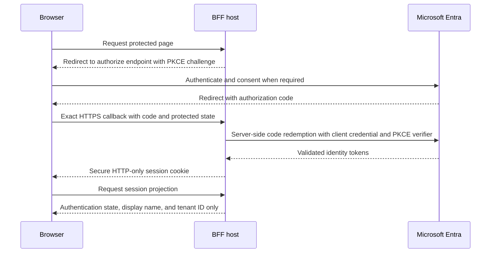

## Purpose and recommendation

This proof compares the same confidential OpenID Connect web-client boundary on
two runtimes. The .NET Framework 4.5.2 host establishes protocol feasibility
with Katana. The .NET 10 host demonstrates the supported strategic destination
with Microsoft.Identity.Web and MSAL.NET.

Use the sequence below for Central:

1. Prove the confidential `web` registration in Dev on .NET Framework 4.5.2.
2. Use .NET Framework 4.8 only as an operational bridge when migration timing
   requires one.
3. Move the authentication boundary to .NET 10 as the strategic destination.

> [!WARNING]
> .NET Framework 4.5.2 has been unsupported since April 26, 2022. The legacy
> sample is evidence code, not an Internet-facing or production destination.

Installing the .NET Framework 4.8 runtime does not change an application's
target framework. A 4.8 uplift requires retargeting the project, recompiling it,
and regression testing authentication, cookies, session state, TLS behavior,
and the application. Treat installation and application migration as separate
changes.

The [three-way session findings](../assets/croesus-3way-session-findings.md)
remain the authoritative Central assessment. This PoC implements the R8 and R9
proof path without changing the existing OBO demonstration.

## Architecture

One confidential Entra application registration contains two exact callbacks
under `web.redirectUris`:

* `https://localhost:44352/signin-oidc` for the classic System.Web host
* `https://localhost:7100/signin-oidc` for the ASP.NET Core host

Both hosts own authorization-code redemption and establish a protected
server-side session. Browser JavaScript receives no OAuth token, authorization
code, PKCE verifier, client credential, or raw cookie. The core comparison uses
only OpenID Connect sign-in and requests no downstream API permission.



The legacy middleware uses native Katana PKCE and code redemption. It does not
contain custom PKCE glue or a custom verifier store. The modern host delegates
the protocol flow to Microsoft.Identity.Web. Neither sample exposes an API
scope or implements On-Behalf-Of.

## Prerequisites

* PowerShell 7 on Windows
* Azure CLI authenticated to the intended home tenant
* Permission to create applications and service principals in that tenant
* .NET SDK 10 with .NET Framework 4.5.2 reference assemblies restored by NuGet
* Visual Studio with IIS Express and a trusted development certificate for the
  legacy host

The provisioning scripts use `az account show` for the authenticated tenant and
`az rest` for Microsoft Graph directory operations. They do not call
`az ad sp create-for-rbac`, create subscription scopes, or assign Azure resource
roles.

## Deploy the App Service comparison environment

The `classic-net-bff-poc` workflow provides an isolated hosted comparison. It
deploys exactly one Windows B1 App Service plan, two web apps on that shared
worker, and one confidential Microsoft Entra `web` registration with both
callbacks. It does not change the existing Linux OBO demonstration.

Resource names are deterministic for a subscription, resource group, and
`name_prefix`. The workflow creates `<name-prefix>-rg`; Bicep derives the plan,
legacy app, modern app, and registration display name from a stable
`uniqueString` suffix. The registration carries the ownership tag
`Croesus.ClassicNetBffDeployment.v1`, which provisioning and teardown verify
before they reuse or delete it.

### Bootstrap GitHub and Microsoft Entra

Create a protected GitHub environment named exactly `poc-demo` and require an
appropriate reviewer. Configure these public GitHub variables:

* `AZURE_CLIENT_ID`: application ID of the GitHub OIDC bootstrap identity
* `AZURE_TENANT_ID`: home Microsoft Entra tenant GUID
* `AZURE_SUBSCRIPTION_ID`: target Azure subscription GUID

Define the variables on `poc-demo` for protected deploy and teardown jobs. If
the validation job must run its optional Azure what-if, also define them as
repository variables because that job does not enter the protected environment.
No GitHub secret is required. The workflows request only `contents: read` and
`id-token: write`, then `azure/login` exchanges GitHub's short-lived OIDC token
for Azure and Microsoft Graph access.

Configure a federated identity credential on the bootstrap registration for
the repository and the `poc-demo` environment subject. The exact subject is
`repo:<owner>/<repository>:environment:poc-demo`. A separate branch or pull
request credential does not authorize the protected jobs unless its subject
also matches the job context.

The bootstrap service principal needs Azure permissions for the operations the
workflows perform:

* Create, read, and delete the deterministic resource group
* Validate, run what-if, and create resource-group deployments
* Create, configure, and deploy the App Service plan and both web apps

Do not grant blanket subscription Contributor for this PoC. One option is a
custom role at subscription scope limited to the required resource-group,
deployment, and `Microsoft.Web` actions. Another is to have an administrator
precreate the deterministic resource group, scope Contributor to that group,
and retain resource-group deletion as an administrator-owned teardown step.
The second option requires adapting the checked-in teardown workflow because it
currently deletes the resource group itself.

Grant the bootstrap registration the Microsoft Graph application permission
`Application.ReadWrite.All` and have a tenant administrator grant consent. The
deployment scripts use it to query, create, patch, and delete applications;
add and remove application passwords; and query, create, and delete the home
tenant service principal. They do not need `Directory.ReadWrite.All` and do not
assign Azure roles. `Application.ReadWrite.OwnedBy` is insufficient for the
current convergence path because the workflow can reuse an exactly named,
ownership-tagged registration rather than only objects owned by the bootstrap
identity.

> [!IMPORTANT]
> This setup has a bootstrap paradox. GitHub OIDC cannot create its own trusted
> bootstrap registration, federated credential, Azure role assignment, Graph
> application permission, or tenant-admin consent. A tenant and subscription
> administrator must establish those controls out of band before the workflow
> can run. Do not solve that boundary with `az ad sp create-for-rbac`, a stored
> deployment secret, or subscription-wide Contributor.

### Choose validation or deployment

Run the `classic-net-bff-poc` workflow manually. Its inputs are:

* `operation`: `validate` by default, or `deploy`
* `tenant_mode`: `single-tenant` by default, or `organizations`
* `allowed_tenant_ids`: comma-separated tenant GUIDs, required for
  `organizations`
* `name_prefix`: lowercase deterministic prefix, 3-24 characters
* `location`: `canadaeast`, `eastus2`, or `westus2`
* `credential_lifetime_days`: 1-7 days, with 1 day as the default

Validation mode builds, tests, and publishes both applications, compiles Bicep,
parses PowerShell, runs the static security suites, and uploads secret-free
packages for three days. It never creates Microsoft Entra objects or Azure
resources. When all three public OIDC variables are available, it runs what-if
only if the deterministic resource group already exists; it does not create the
group for validation.

Deploy mode repeats validation, enters `poc-demo` for approval, signs in with
OIDC, creates the deterministic resource group, and runs a full-resource-payload
what-if. The workflow derives both app names and callbacks from that result,
converges the tagged registration, deploys Bicep with the secret as a secure
parameter, deploys both packages, and checks each root URL without following
redirects. The smoke check accepts an authentication redirect or `401`; it does
not complete an interactive user sign-in.

The legacy package remains compiled for .NET Framework 4.5.2. Windows App
Service runs that assembly on its installed .NET Framework 4.8 runtime. The
modern package is a self-contained `win-x64` deployment with
`Croesus.ModernBff.exe` as its startup command, so it does not depend on App
Service offering a shared .NET 10 runtime.

### Understand credential rotation

Every deployment creates one replacement credential named
`<registration-display-name> GitHub deployment demo` with a maximum lifetime of
seven days. The script masks the returned value immediately, stores it only in
the current PowerShell process environment, deploys it through Bicep's secure
parameter, and clears it in `finally`. It never writes the value to state,
workflow outputs, summaries, packages, or artifacts.

After the new credential is created, masked, and recorded by key ID, the script
removes older credentials with that deterministic name. Rerun deploy before the
credential expires to rotate it. The two app settings are updated together by
the same Bicep deployment, but this remains a PoC exception rather than a
production key-synchronization design.

### Run the browser comparison

Use the deployment summary links and compare one host at a time:

1. Open the legacy URL in a private browser window and sign in with an allowed
   test account.
2. Confirm the protected page shows authenticated session state, display name,
   and tenant ID without exposing an OAuth token, authorization code, PKCE
   verifier, client secret, or raw cookie.
3. Sign out and close the private window.
4. Open the modern URL in a new private window and repeat the same checks.
5. Compare callback routing, sign-in and sign-out behavior, and the visible
   session projection. Record only the privacy-safe evidence listed later in
   this guide.

Do not use a browser HAR as demo evidence. Developer tools, workflow logs, and
screenshots must not contain tokens, codes, credentials, or raw cookie values.

### Use organizational multitenancy

Select `organizations` only with an explicit `allowed_tenant_ids` list that
contains the home tenant and every approved customer tenant. The workflow
converges the registration to `AzureADMultipleOrgs`; both apps still reject a
validated issuer whose tenant is absent from the allowlist.

The publisher owns the application registration and home-tenant service
principal. A customer tenant creates its own enterprise application (service
principal) when an administrator or authorized user grants consent. Customer
tenant policy determines whether user consent is allowed or administrator
consent is required. The workflow does not automate customer consent, create or
delete customer service principals, or grant permissions in customer tenants.

### Tear down the hosted PoC

Run `teardown-classic-net-bff-poc` manually with the same `name_prefix`. Enter
the case-sensitive confirmation `destroy:<name-prefix>`. The workflow enters
the protected `poc-demo` environment, verifies the deterministic Azure context,
resolves the exact registration display name through Bicep what-if, and then
deletes only an exact registration carrying the workflow ownership tag. It
verifies application and home service-principal identity before deletion.

The workflow requests asynchronous deletion of `<name-prefix>-rg`. It does not
delete the GitHub OIDC bootstrap identity, its federated credential or Graph
consent, the `poc-demo` environment, or service principals created through
consent in customer tenants. Remove or retain those bootstrap controls through
your normal repository and tenant governance process.

### Hosted PoC caveats

* B1 is a demonstration tier, not a production scale or resilience target
* Both apps share one worker, so contention or recycle affects the comparison
* The stack has no deployment slots, high availability, monitoring, private
  networking, or production operations model
* The `net452` compile target runs on App Service's installed .NET Framework
  4.8 runtime; this does not retarget or support the legacy application
* The modern app is self-contained for `win-x64` because platform runtime
  availability can lag SDK releases
* The explicit `Poc` client-secret exception is temporary and must not become
  Production policy
* Production should use a certificate or managed-identity-backed client
  credential, stronger availability and monitoring, and tested credential or
  key synchronization where multiple instances are involved

The repository validation is offline. It does not claim that a live Azure
deployment, Microsoft Graph mutation, hosted interactive sign-in, or teardown
was tested.

## Provision the single-tenant registration

Run these commands from the repository root. The default audience is
`AzureADMyOrg`. The state file contains only tenant, application, service
principal, and credential identifiers plus ownership flags. It contains no
secret value.

```powershell
az login --tenant <home-tenant-guid>
pwsh .\scripts\provision-classic-net-bff-poc.ps1
```

The script looks up an exact display name, creates or reuses one application,
creates or reuses its home-tenant service principal, and converges the two
confidential `web` callbacks. It clears `spa.redirectUris` and disables fallback
public-client behavior. The default permission set contains no Microsoft Graph
delegated permission.

The default state path is `.classic-net-bff-poc-state.json`. It is ignored by
Git. Use a dedicated display name for this PoC because convergence updates the
audience, callbacks, public-client flags, and requested permissions on a reused
registration. Cleanup never deletes a reused object and does not restore its
previous settings.

### Optional Microsoft Graph permission

Authenticated session projection is sufficient for this comparison, so
`User.Read` is not justified by default. Add it only when you intentionally add
a server-side Microsoft Graph `/me` demonstration and its token-cache design:

```powershell
pwsh .\scripts\provision-classic-net-bff-poc.ps1 -IncludeUserRead
```

This switch adds delegated Microsoft Graph `User.Read` to the application
registration. It does not grant tenant-wide admin consent. Neither sample in
the core PoC calls Graph or retains a downstream access token.

## Create a short-lived Dev credential

Credential creation is opt-in and limited to 30 days. Supply an explicit output
path whose file name matches `.classic-net-bff-poc-secret*.json` so Git ignores
it. The script refuses to overwrite a file, never prints the value, and replaces
inherited permissions with a Windows ACL for the current identity. It creates
and verifies an empty protected output file before requesting the credential
from Microsoft Graph.

```powershell
New-Item -ItemType Directory -Force .\.local | Out-Null
pwsh .\scripts\provision-classic-net-bff-poc.ps1 `
  -CreateDevSecret `
  -SecretLifetimeDays 7 `
  -SecretOutputPath .\.local\.classic-net-bff-poc-secret-dev.json
```

> [!CAUTION]
> Inspect the file ACL before use. Delete the credential file after configuring
> the processes. A Git ignore rule prevents accidental staging but is not an
> access control. Use a non-exportable certificate or an approved
> managed-identity-backed client assertion for the operational destination.
> If the script reports that Graph created the credential but the protected file
> could not be written, run `cleanup-classic-net-bff-poc.ps1` immediately with
> the reported state path, then delete the secret output file without printing
> or inspecting its contents.

Load the same credential into both local process environments without printing
it:

```powershell
$secret = Get-Content .\.local\.classic-net-bff-poc-secret-dev.json -Raw |
  ConvertFrom-Json
$env:CROESUS_LEGACY_CLIENT_SECRET = $secret.clientSecret
$env:AzureAd__TenantId = $secret.tenantId
$env:AzureAd__ClientId = $secret.clientId
$env:AzureAd__ClientSecret = $secret.clientSecret
```

Clear the variables and remove the local file when the session ends:

```powershell
$env:CROESUS_LEGACY_CLIENT_SECRET = $null
$env:AzureAd__TenantId = $null
$env:AzureAd__ClientId = $null
$env:AzureAd__ClientSecret = $null
$secret = $null
Remove-Item .\.local\.classic-net-bff-poc-secret-dev.json
```

## Configure and run the legacy host

Set the non-secret values in
`poc/legacy-net452/web.config` for local execution:

```xml
<add key="ClientId" value="<application-client-guid>" />
<add key="TenantId" value="<home-tenant-guid>" />
<add key="AuthorityMode" value="SingleTenant" />
<add key="AllowedTenantIds" value="" />
```

Keep `CROESUS_LEGACY_CLIENT_SECRET` in the IIS Express process environment. Do
not place the value in `web.config`. Build and test the host:

```powershell
dotnet build .\poc\legacy-net452\LegacyNet452.csproj --configuration Release
dotnet test .\poc\legacy-net452\Tests\LegacyNet452.Tests.csproj --configuration Release
```

Open `poc/legacy-net452/LegacyNet452.csproj` in Visual Studio and run the
`LegacyNet452` IIS Express profile. `dotnet run` is not a System.Web hosting
model. Confirm the browser uses `https://localhost:44352` and the exact callback
registered above.

## Configure and run the modern host

The environment variables loaded from the protected credential file configure
the tenant, client, and Dev secret. Start the HTTPS profile:

```powershell
dotnet run --project .\poc\modern-net10\Croesus.ModernBff.csproj `
  --launch-profile https
```

Open `https://localhost:7100`. The callback is
`https://localhost:7100/signin-oidc`. The `/api/session` response contains only
session metadata and no OAuth material.

## Opt in to organizational multitenancy

Create or converge the registration as `AzureADMultipleOrgs` only with the
explicit switch:

```powershell
pwsh .\scripts\provision-classic-net-bff-poc.ps1 -MultiTenant
```

Use the `organizations` authority so personal Microsoft accounts are excluded.
Configure both hosts with a non-empty allowlist of customer tenant GUIDs:

* Set legacy `AuthorityMode` to `Organizations` and `AllowedTenantIds` to a
  comma-separated list
* Set modern `Authentication__Mode=Organizations`,
  `AzureAd__TenantId=organizations`, and indexed environment variables such as
  `Authentication__AllowedTenantIds__0=<tenant-guid>`

Each host first validates signature, audience, lifetime, nonce, state, and
correlation. It then binds the validated issuer tenant segment to the `tid`
claim and applies the allowlist before establishing the session. An allowlist
does not replace issuer validation.

The publisher owns the application registration in its home tenant. Each
customer tenant receives its own enterprise application (service principal)
when an administrator or authorized user consents. The customer tenant
administrator controls whether consent is permitted and which tenant policies
apply. This repository does not automate customer-tenant consent or create
customer service principals.

Multitenancy expands the blast radius of a registration, credential, consent,
or issuer-validation mistake from one directory to every admitted customer
directory. Keep the allowlist narrow, rotate credentials, review customer
consent separately, and monitor sign-ins by tenant.

## Capture privacy-safe evidence

Collect only the evidence needed to compare the two hosts:

* UTC timestamp and host name (`legacy-net452` or `modern-net10`)
* Callback URI and `web` platform classification
* Result category, such as success, issuer rejection, or allowlist rejection
* Locally generated correlation ID
* Redacted tenant ID, for example the first and last four characters
* Browser response field names proving that only session metadata is returned

Never capture or share an access token, ID token, refresh token, authorization
code, PKCE verifier or challenge, client secret, raw cookie, full claims set, or
browser HAR. Keep IdentityModel personally identifiable information logging
disabled. Treat Entra sign-in exports as restricted evidence and redact user,
IP, and tenant identifiers before distribution.

## Caveat matrix

<!-- markdownlint-disable MD060 -->

| Concern                 | .NET Framework 4.5.2                              | .NET Framework 4.8 bridge                         | .NET 10 destination                              |
|-------------------------|---------------------------------------------------|---------------------------------------------------|--------------------------------------------------|
| Support position        | Unsupported since April 2022                      | Supported with the underlying Windows lifecycle   | Supported strategic application target           |
| Identity integration    | Katana 4.2.3; no current MSAL.NET                  | Katana can remain; current MSAL.NET is compatible  | Microsoft.Identity.Web and current MSAL.NET       |
| PKCE                    | Native Katana only with explicit code-flow options | Retest Katana behavior after retargeting           | Handler-managed authorization code with PKCE      |
| Upgrade meaning         | Dev protocol proof only                            | Install, retarget, recompile, and regression test  | Migrate hosting and authentication boundary       |
| TLS                     | Force TLS 1.2 process-wide                         | Verify OS defaults and outbound policy             | Use current platform defaults and policy          |
| Cookie and SameSite     | Test exact browsers; old runtime semantics         | Retest after framework and patch changes           | Use secure ASP.NET Core cookie policy              |
| Farm state protection   | Synchronize and protect ASP.NET machine keys       | Preserve stable shared keys during the bridge      | Use shared ASP.NET Core Data Protection keys      |
| Token cache             | None in core; avoid custom process-local cache      | Design a distributed cache if downstream calls exist | Use supported MSAL cache integration when needed |
| Operational credential  | Dev secret for proof only                          | Prefer a non-exportable certificate                | Certificate or managed-identity-backed assertion  |
| Production recommendation | Do not deploy                                    | Transitional only when business timing requires it | Preferred destination                             |

<!-- markdownlint-enable MD060 -->

## Threats and limitations

* The legacy runtime and IdentityModel dependency chain are old even though the
  selected Katana packages compile for .NET Framework 4.5.2.
* Introducing custom PKCE glue, manual verifier storage, or manual token
  redemption would enlarge the attack surface and invalidate the comparison.
* A process-local token cache loses state on recycle and fails across instances.
  The core PoC avoids downstream token acquisition entirely.
* Dev secrets require expiration, rotation, protected storage, and prompt
  deletion. They are not the operational credential recommendation.
* Legacy SameSite behavior varies with Windows and .NET patches. Test every
  supported browser and callback path.
* The legacy process must force TLS 1.2 before metadata and token back-channel
  traffic.
* Every legacy farm instance must share stable protected machine keys. Key drift
  breaks state, nonce, correlation, PKCE verifier, and session recovery.
* Multitenant consent and issuer isolation are security boundaries. Do not
  automate customer consent or disable issuer validation to make sign-in work.
* Successful compilation does not prove IIS hosting, trusted HTTPS, callback
  routing, or production readiness.

## Clean up directory objects

Review the recorded ownership flags before cleanup. Preview the operation first:

```powershell
Get-Content .\.classic-net-bff-poc-state.json
pwsh .\scripts\cleanup-classic-net-bff-poc.ps1 -WhatIf
```

Run cleanup after confirming the target tenant and recorded IDs:

```powershell
pwsh .\scripts\cleanup-classic-net-bff-poc.ps1
```

The cleanup script removes only the password credential and directory objects
whose `created` flags were recorded as `true` by provisioning. It never deletes
a reused application or service principal. It updates state after each removal
so a repeated cleanup does not broaden its scope. Remove the non-secret state
file manually after reviewing the completed result.
