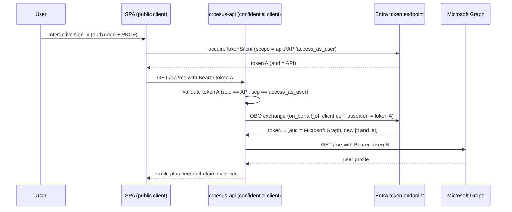

## Purpose

This guide takes you from an empty tenant to a working demonstration of a standards-compliant Microsoft Entra On-Behalf-Of (OBO) flow, and shows you how to read the evidence that proves the second token is freshly issued rather than replayed. You can complete every step here on its own. No internal research notes are required.

The demo plays out the vendor relationship directly: we act as the Croesus vendor and provide the setup steps, and you (acting as Desjardins) own the two app registrations in your tenant.

## Architecture in brief

A React single-page application (SPA) signs the user in with the authorization-code flow and PKCE, then requests a token for the middle-tier API scope only. The ASP.NET Core API validates that inbound token, performs the OBO exchange to obtain a separate Microsoft Graph token, and calls `GET /me`. Because the SPA never requests a Graph scope, the OBO boundary is unavoidable.



## Prerequisites

* An Azure subscription and a single Microsoft Entra tenant where you can create app registrations and grant tenant-wide admin consent.
* The Azure CLI, signed in to that tenant with `az login`.
* A GitHub repository that holds this demo, with the configuration and deploy-identity variables described in [configuration-contract.md](configuration-contract.md).
* Permission to create the App Service, Key Vault, and Application Insights resources that [../infra/main.bicep](../infra/main.bicep) defines.

## Step 1: Provision the Key Vault and app registrations

The API confidential-client certificate lives in a Key Vault, and the provisioning script needs that vault to exist before it can create the certificate. Create the vault first, then point the script at it with `KEY_VAULT_NAME`. The vault uses RBAC, so grant yourself a role that can create certificates (for example, **Key Vault Administrator**) on it before running the script.

```bash
az keyvault create \
  --name "$KEY_VAULT_NAME" \
  --resource-group "$RESOURCE_GROUP" \
  --location "$LOCATION" \
  --enable-rbac-authorization true
```

Run the provisioning script. It creates two single-tenant registrations, the SPA as a public client and the API as a confidential client, exposes the `access_as_user` scope on the API, pre-authorizes the SPA, grants the Microsoft Graph `User.Read` delegated permission, and stores the API certificate in the Key Vault.

```bash
KEY_VAULT_NAME="$KEY_VAULT_NAME" \
SPA_DEPLOYED_REDIRECT_URI="https://croesus-spa.azurewebsites.net" \
  ./scripts/provision-app-registrations.sh
```

The script prints the identifiers you need next: the SPA client ID, the API client ID, and the derived API scope (`api://<API_CLIENT_ID>/access_as_user`). Combine these with your tenant ID and the Key Vault name when you record the configuration.

> [!IMPORTANT]
> Register the deployed SPA origin as a redirect URI. The SPA's MSAL config uses `redirectUri: window.location.origin`, so the deployed URL (for example `https://croesus-spa.azurewebsites.net`) must be a SPA-platform redirect URI on the SPA registration. Pass it through `SPA_DEPLOYED_REDIRECT_URI` as shown; otherwise an interactive sign-in from the deployed app fails with `AADSTS50011` (redirect URI mismatch). The local dev URI (`https://localhost:3000`) is always registered.

> [!NOTE]
> The script is idempotent. It looks up each registration by display name and reuses the existing object, so re-running it does not create duplicates.


Record the outputs as GitHub Actions repository variables. The full mapping, including which component reads each value, lives in [configuration-contract.md](configuration-contract.md).

> [!IMPORTANT]
> The API confidential-client credential is a certificate stored in Key Vault. It never appears in repository variables, in a `.bicepparam` file, or in the workflow. The API reads it through an App Service Key Vault reference resolved by a managed identity.

## Step 2: Deploy the infrastructure and the apps

Deploy the infrastructure out of band with [../infra/main.bicep](../infra/main.bicep), passing the tenant ID, the SPA and API client IDs from Step 1, and the Key Vault name. This creates the App Service plan, the `croesus-spa` and `croesus-api` Web Apps, Application Insights, and the Log Analytics workspace, and wires the API's managed identity to the Key Vault.

```bash
az deployment group create \
  --resource-group "$RESOURCE_GROUP" \
  --template-file infra/main.bicep \
  --parameters \
      tenantId="$TENANT_ID" \
      spaClientId="$SPA_CLIENT_ID" \
      apiClientId="$API_CLIENT_ID" \
      keyVaultName="$KEY_VAULT_NAME"
```

With the Web Apps in place, the deploy workflow at [../.github/workflows/deploy-croesus.yml](../.github/workflows/deploy-croesus.yml) builds and ships the application code. It authenticates to Azure with an OpenID Connect federated credential, so there is no long-lived deploy secret. It then publishes the [../spa/](../spa/) and [../api/](../api/) projects to the existing `croesus-spa` and `croesus-api` Web Apps. The workflow deploys application code only; it does not provision the infrastructure.

Trigger the workflow from the GitHub Actions tab, or push to the branch the workflow watches. When the run finishes, the post-deploy evidence job writes its results to the run summary. The headless smoke and negative tests run only when the `ENABLE_ROPC_EVIDENCE` repository variable is `true`; otherwise they are skipped and the run stays green (see the note under Step 3).

## Step 3: Exercise the flow

Open the SPA at its App Service URL and sign in. The SPA acquires a token for the API scope and calls `GET /api/me` on the middle tier. The API validates the inbound token, runs the OBO exchange, calls Microsoft Graph, and returns your profile along with the decoded-claim evidence for both legs.

You can also run the smoke test directly:

```bash
./scripts/smoke-test.sh
```

A passing smoke test confirms the user can sign in, the API accepts the API-audience token, and the OBO call to Graph succeeds.

> [!NOTE]
> The smoke and negative tests acquire the user token through the resource-owner-password (ROPC) grant, which cannot satisfy multi-factor authentication. In a tenant that enforces MFA for every user (for example, through security defaults or a managed Conditional Access policy), ROPC fails with `AADSTS50079` and no headless token can be obtained. The evidence job therefore gates these two steps behind the `ENABLE_ROPC_EVIDENCE` repository variable, which defaults to off, so the pipeline stays green where MFA is enforced. Set `ENABLE_ROPC_EVIDENCE` to `true` only in a tenant where a dedicated, non-MFA CI test user is allowed. Everywhere else, validate the flow interactively by signing in to the deployed SPA, which completes MFA in the browser and exercises the same OBO exchange.

## Step 4: Run the negative tests

The negative tests prove the audience boundary is enforced, not merely present. Use the interactive SPA control first: after signing in, select `Replay API token to Graph (wrong)`. The button replays token A, whose audience is the API, directly to Microsoft Graph and expects Graph to return `401`. That rejection proves Graph refuses the API-audienced token. It is not the literal Token Protection 1008 signal from the customer logs; it is a safe audience-boundary demonstration that sits next to the working OBO path. See [evidence-narrative.md](evidence-narrative.md) for the 1008 evidence boundary.

The script-based negative tests are gated in CI, and you can run them on demand:

```bash
./scripts/negative-test.sh
```

Two checks matter:

* A token whose audience is Microsoft Graph, presented to the API, returns `401`.
* The API-audience token (token A), presented directly to Microsoft Graph, returns `401`.

If both rejections occur, no single token works against both resources, which is the behavioral signature of a real OBO.

## Step 5: Read the Application Insights claim evidence

The API logs decoded claims only. It never logs raw tokens. For each request it records three things:

* Leg 1: the inbound token claims, `aud`, `scp`, `appid`, `oid`, and `jti`, where `aud` equals the API.
* The OBO request shape: the `jwt-bearer` grant, the `on_behalf_of` parameter, and the certificate thumbprint.
* Leg 2: the Graph token claims, where `aud` equals Microsoft Graph and the `jti` and `iat` differ from leg 1.

The distinct `aud` values and distinct `jti` values across the two legs are the proof. Token B is a new issuance, not a relay of token A.

## Step 6: Correlate the Entra sign-in logs

The Application Insights claims are the primary evidence. The Entra non-interactive sign-in logs corroborate them. Run the query in [../scripts/evidence-kql.kusto](../scripts/evidence-kql.kusto) against the workspace that receives the tenant's sign-in logs:

```kusto
AADNonInteractiveUserSignInLogs
| where TimeGenerated > ago(1h)
| where AppDisplayName == "Croesus GPD Central API (mock)" or ResourceDisplayName == "Microsoft Graph"
| project TimeGenerated, CorrelationId, AppDisplayName, ResourceDisplayName, UserPrincipalName, Status
| sort by TimeGenerated asc
```

You see two correlated rows that share a `CorrelationId`: the SPA-to-API leg and the API-to-Graph leg. The two resources differ, which mirrors the two distinct audiences you saw in the claim logs.

## Step 7: Reproduce the replay shape and Token Protection 1008 (Tier 2)

Tier 1 proved audience binding from the browser alone. Tier 2 goes further: it reproduces the customer's server-side replay shape (Tier 2a) and, on a supported resource, the real Token Protection "unbound" 1008 sign-in-log signal (Tier 2b). Every Tier 2 change is gated off by default and fully reversible, so run it in a lab tenant and tear it down when you finish.

### Step 7a: Confirm the SPA Graph consent

The Tier 2a replay needs a real Microsoft Graph token in the browser, so the SPA must hold the Microsoft Graph `User.Read` delegated grant. The provisioning script from Step 1 already adds and admin-consents it and records the grant id for teardown. Re-run the script if you provisioned before Tier 2 landed; it is idempotent and reuses the existing registrations.

```bash
./scripts/provision-app-registrations.sh
```

> [!NOTE]
> This SPA-side Graph grant is the one intentional exception to the "the SPA requests only the API scope" rule. It exists solely so the replay demo has a genuine Graph token to forward, and the teardown revokes it.

### Step 7b: Provision the report-only Token Protection policy (Tier 2b)

The 1008 signal comes from a Conditional Access Token Protection policy, not from any HTTP response. Create it in report-only mode so it records the binding evaluation without blocking anyone. The policy targets a single test user, excludes a break-glass account, applies only to native mobile and desktop clients, and points at a supported resource (Exchange Online by default).

```bash
TEST_USER_OBJECT_ID="<test-user-object-id>" \
BREAK_GLASS_USER_OBJECT_ID="<break-glass-object-id>" \
  ./scripts/provision-ca-policy.sh
```

> [!IMPORTANT]
> Token Protection is a Microsoft Entra ID P1 capability, and it evaluates only for native applications reaching Exchange Online, SharePoint Online, or Teams. It does not evaluate the browser SPA to custom API to Graph flow, so the 1008 line appears only for this supported-resource exhibit, never for the Croesus OBO path itself.

### Step 7c: Enable the replay gates

The server-side replay endpoint and the SPA replay control are both off by default. Turn them on only for the lab run: set the API gate `Demo:EnableReplay` to `true` and build the SPA with `VITE_ENABLE_REPLAY_DEMO=true`.

On the deployed Web App, set the live application setting, because a code-only deploy does not reapply the Bicep default:

```bash
az webapp config appsettings set \
  --name "$API_APP_NAME" \
  --resource-group "$RESOURCE_GROUP" \
  --settings Demo__EnableReplay=true
```

Alternatively, run the deploy workflow's manually approved `replay-lab` job. It provisions the policy, sets the live gate, and runs the Tier 2 evidence in one gated pass, and it never runs on the default path.

### Step 7d: Exercise the server-side replay

Open the SPA and sign in. With the gate on, a Tier 2a control appears alongside the Tier 1 negative control. It acquires a real Graph token in the browser and POSTs it to `POST /api/replay`. The API replays that same token to Microsoft Graph from server-side context, records the claims-only evidence, and returns the outcome. This reproduces the shape the sign-in logs attribute to the vendor backend: one token acquired in one place, presented from another, with no fresh issuance.

### Step 7e: Read the ReplayAttempt and 1008 evidence

The API emits a distinct App Insights custom event named `ReplayAttempt` for each server-side replay, separate from the good-path `OboExchange` event, so replay evidence never mixes with the OBO evidence. Query it in Application Insights:

```kusto
customEvents
| where name == "ReplayAttempt"
| order by timestamp desc
```

For the report-only Token Protection signal, run Query 4 from [../scripts/evidence-kql.kusto](../scripts/evidence-kql.kusto) against the workspace that receives the sign-in logs:

```kusto
AADNonInteractiveUserSignInLogs
| where TimeGenerated > ago(7d)
| where TokenProtectionStatusDetails != ""
| extend parsed = parse_json(TokenProtectionStatusDetails)
| extend bindingStatusCode = tostring(parsed["signInSessionStatusCode"])
| where bindingStatusCode == "1008"
| project TimeGenerated, UserPrincipalName, AppDisplayName, ResourceDisplayName, IPAddress, bindingStatusCode
| sort by TimeGenerated desc
```

Query 5 in the same file joins the interactive SPA sign-in to the non-interactive second leg, so you can read both legs of one session together.

## Step 8: Tear down and verify clean

Tier 2 is designed to leave no trace. Reverse it in this order, then assert the tenant is clean:

```bash
./scripts/teardown-ca-policy.sh
KEY_VAULT_NAME="$KEY_VAULT_NAME" \
API_APP_NAME="$API_APP_NAME" RESOURCE_GROUP="$RESOURCE_GROUP" \
  ./scripts/teardown-app-registrations.sh
./scripts/verify-clean.sh
```

[../scripts/teardown-ca-policy.sh](../scripts/teardown-ca-policy.sh) deletes the report-only policy by its recorded id, with a demo-prefix sweep as a fallback. The extended [../scripts/teardown-app-registrations.sh](../scripts/teardown-app-registrations.sh) also revokes the SPA-to-Graph delegated grant, resets the live `Demo__EnableReplay` setting to false, and removes the `replay-lab` federated credential from the deploy identity. [../scripts/verify-clean.sh](../scripts/verify-clean.sh) is read-only and exits non-zero if any residue remains, so it gates a "the tenant is clean" claim.

> [!NOTE]
> The `replay-lab` GitHub environment is a repository-side object with no secrets and no tenant effect, so the teardown scripts leave it in place as durable lab infrastructure. If you want the repository returned to its exact prior state, remove it manually under Settings, then Environments.

## Tenancy: single-tenant demo, multi-tenant in production

This demo registers both applications as single-tenant (`signInAudience = AzureADMyOrg`). Microsoft's guidance recommends "accounts in this directory only" when you build your own app registration for a third party that instructs you to do so, which is exactly the Croesus-to-Desjardins relationship. Both registrations live in one tenant, so the SPA-to-API and API-to-Graph relationships are intra-tenant and OBO works without any cross-tenant provisioning.

> [!NOTE]
> A real vendor-hosted multi-tenant SaaS would register the app once in the vendor tenant (`signInAudience = AzureADMultipleOrgs`), use the `/organizations` authority, validate multiple issuers, and onboard each customer through the admin-consent endpoint. Admin consent provisions the service principal in the customer tenant before any token can be requested for it:
>
> ```text
> https://login.microsoftonline.com/organizations/v2.0/adminconsent
> ```
>
> A multi-tenant Application ID URI must be globally unique (for example `https://<verified-domain>/croesus-api`), whereas single-tenant has no such constraint. That is one more reason single-tenant is the simpler shape for this demo.

## What you have proven

After these steps you have a running OBO flow, two distinct tokens with distinct audiences and `jti` values, enforced audience rejection in both directions, and two independent evidence trails: structured claim logs and correlated sign-in logs. The next document maps this evidence to the specific questions Desjardins asked the vendor.
