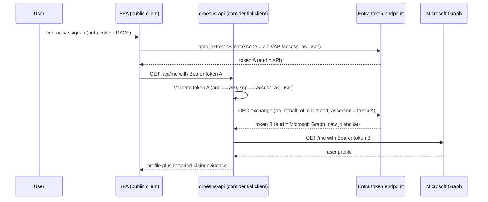

## Purpose

This guide takes you from an empty tenant to a working demonstration of a standards-compliant Microsoft Entra On-Behalf-Of (OBO) flow, and shows you how to read the evidence that proves the second token is freshly issued rather than replayed. You can complete every step here on its own. No internal research notes are required.

The demo plays out the vendor relationship directly: we act as the Croesus vendor and provide the setup steps, and you (acting as Desjardins) own the two app registrations in your tenant.

## Architecture in brief

A React single-page application (SPA) signs the user in with the authorization-code flow and PKCE, then requests a token for the middle-tier API scope only. The ASP.NET Core API validates that inbound token, performs the OBO exchange to obtain a separate Microsoft Graph token, and calls `GET /me`. Because the SPA never requests a Graph scope, the OBO boundary is unavoidable.



## Prerequisites

* An Azure subscription and a single Microsoft Entra tenant where you can create app registrations and grant tenant-wide admin consent.
* The Azure CLI, signed in to that tenant with `az login`.
* A GitHub repository that holds this demo, with the configuration and deploy-identity variables described in [configuration-contract.md](configuration-contract.md).
* Permission to create the App Service, Key Vault, and Application Insights resources that [../infra/main.bicep](../infra/main.bicep) defines.

## Step 1: Provision the Key Vault and app registrations

The API confidential-client certificate lives in a Key Vault, and the provisioning script needs that vault to exist before it can create the certificate. Create the vault first, then point the script at it with `KEY_VAULT_NAME`. The vault uses RBAC, so grant yourself a role that can create certificates (for example, **Key Vault Administrator**) on it before running the script.

```bash
az keyvault create \
  --name "$KEY_VAULT_NAME" \
  --resource-group "$RESOURCE_GROUP" \
  --location "$LOCATION" \
  --enable-rbac-authorization true
```

Run the provisioning script. It creates two single-tenant registrations, the SPA as a public client and the API as a confidential client, exposes the `access_as_user` scope on the API, pre-authorizes the SPA, grants the Microsoft Graph `User.Read` delegated permission, and stores the API certificate in the Key Vault.

```bash
KEY_VAULT_NAME="$KEY_VAULT_NAME" ./scripts/provision-app-registrations.sh
```

The script prints the identifiers you need next: the SPA client ID, the API client ID, and the derived API scope (`api://<API_CLIENT_ID>/access_as_user`). Combine these with your tenant ID and the Key Vault name when you record the configuration.

> [!NOTE]
> The script is idempotent. It looks up each registration by display name and reuses the existing object, so re-running it does not create duplicates.


Record the outputs as GitHub Actions repository variables. The full mapping, including which component reads each value, lives in [configuration-contract.md](configuration-contract.md).

> [!IMPORTANT]
> The API confidential-client credential is a certificate stored in Key Vault. It never appears in repository variables, in a `.bicepparam` file, or in the workflow. The API reads it through an App Service Key Vault reference resolved by a managed identity.

## Step 2: Deploy the infrastructure and the apps

Deploy the infrastructure out of band with [../infra/main.bicep](../infra/main.bicep), passing the tenant ID, the SPA and API client IDs from Step 1, and the Key Vault name. This creates the App Service plan, the `croesus-spa` and `croesus-api` Web Apps, Application Insights, and the Log Analytics workspace, and wires the API's managed identity to the Key Vault.

```bash
az deployment group create \
  --resource-group "$RESOURCE_GROUP" \
  --template-file infra/main.bicep \
  --parameters \
      tenantId="$TENANT_ID" \
      spaClientId="$SPA_CLIENT_ID" \
      apiClientId="$API_CLIENT_ID" \
      keyVaultName="$KEY_VAULT_NAME"
```

With the Web Apps in place, the deploy workflow at [../.github/workflows/deploy-croesus.yml](../.github/workflows/deploy-croesus.yml) builds and ships the application code. It authenticates to Azure with an OpenID Connect federated credential, so there is no long-lived deploy secret. It then publishes the [../spa/](../spa/) and [../api/](../api/) projects to the existing `croesus-spa` and `croesus-api` Web Apps. The workflow deploys application code only; it does not provision the infrastructure.

Trigger the workflow from the GitHub Actions tab, or push to the branch the workflow watches. When the run finishes, the post-deploy evidence job has already executed the smoke test and the gated negative tests and written the results to the run summary.

## Step 3: Exercise the flow

Open the SPA at its App Service URL and sign in. The SPA acquires a token for the API scope and calls `GET /api/me` on the middle tier. The API validates the inbound token, runs the OBO exchange, calls Microsoft Graph, and returns your profile along with the decoded-claim evidence for both legs.

You can also run the smoke test directly:

```bash
./scripts/smoke-test.sh
```

A passing smoke test confirms the user can sign in, the API accepts the API-audience token, and the OBO call to Graph succeeds.

## Step 4: Run the negative tests

The negative tests prove the audience boundary is enforced, not merely present. They are gated in CI and you can run them on demand:

```bash
./scripts/negative-test.sh
```

Two checks matter:

* A token whose audience is Microsoft Graph, presented to the API, returns `401`.
* The API-audience token (token A), presented directly to Microsoft Graph, returns `401`.

If both rejections occur, no single token works against both resources, which is the behavioral signature of a real OBO.

## Step 5: Read the Application Insights claim evidence

The API logs decoded claims only. It never logs raw tokens. For each request it records three things:

* Leg 1: the inbound token claims, `aud`, `scp`, `appid`, `oid`, and `jti`, where `aud` equals the API.
* The OBO request shape: the `jwt-bearer` grant, the `on_behalf_of` parameter, and the certificate thumbprint.
* Leg 2: the Graph token claims, where `aud` equals Microsoft Graph and the `jti` and `iat` differ from leg 1.

The distinct `aud` values and distinct `jti` values across the two legs are the proof. Token B is a new issuance, not a relay of token A.

## Step 6: Correlate the Entra sign-in logs

The Application Insights claims are the primary evidence. The Entra non-interactive sign-in logs corroborate them. Run the query in [../scripts/evidence-kql.kusto](../scripts/evidence-kql.kusto) against the workspace that receives the tenant's sign-in logs:

```kusto
AADNonInteractiveUserSignInLogs
| where TimeGenerated > ago(1h)
| where AppDisplayName == "Croesus API" or ResourceDisplayName == "Microsoft Graph"
| project TimeGenerated, CorrelationId, AppDisplayName, ResourceDisplayName, UserPrincipalName, Status
| sort by TimeGenerated asc
```

You see two correlated rows that share a `CorrelationId`: the SPA-to-API leg and the API-to-Graph leg. The two resources differ, which mirrors the two distinct audiences you saw in the claim logs.

## Tenancy: single-tenant demo, multi-tenant in production

This demo registers both applications as single-tenant (`signInAudience = AzureADMyOrg`). Microsoft's guidance recommends "accounts in this directory only" when you build your own app registration for a third party that instructs you to do so, which is exactly the Croesus-to-Desjardins relationship. Both registrations live in one tenant, so the SPA-to-API and API-to-Graph relationships are intra-tenant and OBO works without any cross-tenant provisioning.

> [!NOTE]
> A real vendor-hosted multi-tenant SaaS would register the app once in the vendor tenant (`signInAudience = AzureADMultipleOrgs`), use the `/organizations` authority, validate multiple issuers, and onboard each customer through the admin-consent endpoint. Admin consent provisions the service principal in the customer tenant before any token can be requested for it:
>
> ```text
> https://login.microsoftonline.com/organizations/v2.0/adminconsent
> ```
>
> A multi-tenant Application ID URI must be globally unique (for example `https://<verified-domain>/croesus-api`), whereas single-tenant has no such constraint. That is one more reason single-tenant is the simpler shape for this demo.

## What you have proven

After these steps you have a running OBO flow, two distinct tokens with distinct audiences and `jti` values, enforced audience rejection in both directions, and two independent evidence trails: structured claim logs and correlated sign-in logs. The next document maps this evidence to the specific questions Desjardins asked the vendor.
